# 树脉系统建设记录

> 用途：记录树脉从想法、判断、决策、实施到迭代的全过程。
>
> 建议：此文件作为项目主档长期维护，飞书可作为同步镜像，但不要替代仓库里的主版本。

## 1. 记录原则

每次推进都尽量写清：

- 日期
- 阶段
- 行动
- 目的
- 结果
- 困难
- 解决方式
- 技术选择
- 截图
- 下一步

## 1.1 文风要求

这份记录不是冷冰冰的流水账，建议写成有温度的日记式文字，尽量保留：

- 当天的想法
- 做决定时的犹豫和判断
- 遇到困难时的真实感受
- 解决问题后的轻松或兴奋
- 对产品未来的期待

写法上可以更像“项目日记”，而不是“会议纪要”。

这样后续内容既能作为内部建设档案，也能直接整理成：

- 小红书笔记素材
- 抖音口播脚本素材
- 公众号长文素材

所以正文里可以适当有一点叙述感、画面感和节奏感，让它更像人在记录一件正在成长的事。

## 2. 时间记录格式

建议统一使用下面格式：

### [YYYY-MM-DD HH:mm] 阶段名称

- 行动：
- 目的：
- 结果：
- 困难：
- 解决：
- 截图：
- 下一步：

## 3. 适合记录的阶段

### 阶段 A：初心与定位

记录：

- 为什么做树脉
- 想解决什么问题
- 产品最终要变成什么

### 阶段 B：产品骨架

记录：

- 首页结构
- 学科与学段入口
- 权限边界
- 任务流

### 阶段 C：学习闭环

记录：

- 题目详情页
- 错题本
- 知识树
- 题目网与方法网

### 阶段 D：AI 化

记录：

- AI 学伴
- AI 客服
- 提示 / 讲解 / 追问

### 阶段 E：动态计划

记录：

- 反向规划
- 学习方案动态调整
- PDF 训练

### 阶段 F：家校协同

记录：

- 家长端需求
- 教师端建议
- 微信提醒

## 4. 当前已确认的关键判断

- 数学和英语先做一个总入口
- 内容分阶段补齐
- 首页必须变成今日学习驾驶舱
- 保留原系统的基础知识、基础题、题组、压轴、真题、23 种方法
- 每道题必须挂到知识、方法、错因、补差路径上
- 系统必须看起来像 AI 智能体，而不是普通学习网站

## 5. 当前阶段记录

### [2026-05-07] 文档启动

- 新建《树脉 V3 总体方案》
- 新建《树脉系统建设记录》
- 确认项目主档放在仓库 `文档/` 下
- 确认飞书只做同步，不做唯一存储

原因：

- 仓库便于版本管理
- 截图、文档、代码可以一起追踪
- 后续开发时容易引用、回看和追加

下一步：

- 开始拆首页信息架构
- 定义首页首屏内容
- 拆解反向规划入口

### [2026-05-08] 首页骨架起步

- 先把首页从“数学单学科仪表盘”抬成“树脉 AI 学习中枢”的雏形
- 增加数学 / 英语总入口的第一层视觉占位
- 增加学段身份感和今日学习判断
- 保留数学底座入口，不动原有学习流

当下感受：

这一步不是大拆大建，更像是在一座已有骨架上，先把门牌、天光和走廊的方向立起来。系统还没完全长成，但它已经开始朝“AI 学习驾驶舱”那个方向呼吸了。

下一步：

- 继续补首页首屏的任务语义
- 让数学 / 英语入口更像真正的总入口
- 给英语留出独立体系的视觉与交互边界
- 再进入 V3.2 学段与总入口的细化

### [2026-05-08] 英语独立入口落地

- 新增英语独立入口页，不再把英语硬塞进数学流里
- 英语页先只做体系占位，明确小学 / 初中 / 高中的独立结构
- 首页英语按钮已接到独立页面，形成真正的双学科总入口

当下感受：

树脉开始有了“树”的样子。数学是主干，英语是另一根并列向上的枝，而不是把两种语言的学习逻辑搅成一团。这样以后无论是词汇、语法，还是数学的题目、方法、错因，都能各自长出自己的脉络。

下一步：

- 继续收紧首页总入口语义
- 让英语页从占位过渡到信息架构
- 再把学段权限和反向规划接到首页主线里

补充边界：

- 英语体系暂时只确认一级方向：单词、意群、句子、阅读、真题等
- 具体结构后续专题讨论
- 当前阶段不继续展开，避免过早把英语体系填满

### [2026-05-08] 学段权限条接入

- 增加统一的学段权限条
- 首页与英语页都显示小学 / 初中 / 高中
- 当前账号对应学段显示开放，其他学段显示受限

当下感受：

这个细节看起来小，但它会让系统更像一个真正面向家庭的学习产品。入口不是随便点进去，而是系统先知道你是谁、在哪个阶段、该进入哪一层树脉。孩子少选择一步，系统就多承担一步。

下一步：

- 接入反向规划入口
- 让首页开始回答“目标是多少，时间还剩多久，系统怎么倒推”
- 再把今日任务和反向计划连起来

### [2026-05-08] 反向规划入口接入

- 新增反向规划页面
- 支持输入当前成绩、目标成绩、剩余时间、每日可学时长
- 先生成本地阶段方案：补根基、提方法、稳输出
- 首页新增“反向规划”入口

当下感受：

这一步让树脉开始有了“向未来倒推”的味道。孩子和家长不只是问“今天做哪几道题”，而是可以先说“我想去哪里”，系统再往回拆路径。学习开始从被动刷题，变成有方向地往目标走。

下一步：

- 把首页的今日任务和反向规划连接起来
- 让计划结果后续可以生成 PDF 训练单
- 再把微信提醒接入计划节奏

### [2026-05-08] 首页气质第一轮收束

- 手机端底部导航改为“今日 / 知识树 / 练题 / 错题 / 我的”
- 首页“今日 3 件事”从普通待办改成教练式建议
- 每一步都开始回答：做什么、为什么做、做完推进到哪里
- 学习结构入口列数收紧，减少入口堆叠感

当下感受：

首页终于开始少一点“功能很多”的焦躁，多一点“我知道你今天该怎么走”的安定。这个方向很重要。真正好的学习系统，不应该把所有功能摊给孩子选择，而应该像一个稳稳站在旁边的教练，把今天最重要的动作递到他手里。

### [2026-05-09] 树脉搜索开始 AI 化

- 搜索结果不再只停在“找到什么”，而是开始直接告诉学生“先补什么、练什么、怎么确认会了”
- 知识点结果补上三步路径：先补概念，再练基础题，最后用真题确认稳定
- 题目结果开始带上关联知识点、方法入口、错因提示和可追问 AI 的句子
- 方法结果开始强调适用题型和练习方式，不再只是方法名列表
- 错因结果开始变成可修复动作，帮助学生从“错题收藏”走向“错因清除”
- `AskTutor` 成功回答后记录 `ai_used`
- 答案下方补上“有帮助 / 没帮助”按钮，让 `helpful` / `not_helpful` 也进入 Skill 事件回流
- `/api/skills/event` 现在和前端一起形成了更完整的最小闭环
- 前端还会把本地历史点击、AI 使用和反馈一起纳入提问词排序，先让权重回流在浏览器侧跑起来
- 树脉搜索也开始直接拉取 `SKE 推荐问法`，把搜索结果接回提问词体系

当下感受：

这一步让我更清楚树脉搜索真正该像什么。它不是在页面里塞一个搜索框，而是把每一次输入都接回学习路径。学生搜索“二次函数”，系统不该只回一个词条；它应该像一个稳稳的教练，轻轻把这根树枝先扶正，再告诉他下一刀该往哪里修。

下一步：

- 继续把前端本地回流结果和后端 Skill 画像对齐
- 让搜索行为更能回到今日任务和学习路径
- 再把结果和今日任务、学习路径连起来

截图：

- `文档/截图记录/2026-05-09-v4-49-search-repair-desktop.png`
- `文档/截图记录/2026-05-09-v4-49-search-repair-mobile.png`

下一步：

- 进入错题本错因系统
- 把错题本从“收藏夹”改成“错因修复系统”
- 再进入题目详情页教练场

### [2026-05-08] 错题本升级为错因修复系统

- 错题本顶部新增高频错因
- 新增高频知识点统计
- 新增错题清除标准：第一次做错、看提示做对、隔天独立做对、一周后独立做对
- 每道错题开始显示错因标签和待清除阶段

当下感受：

这一步是树脉从“保存错误”走向“修复错误”的关键一步。错题如果只是收起来，孩子看到的是失败的存档；错题如果能被归因、被安排、被一步步清除，孩子看到的就是可以恢复的路径。学习产品最重要的温柔，不是说“你很棒”，而是让他真的知道下一步怎么变好。

下一步：

- 进入题目详情页教练场
- 增加题目区、作答区、归因区、AI 教练区
- 让 AI 优先给提示和追问，不急着完整讲完

### [2026-05-08] 题目详情页教练场起步

- 在知识点详情页的真题解析中加入教练场组件
- 新增作答区：自信度、用时
- 新增归因区：概念不清、公式记错、审题漏条件、计算失误、方法选择错误
- 新增 AI 教练区：提示模式、讲解模式、追问模式

当下感受：

题目页开始不再像“答案仓库”。它有了学生作答后的停顿，有了错因判断，也有了 AI 不急着把答案倒出来的余地。好的教练不是一上来展示自己多会，而是看学生卡在哪里，然后只递下一步。

下一步：

- 把教练场从知识点详情页推广到真题刷题页
- 再改知识树节点，让每个节点能直接给出行动建议

### [2026-05-08] 真题刷题页接入教练场

- 真题刷题页解析区接入同一套教练场组件
- 保留原有语音讲解与视频入口
- 学生刷题现场也能记录自信度、用时、错因，并进入 AI 提示 / 讲解 / 追问

当下感受：

这是一个很关键的迁移：教练不应该只站在知识点详情页里，而应该站在学生正在做题的现场。学生刚刚做完、刚刚卡住、刚刚想看答案的那一刻，才是 AI 最应该介入的地方。

下一步：

- 进入知识树节点行动化
- 每个知识点节点不只展示位置，还要给出先修、掌握状态、最近错题、推荐题和下一节点

### [2026-05-08] 知识树节点行动化

- 选中知识点后新增行动面板
- 显示当前状态：薄弱、巩固中、已掌握
- 显示推荐 3 题
- 显示最近相关错题
- 显示下一节点
- 增加去练题入口

当下感受：

知识树终于不只是地图，而开始变成路线图。地图告诉你“这里有什么”，路线图告诉你“现在该往哪里走”。树脉这个名字，最重要的不是树的外形，而是知识之间的脉络能真正带着孩子行动。

下一步：

- 做 PDF 训练单入口
- 先从反向规划页和错题本页生成可打印训练方案
- 后续再接真正的 PDF 导出

### [2026-05-08] 纸质训练单入口起步

- 新增纸质训练单页面
- 首页新增“训练单”入口
- 反向规划页新增“生成纸质训练单”按钮
- 首版支持浏览器打印，后续再接真正 PDF 导出

当下感受：

树脉开始从屏幕走向纸面。对数学来说，纸面训练仍然很重要，尤其是步骤、演算、错因记录和家长确认。AI 不是替代纸笔，而是让纸笔训练更有方向，不再是随便打印几页题。

下一步：

- 让训练单内容从固定模板变成根据反向规划、错题和知识树动态生成
- 再接微信提醒，把每日训练单和计划节奏推到微信里

### [2026-05-08] 动态纸质训练单

- 训练单开始读取掌握状态和错题数据
- 自动选择高频薄弱知识点作为今日目标
- 自动列出推荐真题
- 自动列出错题复盘项
- 保留错因记录和家长确认区

当下感受：

训练单从“模板”变成了“给这个孩子的一张纸”。这一步很小，但它把树脉的智能感落到了纸面上。不是打印一堆题，而是打印今天最该修的一段脉络。

下一步：

- 进入微信提醒与计划节奏
- 先把首页、反向规划、训练单三者在产品逻辑上接起来
- 再考虑后端推送与 ClawBot 消息格式

### [2026-05-08] 小学数学体系素材进入待讨论池

- 收到一份关于“小学数学一年学完六年”的外部讨论素材
- 不直接采纳其中方案
- 先提炼为后续专题方向：小学数学不能简单照搬初中数学结构
- 暂定小学数学更关注概念根基、计算能力、单位体系、图形直观、应用题模型、纸质训练、拍照批改与家长陪伴

当下感受：

这份素材提醒了一个很重要的事：树脉未来不是把初中数学复制成小学版、高中版。小学数学有小学数学的呼吸，它更像给孩子长根；初中数学开始长枝干；高中数学再长出抽象和方法的高处。树脉要做的不是统一模板，而是统一理念：知识有结构，学习有脉络，AI 要帮人看见路径。

下一步：

- 当前主线仍继续初中数学 V3 改造
- 小学数学后续单独开专题讨论
- 英语体系也后续单独开专题讨论

## 6. 困难记录

### 6.1 功能太多

- 问题：容易把首页做成一堆入口
- 处理：首页收束成“今日学习驾驶舱”

### 6.2 关系太散

- 问题：题目、知识、方法、错因、计划容易断开
- 处理：统一成网状结构

### 6.3 AI 容易像百科

- 问题：只回答，不引导
- 处理：加入提示、追问、修复、规划能力

## 7. 截图插入方式

建议把截图统一放到项目内单独目录，再在这里引用。

例如：

- ``
- ``

## 8. 长期维护约定

以后每次做完一个阶段，都补一条日志。

只要坚持记录，这个文件就会变成树脉真正的“成长年轮”。

## 9. 固定协作工作法

为了减少上下文丢失，也为了让任务推进更稳，树脉采用固定协作工作法：

### 9.1 主窗口

主窗口只负责：

- 定总方向
- 拆阶段
- 定优先级
- 做跨模块取舍
- 最终整合

### 9.2 新窗口

新窗口只做单项任务，例如：

- 首页改版
- 题目页改造
- 错题系统
- 反向规划
- 文档润色
- Bug 排查

### 9.3 交接卡

每次切换窗口时，使用固定交接卡传递信息：

```md
【任务名】
【当前目标】
【已确认原则】
【已完成内容】
【未完成内容】
【关键限制】
【下一步动作】
```

### 9.4 切窗原则

适合切新窗口的情况：

- 任务已经明确成一个独立模块
- 需要长时间推进
- 上下文开始变重
- 适合单独收敛

主窗口始终保留全局视角，新窗口只处理局部细节。

### 9.5 阶段提示原则

以后每次推进时，都要同时说明：

- 下一阶段做什么
- 下一步先做什么
- 后几步依次做什么

这样可以让整体路线一直清楚，不会只看到眼前的一小步。

### 9.6 身份要求

每个阶段都要带着这组身份来判断问题：

- 从未来回来的数学专家
- 英语专家
- 计算机与 AI 专家
- 系统学、统计学、逻辑学、效率学、结构学、学习学、规划学专家
- 苹果公司的资深技术工程师
- 苹果 UI 资深设计工程师
- 苹果资深美工

这意味着每次看方案、看页面、看交互、看文案，都要同时考虑：

- 教育有效性
- 系统结构性
- 技术可实现性
- 苹果式的简洁、克制、精致、统一

不是只做“能用”，而是做“像苹果一样稳、像教练一样懂、像系统一样清楚”。

---

## 10. 2026-05-08：让微信提醒也长出“教练感”

今天继续往前走了一小步，但这一步不只是改几句文案。

原来的微信提醒更像一个任务清单：复习一个知识点，做两道基础题，挑战一道真题。它是有用的，但还不够像树脉。树脉真正想做的，不是每天把学生推到题目前面，而是让学生知道：今天为什么是这道题，为什么是这个知识点，做完以后自己会往哪里前进。

所以我把 ClawBot 的早提醒改成了“树脉 AI 今日学习驾驶舱”。它会先给出今日判断，再解释为什么是它，然后给出今日 3 件事：5 分钟复盘、10 分钟针对练、1 道错因追踪。最后，它会告诉学生做完推进哪里。

这一点很重要。

很多孩子不是不愿意学，而是打开系统时不知道该从哪里下手。选择太多，会让人疲惫；入口太多，会让人逃走。一个好的 AI 教练，应该先把路线整理好，再把任务缩小到今天能完成的一步。

同时，错题提醒也改了方向。错题不再只是“你还有几道没解决”，而是进入“错因修复”的语言：看提示做对，隔天独立做对，一周后独立做对。只有最后一种，才算真正清除。

晚上提醒也变轻了。它不再催学生继续学，而是让学生回看两件事：今天有没有完成最关键的一小步，今天主要错在概念、方法、审题还是计算。

这符合树脉一直想保护的东西：学生的可恢复感。

系统要像一位安静、清楚、有方向的教练。白天告诉你往哪里走，晚上帮你把心收回来。不是逼迫，不是评判，而是每天让一根树枝更稳一点。

### 本次行动记录

- 改造 `server/bot.js` 的微信早提醒，加入“今日判断 / 为什么是它 / 今日 3 件事 / 做完推进哪里”
- 改造错题报告，把“错题本”升级成“错因修复”
- 改造学情报告，用修复式文案表达薄弱点
- 改造晚间提醒，让它成为温和的学习收束
- 通过 `node --check server/bot.js` 语法检查

### 下一阶段

下一阶段进入“动态计划更真实”的部分。

下一步先看现有每日任务服务 `server/services/daily.js` 和 `server/services/cron-tasks.js`，判断它现在是固定生成，还是已经能根据错题、掌握度、考试时间做动态调整。

后几步依次是：

- 把微信提醒和真正的每日任务数据打通
- 让反向规划结果影响今日任务
- 给家长端输出“该鼓励什么，不该催什么”
- 给教师端预留“明天课堂建议”的数据结构

---

## 11. 2026-05-08：让微信提醒接上真正的任务引擎

刚才那一步，是让微信提醒有了教练的语气。

这一小步，是让它接上系统的骨架。

我检查了树脉后端的每日任务服务，发现它已经不只是固定任务：它会取未清除错题，会找薄弱知识点，也会看遗忘曲线到期题，还保留挑战题的位置。这说明树脉已经有了“每天该学什么”的底层判断，只是之前微信提醒没有真正使用它。

于是我把 ClawBot 的“今日任务”接到了 `generateDailyTask()`。从现在开始，微信里的今日学习驾驶舱不是孤立文案，而是从每日任务引擎里取出任务包，再翻译成学生能理解的语言。

如果今天有高频错题，它会优先提醒错因追踪。

如果今天有遗忘曲线到期题，它会提醒及时回看，因为这时候复习最省力。

如果没有明显错题，它会回到薄弱知识点和基础题，继续补根基。

如果掌握度已经上来了，它会把任务推向题组训练和真题连接。

这就是树脉应该有的样子：系统在底层判断，AI 在表层表达，学生只需要开始。

### 本次行动记录

- 在 `server/bot.js` 引入 `generateDailyTask`
- 微信“今日任务”读取真实每日任务包
- 新增 `buildDailyCoachCopy()`，把错题复练、遗忘复习、薄弱点、挑战题翻译成教练式提醒
- 保持数据库结构不变，不增加线上风险
- 通过 `node --check server/bot.js` 语法检查

### 下一阶段

下一阶段继续做“计划闭环”。

下一步先检查反向规划接口和前端反向规划页面，确认它现在生成的计划是否只是即时展示，还是能沉淀到用户数据里。

后几步依次是：

- 设计“目标计划”保存结构
- 让每日任务引擎读取目标分数、考试日期、每日可学时长
- 让家长端看到“今天该鼓励什么”
- 让教师端预留“明天课堂建议”

---

## 12. 2026-05-08：反向规划有了可以落脚的地方

今天继续往“计划闭环”走。

我发现反向规划页面已经有了很好的雏形：当前成绩、目标成绩、剩余天数、每日时长，系统会把它拆成补根基、提方法、稳输出三个阶段。这很符合树脉的方向，但它还像一张临时草稿，算完就停在页面上。

真正的 AI 教练系统，计划不能只是展示。计划必须能被保存，能被每日任务读取，能被微信提醒引用，能被家长端解释。

所以我新增了 `study_plans` 表，把反向规划变成用户的一份 active study plan。它保存目标成绩、当前成绩、目标日期、每日可学时长、阶段方案和今日负荷建议。

前端反向规划页面也加了“保存目标计划”。登录用户会同步到后端；未登录用户先保存在本机，并提示登录后可以同步到每日任务和微信提醒。

这一步很像给树脉打下一颗钉子。

以后系统问“今天该学什么”，不能只看错题，也不能只看知识点掌握率，还要看学生到底想去哪里、离目标还有多远、每天能走多久。

这就是反向规划的价值：不是从内容出发，而是从目标倒推路径。

### 本次行动记录

- 新增 `study_plans` 数据表
- 新增 `/api/study-plan` 读取与保存接口
- 在 `server/index.js` 注册 study-plan 路由
- 反向规划页面加入保存目标计划能力
- 未登录用户先本地保存，登录用户写入后端
- 同步用户考试日期到 `users.exam_date`
- 通过 `node --check server/api/study-plan.js`
- 通过 `node --check server/index.js`
- 通过 `node --check server/bot.js`
- 通过 `npm run build`

### 下一阶段

下一阶段让每日任务引擎读取这份目标计划。

下一步先改 `server/services/daily.js`，让 `generateDailyTask()` 能读取 active study plan，根据每日可学时长和目标阶段调整任务包。

后几步依次是：

- 微信提醒显示目标差距和当前阶段
- 纸质训练单读取目标计划
- 家长端输出“今天该鼓励什么”
- 教师端预留“明天课堂建议”

---

## 13. 2026-05-08：微信路线收束，只走 ClawBot 私聊绑定

今天中途插入了一个很关键的产品判断。

树脉不需要把微信入口做复杂。不考虑服务号，也不考虑企业微信作为主通道。更清楚、更自然的路线是：用户扫码添加“树脉学长”这个 ClawBot 微信号，发送“绑定 手机号”，然后就能直接在微信里和 AI 教练对话。

这个判断很重要，因为它让树脉更像一个真正的 AI 智能体，而不是一个又多了几个入口的网站。

学生不用打开一堆页面，也不用理解服务号菜单。他只要像发微信一样发问题、发语音、发图片、发 PDF，树脉学长就能回应。系统也能每天把今日计划、错因修复、晚间收束、周报、考前节奏推到微信里。

这和我们一直追求的方向一致：系统在底层做判断，AI 在微信里做人性化表达。

我也把这个决策写进了 `文档/wechat-clawbot.md` 和 `文档/树脉V3总体方案.md`：树脉微信触达主路径就是 ClawBot 私聊绑定。

同时，微信今日提醒已经开始显示目标计划节奏。如果学生保存了反向规划，微信会带上“当前分数 → 目标分数、每日时长、当前阶段”。这会让提醒更像“我知道你要去哪里”，而不是泛泛地催一句“今天要学习”。

### 本次行动记录

- 明确微信主路径：扫码 ClawBot → 绑定手机号 → 私聊式 AI 教练
- 文档中取消服务号/企业微信作为主通道的路线分散
- `文档/wechat-clawbot.md` 增加 ClawBot 私聊绑定产品决策
- `文档/树脉V3总体方案.md` 增加微信路径决策
- 微信今日提醒增加目标计划行：当前分数、目标分数、每日时长、当前阶段

### 下一阶段

下一阶段继续让每日任务引擎读取目标计划。

下一步先完成 `server/services/daily.js` 与 `server/bot.js` 的检查和构建验证。

后几步依次是：

- 微信提醒显示更完整的目标差距
- 纸质训练单读取目标计划
- 家长端输出“该鼓励什么”
- 教师端预留“明天课堂建议”

---

## 14. 2026-05-08：给 ClawBot 私聊推送补上技术支点

确定“只走 ClawBot 私聊绑定”之后，我又回头看了一眼推送细节。

这一步很工程，也很关键。

ClawBot 的私聊关系不是传统公众号模板消息。它更像一个微信里的 AI 对话对象。用户最近一次对话里会带有上下文 token，系统要尊重这个机制，尽量沿用最近一次私聊上下文去回复和触达。

之前批量定时推送时，代码里使用的是空 `context_token`。这在有些场景下可能能发出去，但它不够稳，也不够符合我们刚刚确定的“私聊式 AI 教练”路线。

所以我新增了两个字段：

- `wechat_context_token`
- `wechat_last_seen`

用户每次在微信里发文字、语音、图片或 PDF，系统都会刷新这两个字段。以后定时推送每日任务、晚间收束、周报时，会优先使用最近的上下文 token。

解绑微信时，这两个字段也会一起清掉。

这是一个小改动，但它让树脉更像真正活在微信里的 AI 学伴，而不是一个偶尔往外发通知的系统。

### 本次行动记录

- `users` 表新增 `wechat_context_token`
- `users` 表新增 `wechat_last_seen`
- ClawBot 收到用户消息时自动保存最近上下文
- 批量定时推送优先使用最近上下文 token
- 微信解绑时同步清空上下文字段
- 微信绑定状态接口返回 `lastSeen`
- 通过 `node --check server/bot.js`
- 通过 `node --check server/api/wechat.js`
- 通过 `node --check server/services/daily.js`
- 通过 `npm run build`

### 下一阶段

下一阶段回到计划闭环主线。

下一步继续让每日任务引擎读取目标计划，把当前阶段、每日时长和挑战题开关更完整地传给微信提醒和前端今日任务。

后几步依次是：

- 纸质训练单读取目标计划
- 家长端输出“孩子今天该鼓励什么”
- 教师端预留“明天课堂建议”
- 如果上下文越来越重，就为“ClawBot 私聊绑定体验”单独开新窗口

---

## 15. 2026-05-08：纸质训练单接上目标计划

计划如果只停在屏幕上，力量是不够的。

很多孩子真正进入学习状态，还是要落到一张纸、一支笔、一道题。树脉要全面 AI 化，但不是把纸质训练丢掉，而是让 AI 决定今天该打印什么、为什么打印它、做完以后推进哪里。

所以今天继续把纸质训练单往计划闭环里接。

之前训练单已经能读取掌握状态和错题，能选择今天最该修的知识点和推荐题。但它还不知道学生保存过的目标计划：当前多少分、目标多少分、每天能学多久、现在处在补根基还是提方法。

现在训练单会读取 active study plan，把这些信息写到纸面上：

- 当前分数 → 目标分数
- 目标日期
- 每日可学时长
- 阶段路线：补根基 / 提方法 / 稳输出
- 根据每日时长调整训练安排

这一步让树脉的“反向规划”不再只是页面里的方案，而是进入了孩子手上的纸。

我喜欢这个方向：AI 在远处规划，微信在身边提醒，纸张在桌面承接。它们不是三个功能，而是一条学习路径的三个触点。

### 本次行动记录

- `PagePrintPlan` 读取 `/api/study-plan?subject=math`
- 打印页显示目标分、目标日期、每日时长和阶段路线
- 训练安排根据每日时长补充负荷建议
- 未登录或无计划时保留原动态训练单逻辑
- 通过 `npm run build`

### 下一阶段

下一阶段进入家长端行动建议。

下一步先查看 `PageParent` 和 `server/api/parent.js`，把家长端从“看数据”改成“知道该怎么陪”。

后几步依次是：

- 家长端显示孩子最近卡在哪里
- 家长端显示今天是否完成关键任务
- 家长端输出“该鼓励什么，不该催什么”
- 教师端再做“明天课堂建议”

---

## 16. 2026-05-08：家长端从看数据，走向会陪伴

今天继续把树脉从“学习网站”往“AI 教练系统”推。

家长端原来已经有数据：今日打卡、今日任务、待解错题、本周新掌握、解决错题、打卡日历、总进度。这些信息是必要的，但还不够。

真正的家长不只是想看数字。

家长最想知道的是：孩子最近卡在哪里？今天要不要催？我该鼓励什么？什么话现在最好别说？

所以我在家长端每日接口里新增了 `advice`，把数据翻译成家长能用的行动建议。

页面也做了顺序调整：家长先看到“今日陪伴建议”，再看具体数据。

现在家长端会先回答四件事：

- 今天状态
- 孩子卡点
- 该鼓励什么
- 不该催什么

最后再给一个“今晚动作”。

这比单纯给图表更有价值。因为教育里很多伤害，不是来自不会学，而是来自家长不知道怎么陪。树脉不能只帮助孩子，也要帮助家长减少无效焦虑。

### 本次行动记录

- `server/api/parent.js` 的每日学情接口新增弱点、目标计划、任务节奏读取
- 新增 `buildParentAdvice()`，生成家长行动建议
- 修复家长周报错题统计字段，避免使用不存在的 `resolved_at`
- `PageParent` 详情顶部新增“今日陪伴建议”
- 通过 `node --check server/api/parent.js`
- 通过 `npm run build`

### 下一阶段

下一阶段进入教师端。

下一步先查看 `PageTeacher` 和 `server/api/teacher.js`，把教师端从“班级数据看板”升级为“明天课堂建议”。

后几步依次是：

- 班级薄弱知识点排行
- 共性错因
- 推荐讲评题
- 学生分层名单
- 10 分钟课堂讲评建议

---

## 17. 2026-05-08：教师端有了“明天课堂建议”

今天把家校协同的另一端也往前推了一步。

教师端原来已经有班级、学生、周报、出卷。这些功能有价值，但对老师来说，最有用的不是“再看一张报表”，而是明天走进教室前知道：这 10 分钟该讲什么，为什么讲它，哪些学生要关注，讲完怎么确认学生真的会了。

所以我在教师端班级报告里新增了 `tomorrowAdvice`。

它会根据班级错题和学生数据，生成：

- 明天讲评焦点
- 为什么讲这个点
- 10 分钟讲评流程
- 推荐讲评题
- 需要关注的学生
- 补差 / 巩固 / 提升分层名单

前端也把这块放在学生学情页的顶部。老师先看到课堂行动建议，再看班级统计和学生表。

这一步让树脉不只是服务学生，也开始服务课堂。

好的教师端不应该把老师淹没在图表里，而应该把数据翻译成教学动作。老师的时间很贵，系统要帮老师节省判断时间，而不是增加一个需要解释的后台。

### 本次行动记录

- `server/api/teacher.js` 的班级报告新增学生分层与 `tomorrowAdvice`
- 新增 `buildTomorrowAdvice()`，生成讲评焦点、推荐题、关注学生、分层名单
- `PageTeacher` 学生学情顶部新增“明天课堂建议”
- “生成讲评小测”按钮接入现有智能出卷
- 通过 `node --check server/api/teacher.js`
- 通过 `npm run build`

### 下一阶段

下一阶段建议进入一个新的独立窗口，专门做“ClawBot 扫码绑定体验”。

下一步要做：

- H5 我的页 / 微信绑定页展示树脉学长二维码或微信号
- 绑定状态显示最近微信互动时间
- 引导用户发送“绑定 手机号”
- 绑定成功后的欢迎语更像 AI 教练入口

后几步再做：

- 微信里发图片 / PDF 的体验优化
- 微信每日任务消息格式微调
- ClawBot 保活和重连提示
- 如果你愿意，也可以做一张适合自媒体展示的“树脉微信 AI 教练路径图”

---

## 18. 2026-05-08：把总首页和数学首页拆开

今天用户看了截图后，提出了一个非常准确的问题：这是不是未来系统最终首页？

答案应该是：不是。

截图里的页面已经有了树脉 AI 学习中枢的气质，但它把两个层级混在一起了。上面是树脉总入口，下面却堆了大量数学系统内容：10 年真题、基础知识、基础题、题组训练、压轴题组、23 种方法、知识图谱、真题刷题、错题本、训练单。

这些内容都重要，但它们属于“数学分支”的二级首页，不应该全部压在树脉总首页。

所以我今天把首页层级校准了：

- `home`：树脉总首页
- `math`：数学分支二级首页

新的总首页只做几件事：

- 告诉用户这是树脉 AI 学习中枢
- 给出数学 / 英语两个学科入口
- 展示学段权限
- 给出跨学科层面的今日 AI 判断
- 引导进入数学今日驾驶舱或绑定微信 AI 教练

原来截图里的数学题库数字、今日 3 件事、学习结构入口、知识树、真题、23 种方法等，被保留到数学分支二级首页。

这个结构更清楚，也更符合树脉未来扩展英语、小学数学、高中数学的路线。

树脉总首页不应该像一个装满按钮的学习网站首页。它应该像一个安静的入口，先判断用户是谁、该进哪门学科、今天从哪里开始。

### 本次行动记录

- 新增真正的 `PageHome`：树脉总首页
- 将原首页改为 `PageMathHome`：数学分支二级首页
- 顶部导航新增“数学”
- 移动端底部导航新增“数学”
- `view="home"` 渲染总首页
- `view="math"` 渲染数学二级首页
- 通过 `npm run build`

### 下一阶段

下一阶段建议继续细化“总首页视觉设计”。

下一步可以做：

- 让总首页更像最终产品入口，而不是过渡页
- 首页两大学科卡片做得更有苹果式秩序
- 数学二级首页继续承担今日学习驾驶舱
- 英语入口保持轻量占位，后续单独专题展开

后几步再做：

- 首页首屏视觉精修
- 学段权限和账号角色联动更严谨
- 数学二级首页标题从“树脉 AI 学习中枢”改成“树脉数学驾驶舱”
- 如需要，再做一版产品级 UI 截图用于宣传

---

## 19. 2026-05-08：V4 开始，先把标准写进系统

今天用户提醒了一件真正重要的事：树脉 UI 不能继续在旧页面上缝缝补补。

这句话应该被写进项目，而不是只在聊天里说一次。

所以我先把身份和标准写入了 `AGENTS.md`：以后每次对话、每次 UI 改造前，都要恢复这组身份：

- 从 2035 年回到现在的数学、英语、计算机、AI、美学、心理学、逻辑学、效率学、结构学、学习学、规划学专家
- 苹果公司能力全面资深工程师
- 苹果公司美学工程师
- 苹果资深 UI 工程师
- 苹果资深前端工程师

这组身份不是装饰，它是树脉 V4 的判断标准。

我也新建了 `文档/树脉V4界面重建设计规范.md`，明确 V4 不再默认修补旧页面，而是允许全面重建页面、重排信息架构、重建组件，只要不丢掉树脉数学的根和已有数据资产。

树脉最终不应该像题库网站，也不应该像后台仪表盘。

它应该像一个 AI 学习操作系统：安静、清晰、有方向、有掌控感，有未来感，让学生觉得自己能变好。

### 本次行动记录

- `AGENTS.md` 写入 2035 未来专家与苹果级工程/美学身份
- `tasks.md` 写入 V4 身份与执行标准
- 新建 `文档/树脉V4界面重建设计规范.md`
- `文档/README.md` 增加 V4 规范索引
- `tasks.md` 新增 V4 界面全面重建任务组

### 下一阶段

下一阶段正式开始 V4 页面重建。

下一步先重建树脉总首页。

后几步依次是：

- 重建数学驾驶舱
- 重建题目教练场
- 重建知识树行动页
- 重建错因修复系统
- 重建家长端和教师端工作台

---

## 20. 2026-05-08：重建树脉总首页

V4 的第一刀，落在总首页。

这次不是继续往旧首页里塞卡片，而是把它重新定义成树脉的产品级总入口。

总首页现在不再承担数学系统首页的职责。它只做更上层的事情：

- 告诉用户这是树脉 AI Learning OS
- 说明树脉是一个知道学生今天该学什么、为什么学、怎么补、补到哪里算会了的 AI 私人教练系统
- 给出今日 AI 判断
- 给出数学 / 英语两大学科入口
- 展示学习身份、当前学段、数学知识树进度
- 引导连接微信 AI 教练

数学题库数字、知识图谱、真题刷题、23 种方法、训练单这些内容，不再出现在总首页。它们属于数学分支二级首页。

这一步让树脉更像一个未来产品，而不是一个功能聚合页。

我刻意减少了装饰和入口密度，让首页第一屏更安静。左侧是 AI 判断和主动作，右侧是学习身份、学段、进度、微信教练。下方只保留数学和英语两张学科入口卡。

这才是树脉总首页应该有的秩序。

### 本次行动记录

- 重建 `PageHome`
- 总首页改为 AI Learning OS 风格入口
- 总首页只保留学科分流、今日 AI 判断、身份/学段、微信教练
- 数学细节入口继续留在 `PageMathHome`
- 通过 `npm run build`

### 下一阶段

下一阶段进入 `PageMathHome` 重建。

下一步要把数学二级首页标题改为“树脉数学驾驶舱”，并重新组织数学底座，不再把所有功能平均平铺。

后几步依次是：

- 今日 3 件事成为数学首页第一主动作
- 数学底座按“补根基 / 提方法 / 稳输出”重排
- 知识树、错题、真题、方法不再像入口超市
- 题目教练场作为下一阶段重建重点

---

## 21. 2026-05-08：Refero 风格参考，定下树脉自己的视觉方向

在真正继续改界面之前，用户给了几个 Refero 风格参考。

这一步很必要。树脉不能一边写代码一边凭感觉变样子，否则页面会慢慢变成拼贴：这里像学习网站，那里像后台仪表盘，再加几块 AI 标签，看似丰富，实际没有灵魂。

我读取了本地保存的四份参考：

- Duolingo
- Palette Supply
- Quizlet
- User Interviews

最后没有选择照搬其中任何一个。

Duolingo 的好，是让学习开始得很轻，反馈也温柔；但树脉不能太卡通。Palette Supply 的好，是温暖、有工具审美；但树脉不能变成浅色创意站。Quizlet 的好，是学习模块组织清楚；但树脉不能只是资料卡片平台。User Interviews 的好，是专业、可信、有人味；但树脉不能变成 B2B 官网。

所以树脉 V4 的视觉方向定为：

> 静谧智能 OS + 温暖 AI 教练 + 知识树脉络

这个判断会成为后面所有页面重建的底层规则。

总首页、数学驾驶舱、题目教练场、知识树行动页、错因修复系统，都不能再按“功能入口”去设计，而要按“AI 正在帮学生判断下一步”去设计。

树脉的未来感，不靠霓虹和大渐变来证明；它应该来自系统真的知道孩子该往哪里走。

树脉的温暖，也不靠空泛鼓励来证明；它应该来自每一次反馈都告诉孩子：这里还没稳定，但可以修，今天先修这一根树枝。

### 本次行动记录

- 读取 `文档/参考风格/refero/Duolingo.md`
- 读取 `文档/参考风格/refero/Palette Supply.md`
- 读取 `文档/参考风格/refero/Quizlet.md`
- 读取 `文档/参考风格/refero/User Interviews.md`
- 在 `文档/树脉V4界面重建设计规范.md` 新增“视觉风格定案：静谧智能 OS”
- 在 `tasks.md` 增加 V4.2.1 风格参考融合定案

### 下一阶段

下一阶段进入 V4.3：重建数学驾驶舱。

下一步先读取 `src/App.jsx` 中的 `PageMathHome`，弄清当前数学二级首页的结构和入口。

后几步依次是：

- 重新定义数学驾驶舱第一屏
- 把数学根基组织成“补根基 / 提方法 / 稳输出 / 反向规划”
- 将知识树、错因、真题、训练单变成行动路径
- 改造后运行构建检查

---

## 22. 2026-05-08：把菁优网记为学科资料参考源

用户提醒我：菁优网是一个著名的学科资料网站。

这句话要记下来。因为树脉以后要做数学和英语，不能只靠界面想象，也不能只靠自己已有的初中数学数据闭门生长。成熟学科资料平台已经走过很多路，它们的学段分类、试题筛选、试卷组织、知识点挑题、组卷流程，都值得研究。

我实际访问了菁优网公开页面，能读到它的首页、学科导航、初中数学试题中心、初中数学试卷中心和开放平台介绍。

公开可参考的部分很丰富：

- 小学、初中、高中、中职的学段导航
- 数学、英语等学科入口
- 章节挑题、知识点挑题、知识点 TOP、学科特色
- 推荐、名校、中考、竞赛、期中、期末、月考、单元、同步等试卷分类
- 题型、难度、题类、来源、年份、能力、年级、排序等筛选维度
- 常考题、易错题、好题、压轴题、优选题等题类标签
- 数感、符号意识、空间观念、几何直观、运算能力、推理能力、模型思想等能力标签
- 试题服务、试卷服务、拍照搜题、考点标注、公式转化、教辅加工、组卷平台等开放能力

但也必须清醒：菁优网不是可以随便搬运的题库。

它的服务条款明确限制长期逐页逐项抓取、资源复制发布、转卖、绕过付费限制等行为。所以树脉后续可以研究菁优的结构，不能把菁优当成可抓取的数据源。

这反而帮树脉划清了一条很重要的线：

可以借鉴成熟平台的学科结构；

不能偷懒复制成熟平台的资源。

树脉真正要做的，不是另一个资源站，而是一个会判断、会规划、会修复的 AI 私人教练系统。

### 本次行动记录

- 访问菁优网首页
- 访问初中数学试题中心
- 访问初中数学试卷中心
- 访问菁优网开放平台
- 查阅菁优网服务条款中的用户行为和知识产权边界
- 在 `文档/树脉V4界面重建设计规范.md` 新增“学科资料参考源：菁优网”

### 下一阶段

下一阶段仍然进入 V4.3：重建数学驾驶舱。

下一步读取 `src/App.jsx` 中的 `PageMathHome`。

后几步依次是：

- 用树脉自己的风格重排数学首页
- 参考成熟平台的筛选维度，但转化成树脉的“学习路径”
- 不把数学首页做成题库筛选页
- 保留树脉数学根基，强化 AI 教练判断

---

## 23. 2026-05-08：重建数学驾驶舱

今天进入 V4.3：数学分支二级首页。

这一步不是把旧数学首页修得好看一点，而是把它重新定位。

总首页负责树脉入口，数学首页负责数学学习现场。原来的数学页仍然有很多珍贵能力：知识图谱、数学底座、真题刷题、23 种方法、智能诊断、试卷分析、反向规划、训练单、OCR、考前冲刺、学伴 Agent。但它们被放在同一层，看起来像功能展厅。

功能展厅会让学生觉得自己要先选择工具。

数学驾驶舱应该让系统先做选择。

所以我把 `PageMathHome` 改成了新的结构：

- 第一屏是“树脉数学驾驶舱”
- 主判断是“今日 AI 判断”
- 主动作是“开始今日 3 件事”
- 今日 3 件事固定为：5 分钟复盘、10 分钟针对练、1 道错因追踪
- 每件事都说明为什么做，以及做完推进哪里
- 数学根基不再作为数字墙平铺，而是完整保留到“数学根基不丢”区域
- 旧入口被重新组织为四条路径：补根基、提方法、稳输出、反向规划
- 知识树变成行动区，显示数与代数、图形与几何、统计与概率的掌握状态
- 高频考点仍保留，但作为“下一步可行动节点”，不再只是展示排名
- 成熟题库平台的筛选维度被记录为底层选题能力，不直接暴露成首页筛选器

这一步让数学页终于从“这里有很多功能”走向“今天先做这一步”。

树脉的数学根没有丢：

- 基础知识
- 基础题
- 题组训练
- 压轴题组
- 10 年中考真题
- 23 种方法
- 向上提升
- 向下补差
- 题目、方法、错因、知识点、真题之间的网状关联

只是它们不再一起挤到学生面前。

系统在底层保持丰富，前台只给学生方向。

这才像一个 AI 教练。

### 本次行动记录

- 重建 `src/App.jsx` 中的 `PageMathHome`
- 数学首页标题改为“树脉数学驾驶舱”
- 移除数学页里的英语入口职责，让总首页继续承担学科分流
- 今日 AI 判断成为首屏主内容
- 今日 3 件事成为数学首页主动作
- 数学能力入口重排为“补根基 / 提方法 / 稳输出 / 反向规划”
- 保留数学根基全部内容与入口
- 运行 `npm run build`，构建通过
- 更新 `tasks.md`，标记 V4.3 完成
- 更新 `文档/树脉V4界面重建设计规范.md` 的当前阶段

### 下一阶段

下一阶段进入 V4.4：重建题目教练场。

下一步读取 `PageDetail` 和 `CoachPanel` 相关实现，确认题目详情页目前的题目区、解析区、错因区和 AI 讲解区如何组织。

后几步依次是：

- 题目详情页固定成“题目区 / 作答区 / 归因区 / AI 教练区”
- 桌面端做左右分栏：左题目，右教练
- 移动端做题目在上、AI 教练底部抽屉或下方教练区
- AI 默认进入提示模式，先问关键问题，再逐步讲解
- 运行构建检查

---

## 24. 2026-05-08：把句乐部记为英语体系参考源

用户又给了一个英语产品参考：句乐部。

这一步和菁优网不同。菁优网更像学科资料和题库结构参考，句乐部更像英语学习体验参考。

我实际阅读了句乐部公开首页、帮助文档、快速上手和学习模式说明。

它最值得树脉记住的，不是页面长什么样，而是它把英语学习从“背单词”转向“用句子练输出”。

句乐部的核心是：看到中文，打出英文；一个句子会被拆成更小的片段，学生在拼接过程中自然重复词汇、句型和表达。这个方向对树脉英语很重要。

以后树脉做英语，不能只做单词表，也不能把英语做成数学知识树的复制品。

英语应该有自己的脉络：

- 单词
- 意群
- 句子
- 听写
- 跟读
- 阅读
- 写作
- 真题

句乐部还有几个值得储备的点：

- 手机号验证码登录，无账号自动注册
- 微信扫码登录
- 网页版优先，不强迫下载 App
- 课程包商城，支持教材同步、考试备考、实用英语
- 中译英、听写、听力、口语测评、视频观看五种模式
- 复习本、生词本、掌握列表分开
- AI 助手知道学生当前正在学什么
- 支持文字、音频、视频、音乐等素材做成课程
- AI 自动拆分句子、生成音标、标注知识点
- 连击、评级、热力图、成长曲线用于提升坚持度

但树脉不会照搬句乐部。

句乐部偏“像玩游戏一样学英语”，树脉的整体气质仍然是“静谧智能 OS”。我们可以借它的低门槛、句子训练、多模式练习、复习机制和素材加工，但不能把树脉英语做得过度游戏化。

树脉英语应该像一个未来英语教练：

它知道孩子这一句哪里不会；

知道是单词不熟、意群没切对、语法结构没立住、听音没分清，还是表达习惯不稳定；

然后只让孩子先修这一句、这一块意群、这一类错因。

### 本次行动记录

- 阅读句乐部公开首页
- 阅读句乐部帮助文档简介
- 阅读句乐部快速上手
- 阅读句乐部学习模式说明
- 在 `文档/树脉V4界面重建设计规范.md` 新增“英语产品参考源：句乐部”
- 记录注册登录、句子驱动学习、五种学习模式、复习机制、课程包、AI 助手和素材加工能力

### 下一阶段

主线仍然进入 V4.4：重建题目教练场。

英语体系先不展开实现，只作为后续专题储备。

下一步读取 `PageDetail` 和题目 AI 教练相关实现。

后几步依次是：

- 重建题目教练场
- 再做知识树行动页
- 再做错因修复系统
- 后续单独开英语专题时，再回到句乐部参考和树脉英语主干

---

## 25. 2026-05-08：重建题目教练场

今天继续 V4.4：题目教练场。

之前树脉已经有了不错的能力：题目、答案、解析、易错点、作答自信度、用时、错因标签、AI 提示、AI 讲解、AI 追问。这些都在。

问题不是能力缺少，而是承载方式还像题库。

学生打开题目时，如果第一眼看到的是“题干、查看解析、AI 讲解按钮”，他会自然把系统当题库用：不会就点解析，点完就过去了。

树脉要做的是教练场。

所以我做了两件事：

第一，把 `CoachWorkbench` 从小型附属区升级为真正的作答和归因工作台。自信度、用时和错因标签都保留，并且错因标签可以选择。文案也改成修复式：先选一个最像的错因，不急着给自己贴“不会”的标签。

第二，新建 `QuestionCoachCard`，把每道题固定成四层：

- 题目区：题干、年份、题型、分值、方法标签、图形、错题本
- 作答区：自信度、用时
- 归因区：概念不清、公式记错、审题漏条件、计算失误、方法选择错误
- AI 教练区：提示模式、讲解模式、追问模式

桌面端现在是左右分栏：左侧题目，右侧教练。

移动端会自然变成上下结构：题目在上，教练在下。

完整解析也被改成“做完后查看解析”，不再鼓励学生一上来就看答案。

AI 教练区的顺序也更像树脉：

先提示；

再追问；

必要时再讲解。

这样一来，题目页不再只是题库详情，而开始有了“教练场”的秩序。

### 本次行动记录

- 升级 `CoachWorkbench`
- 新增 `QuestionCoachCard`
- 将 `PageDetail` 的历年真题区域改为题目教练场
- 桌面端左右分栏，移动端上下结构
- 解析按钮改为“做完后查看解析”
- AI 教练区强调提示模式优先
- 运行 `npm run build`，构建通过
- 更新 `tasks.md`，标记 V4.4 完成
- 更新 `文档/树脉V4界面重建设计规范.md` 当前阶段

### 下一阶段

下一阶段进入 V4.5：重建知识树行动页。

下一步读取 `PageGraph`，确认当前知识树页面的节点、行动面板、推荐题、最近错题和下一节点如何组织。

后几步依次是：

- 把知识树从“可视化地图”改成“可行动路线图”
- 节点状态固定为：未学、薄弱、巩固中、已掌握
- 点击节点后优先显示先修知识、掌握度、最近错题、推荐 3 题、AI 讲解、下一节点
- 运行构建检查

---

## 26. 2026-05-08：重建知识树行动页

今天进入 V4.5：知识树行动页。

树脉这个名字里有“树”，但知识树不能只是好看的图。

旧的 `PageGraph` 已经有很多能力：按学期、章节、领域展示知识点；显示前置知识和关联知识；点击节点后能看到推荐题、最近错题、下一节点。这些能力是对的，但它们藏在底部面板里，页面第一感觉仍然是“知识点地图”。

地图告诉学生这里有什么。

树脉要告诉学生现在该往哪里走。

所以我保留旧版为 `PageGraphLegacy`，新建了真正的 `PageGraph`。

新的知识树行动页做了几件事：

- 首屏明确为“Knowledge Tree Action Map”
- 节点状态固定成四类：未学、薄弱、巩固中、已掌握
- 左侧是按学期、章节组织的知识路线
- 右侧是当前行动节点面板
- 点击节点后，立即看到当前状态、掌握度、考频、累计分、难度
- AI 路线判断会告诉学生：是该先补前置，还是可以直接做推荐题
- 先修知识会显示出来，未稳的前置可以一键跳转
- 推荐 3 题放在行动面板里，不再藏在底部
- 最近错题线索用于提醒这个节点为什么还没稳定
- 下一节点明确显示，学生能沿着树枝继续推进
- 底部保留数与代数、图形与几何、统计与概率三条主干掌握度

这一步让知识树不再只是“我知道自己在哪”，而是“我知道下一步怎么走”。

这也更接近树脉最初的理念：

知识有外在结构，也有内在脉络。

AI 要做的不是把这棵树画得更复杂，而是让学生看见自己该修哪一根枝。

### 本次行动记录

- 将旧 `PageGraph` 保留为 `PageGraphLegacy`
- 新建 V4 版 `PageGraph`
- 节点状态固定为未学、薄弱、巩固中、已掌握
- 新增左侧路线图 + 右侧行动面板结构
- 行动面板包含先修知识、掌握度、最近错题、推荐 3 题、AI 讲解、下一节点
- 运行 `npm run build`，构建通过
- 更新 `tasks.md`，标记 V4.5 完成
- 更新 `文档/树脉V4界面重建设计规范.md` 当前阶段

### 下一阶段

下一阶段进入 V4.6：重建错因修复系统。

下一步读取 `PageWrong` 当前实现，确认错题列表、高频错因、清除标准和错因追溯当前如何组织。

后几步依次是：

- 把错题本从收藏夹改成错因系统
- 首页优先显示高频错因、高频知识点、本周待清除错题
- 每道错题固定清除标准：第一次做错、看提示做对、隔天独立做对、一周后独立做对
- 运行构建检查

---

## 27. 2026-05-08：重建错因修复系统

今天进入 V4.6：错因修复系统。

用户特别提醒：每次任务前必须阅读固定的 md 文件，不能漏读。

我重新读取了：

- `AGENTS.md`
- `tasks.md`
- `文档/树脉V4界面重建设计规范.md`

这条以后继续作为固定纪律。

这一步也顺便确认了 `keep-codex-fast` 的使用频率：如果像现在这样每天长任务、多窗口、多次构建，建议每周跑一次只读报告；真正 apply 维护不要自动化，通常 2 到 4 周一次，或者明显变慢时再做。apply 前要有交接文档，确认重要会话不丢，最好关闭 Codex 后再执行。

回到错因系统。

旧的 `PageWrong` 已经有雏形：高频错因、高频知识点、清除标准、错因追溯、基础错题和真题错题都在。但它还是很像“错题列表加强版”。

树脉要的是错因修复系统。

所以我保留旧版为 `PageWrongLegacy`，新建 V4 版 `PageWrong`。

新的页面结构是：

- 首屏：Mistake Repair System
- 四个关键指标：待修错题、高频错因、集中知识点、本周待清除
- 高频错因：不只显示次数，还给出今天该怎么修
- 高频知识点：点击可回到对应知识点
- 清除标准：第一次做错、看提示做对、隔天独立做对、一周后独立做对
- 本周待清除错题：优先处理 6 道，减少学生面对一堆错题的压迫感
- 错因追溯：把错题往根源知识点追
- 基础 / 题组 / 压轴错题：保留纸面式解析入口
- 真题错题：直接复用题目教练场 `QuestionCoachCard`

最重要的变化是：错题不再只是被保存。

它会被归因、被排队、被清除。

这一步继续保护学生的可恢复感。

不说“你错了这么多”。

而是说：今天只修这个错因，先走到看提示做对。

### 本次行动记录

- 将旧 `PageWrong` 保留为 `PageWrongLegacy`
- 新建 V4 版 `PageWrong`
- 首屏展示高频错因、高频知识点、本周待清除错题、清除标准
- 固定四步清除标准：第一次做错 / 看提示做对 / 隔天独立做对 / 一周后独立做对
- 真题错题复用 `QuestionCoachCard`
- 保留基础、题组、压轴错题处理入口
- 运行 `npm run build`，构建通过
- 更新 `tasks.md`，标记 V4.6 完成
- 更新 `文档/树脉V4界面重建设计规范.md` 当前阶段

### 下一阶段

下一阶段进入 V4.7：升级纸质训练单视觉与结构。

下一步读取 `PagePrintPlan` 当前实现，确认训练单如何生成目标、推荐题、错题复盘和打印版式。

后几步依次是：

- 把训练单从“打印题目”升级成“今日修复纸面”
- 纸面包含今日目标、为什么打印、推荐题、错因记录、家长确认和下次复做时间
- 保持浏览器打印可用
- 运行构建检查

---

## 28. 2026-05-08：升级纸质训练单为今日修复纸面

今天进入 V4.7：纸质训练单视觉与结构。

每次任务前，我再次读取了固定的三个文件：

- `AGENTS.md`
- `tasks.md`
- `文档/树脉V4界面重建设计规范.md`

旧的 `PagePrintPlan` 已经能打印，里面也有今日目标、训练安排、推荐题、错题复盘、错因记录和家长确认。它是可用的。

但它还像一张“打印题目单”。

树脉需要的是“今日修复纸面”。

对数学来说，纸面不是落后工具。纸面是步骤、演算、圈条件、写错因和家长确认的地方。AI 不应该替代纸笔，而应该决定今天该打印什么，为什么打印，做完以后推进哪里。

所以我保留旧版为 `PagePrintPlanLegacy`，新建 V4 版 `PagePrintPlan`。

新版纸面结构是：

- 标题：树脉 AI 今日修复纸面
- 今日目标：先稳住一个目标节点
- 为什么打印：屏幕负责判断，纸面负责稳定步骤
- 今日 3 件事：5 分钟复盘、10 分钟针对练、1 道错因追踪
- 推荐题：保留题干和手写作答区
- 错题复盘：写错误原因和正确入口
- 错因记录：概念不清、公式记错、审题漏条件、计算失误、方法选择错误
- 清除标准：第一次做错、看提示做对、隔天独立做对、一周后独立做对
- 家长确认：完成情况、签字、下次复做、鼓励一句

打印样式也做了处理：打印时强制白底纸面，隐藏按钮和导航，保持浏览器打印可用。

这一步让树脉从屏幕继续走向真实学习现场。

孩子最终还是要坐到桌前，用笔写出过程。

树脉要做的是让这张纸不再随机，而是今天最该修的一段脉络。

### 本次行动记录

- 将旧 `PagePrintPlan` 保留为 `PagePrintPlanLegacy`
- 新建 V4 版 `PagePrintPlan`
- 训练单升级为“树脉 AI 今日修复纸面”
- 增加“为什么打印”
- 增加今日 3 件事
- 增加清除标准和下次复做时间
- 增加家长鼓励一句
- 保持浏览器打印白底版式可用
- 运行 `npm run build`，构建通过
- 更新 `tasks.md`，标记 V4.7 完成
- 更新 `文档/树脉V4界面重建设计规范.md` 当前阶段

### 下一阶段

下一阶段进入 V4.8：重建家长端行动建议工作台。

下一步读取 `PageParent` 当前实现，确认家长端目前展示了哪些数据、报告和建议。

后几步依次是：

- 家长端少展示数据，多展示行动建议
- 首屏回答：孩子卡在哪里、是否需要干预、今天关键动作、应该鼓励什么、不该催什么
- 保留必要数据，但降级到辅助层
- 运行构建检查

---

## 29. 2026-05-08：家长端变成陪伴工作台

今天进入 V4.8：重建家长端行动建议工作台。

开工前，我继续按固定工作法读取：

- `AGENTS.md`
- `tasks.md`
- `文档/树脉V4界面重建设计规范.md`

家长端原来不是没有价值。它已经能绑定孩子，能看到今日打卡、今日任务、待解错题、本周掌握、打卡日历和总进度。

但这些信息如果直接堆给家长，家长还是要自己翻译：

孩子到底卡在哪里？

今晚我要不要管？

我要说什么，孩子才不会更烦？

哪些话暂时不要说？

树脉的家长端不应该成为另一个分数看板。它应该像一个安静的陪伴助手，把学习数据翻译成可执行、可开口、可恢复的家庭动作。

所以这次我重建了 `PageParent` 的页面结构。

左侧保留绑定孩子和选择孩子。右侧不再先铺开指标，而是先给出“树脉 AI 今日判断”。

新版家长端先回答：

- 孩子今天主要卡在哪里
- 是否需要家长轻干预
- 今晚只做哪三件事
- 可以怎样鼓励
- 暂时不要怎样催
- 数据证据在哪里

我把“今晚关键动作”压缩成三步：

1. 复述卡点
2. 看提示做对
3. 收束鼓励

这三步很小，但小到能发生。

很多家庭学习冲突，不是因为家长不关心，而是关心没有落点。树脉要做的是把“你要努力”翻译成“今晚先修这一点”。

数据仍然保留，但位置变了。今日打卡、今日任务、待清除错题、本周新掌握、总进度和打卡日历都被放到“数据证据”里。它们负责解释行动，不负责制造压力。

这一步让家长端第一次真正像树脉的家长端：不是监督，而是陪伴；不是焦虑，而是恢复。

### 本次行动记录

- 重建 `PageParent` 视觉结构
- 左侧保留绑定孩子和孩子选择
- 右侧新增“树脉 AI 今日判断”
- 新增是否需要干预判断
- 新增今晚三步：复述卡点、看提示做对、收束鼓励
- 新增家长沟通脚本：可以这样说、暂时别这样催、需要观察
- 将今日学情和周报降级为数据证据
- 保留打印训练单入口
- 运行 `npm run build`，构建通过
- 更新 `tasks.md`，标记 V4.8 完成
- 更新 `文档/树脉V4界面重建设计规范.md` 当前阶段

### 下一阶段

下一阶段进入 V4.9：重建教师端明天课堂建议工作台。

下一步读取 `PageTeacher` 当前实现，确认教师端目前有哪些班级、学生、周报和出卷功能。

后几步依次是：

- 教师端少展示后台统计，多展示明天课堂行动
- 首屏回答：明天 10 分钟讲什么、为什么讲、用哪几道题、关注哪些学生
- 保留班级数据、学生表和出卷能力，但降级为课堂建议的支撑层
- 运行构建检查

---

## 30. 2026-05-08：教师端从后台报表，走向明天课堂

今天进入 V4.9：重建教师端明天课堂建议工作台。

开工前，我继续读取固定三件事：

- `AGENTS.md`
- `tasks.md`
- `文档/树脉V4界面重建设计规范.md`

教师端原来已经有班级管理、学生学情、AI 周报和智能出卷。功能是完整的，但视觉重心还像后台。

老师真正需要的不是更多指标。

老师需要的是明天走进教室前，能快速回答：

明天 10 分钟讲什么？

为什么讲这个？

用哪几道题讲？

哪些学生课后要看一眼？

不同层次的学生怎么安排？

后端其实已经准备好了 `tomorrowAdvice`。这说明树脉的底层判断已经有了，只是前端还没有把它放到最重要的位置。

所以这次我不改后端接口，重建 `PageTeacher` 的信息架构。

新版教师端把“树脉 AI 明天课堂判断”放到首屏。老师先看到明天课堂焦点，再看到原因，再一键生成讲评小测。

下面固定四块：

- 10 分钟讲评流程
- 推荐讲评题
- 需要课后看一眼的学生
- 分层名单

班级数据还在，但被放进“数据证据”里。学生表、AI 周报、智能出卷也还在，只是不再抢占第一判断。

这一步很关键。

如果家长端是把学习数据翻译成家庭陪伴动作，那么教师端就是把班级数据翻译成课堂动作。

树脉不应该要求老师再花时间解释报表。树脉应该先替老师完成判断，把最有价值的课堂 10 分钟交还给老师。

### 本次行动记录

- 重建 `PageTeacher` 视觉结构
- 班级列表改为“点击进入明天课堂建议”的入口
- 教师端首屏新增“树脉 AI 明天课堂判断”
- 新增明天 10 分钟讲评流程区
- 新增推荐讲评题区
- 新增课后关注学生区
- 新增分层名单区：补差、巩固、提升
- 班级数据降级为课堂判断的数据证据
- 学生明细保留为分层和课后跟进支撑层
- 智能出卷升级为讲评小测生成区
- 运行 `npm run build`，构建通过
- 更新 `tasks.md`，标记 V4.9 完成
- 更新 `文档/树脉V4界面重建设计规范.md` 当前阶段

### 下一阶段

V4 第一阶段页面重建已完成。

下一阶段建议进入 V4.10：整体体验体检。

下一步检查总首页、数学驾驶舱、题目教练场、知识树、错因系统、纸质训练单、家长端、教师端是否形成统一的“静谧智能 OS”气质。

后几步依次是：

- 做一次移动端和桌面端视觉巡检
- 检查按钮、文案、间距、卡片半径、层级是否统一
- 检查核心动作是否都在两次点击内
- 检查是否还有旧页面气质太重的区域
- 决定是否进入真实浏览器截图验证

---

## 31. 2026-05-08：V4 第一阶段整体体验体检

今天进入 V4.10：整体体验体检。

开工前，我仍然先读：

- `AGENTS.md`
- `tasks.md`
- `文档/树脉V4界面重建设计规范.md`

V4.2 到 V4.9 已经把主要页面重建完了。但一个系统不是每个页面单独好看就够了。

真正的产品气质，藏在细节一致性里：

导航怎么叫？

入口往哪里走？

学生是不是还被旧功能名拉回“题库网站”的感觉？

家长和教师端是不是也能接上同一套 AI 操作系统语言？

这次体检先不大改页面，而是修正最影响整体感的路径和命名。

我发现几个问题：

- 全局侧边栏仍然保留旧的“四模块、真题刷题、知识图谱、学伴Agent”等口径。
- 我的页“继续学习”还直跳旧四模块，而不是先进入数学驾驶舱。
- 家长端“打印训练单”按钮指向了旧的 `print` 路由，应该进入 V4 的 `printplan`。
- 错题本、知识图谱、学伴 Agent 这些词在高层入口里不够 V4，应该收束为错因修复、知识树、AI 学伴。

于是我做了第一轮统一：

- 主导航改成：首页、数学、知识树、练题、错因、我的、训练单。
- Pad 侧边栏也同步改成同一套 V4 主路径。
- 我的页“继续学习”改成进入数学驾驶舱。
- 我的页工具入口增加数学驾驶舱、知识树、错因修复、纸质训练单。
- 家长端打印按钮修正到 V4 训练单页面。
- 高层错误边界和页面入口命名改成“知识树 / 错因修复 / AI 学伴”。

这一步不华丽，但很重要。

树脉要像一个系统，而不是一组页面。

如果主路径语言统一了，学生、家长、老师才会觉得自己在同一个智能体里，而不是在不同功能之间跳来跳去。

### 本次行动记录

- 统一 `NAV` 主导航为 V4 主路径
- 统一 Pad 侧边栏路径与 V4 命名
- 修正我的页“继续学习”进入数学驾驶舱
- 增加我的页工具入口：数学驾驶舱、知识树、错因修复、纸质训练单
- 修正家长端打印训练单路由为 `printplan`
- 将高层“知识图谱 / 学伴Agent / 错题本”统一为“知识树 / AI 学伴 / 错因修复”
- 更新 `tasks.md`，标记 V4.10 完成
- 更新 `文档/树脉V4界面重建设计规范.md` 当前阶段

### 下一阶段

下一阶段建议进入 V4.11：真实浏览器视觉检查。

下一步启动本地 dev server，打开桌面端和移动端视口，查看总首页、数学驾驶舱、知识树、错因、家长端、教师端是否有明显错位、溢出、层级冲突。

后几步依次是：

- 截图检查桌面端首屏
- 截图检查移动端首屏
- 修正可见布局问题
- 再运行构建检查

---

## 32. 2026-05-08：总首页重新成为“树脉入口”

今天这一轮很关键。

一开始我把首页切成白色主题观察版，想看看它在更接近家长和学生日常使用环境里的气质。白色背景确实让树脉更清爽、更可信，也少了一点“后台系统”的压迫感。

但截图暴露了一个更本质的问题：总首页虽然主体已经放了数学和英语两个入口，左侧栏和顶端导航却还在泄露数学单科信息。

左侧栏里有数学驾驶舱、掌握进度、薄弱知识点；顶端导航里有知识树、练题、错因、23 种方法和 0/194 进度。

这会让用户一进来就误以为树脉只是数学系统，而不是一个未来要承载数学和英语的 AI 学习操作系统。

所以这次不是简单删导航，而是重新划清边界：

总首页只负责三件事：

- 说明树脉是什么
- 让用户选择数学或英语
- 展示通用 AI 能力：微信教练、反向规划、动态计划、纸质训练闭环

数学单科信息必须下沉到数学主页。

于是我把首页左侧栏改成通用系统侧栏：身份、学科入口、微信 AI 教练、反向规划、系统阶段。数学掌握率、错因、薄弱点、二次函数这些信息全部从总首页移走。

顶端导航也同步分层。总首页只显示：首页、数学、英语、微信 AI、反向规划、我的。进入数学体系后，才出现知识树、练题、错因、训练单、23 种方法和学习进度。

这一步看起来像是在“减少东西”，但实际上是在建立产品秩序。

树脉的总首页不能像数学分支的门厅。它应该像一个安静的学习操作系统入口，先问学生：你今天进入哪门学科？然后再由对应学科的 AI 教练接管。

### 本次行动记录

- 默认切换到白色浅主题观察版
- 总首页主体保留数学 / 英语双入口
- 总首页左侧栏改为通用系统侧栏
- 总首页顶部导航改为通用导航
- 数学单科信息从总首页移出
- 数学导航和学习进度只在进入数学体系后出现
- 运行 `npm run build`，构建通过
- 生成桌面截图 `/private/tmp/shumai-home-desktop.png` 检查通过
- 更新 `tasks.md`
- 更新 `文档/树脉V4界面重建设计规范.md`

### 下一阶段

下一阶段建议继续 V4.12 的视觉判断：看白色主题是否要成为默认方向，还是保留深色作为数学专注模式。

下一步可以检查数学主页在白色主题下是否仍然有“AI 教练”和“知识树脉络”的质感。

后几步依次是：

- 检查数学驾驶舱白色主题效果
- 检查题目教练场白色主题阅读性
- 检查知识树、错因、训练单在白色主题下的层级
- 决定总首页和数学页是否采用不同视觉气质
- 再考虑是否隐藏右上角模型 / Key 调试控件，让首页更像正式产品

---

## 33. 2026-05-08：主题与登录入口成为首页第一层

今天继续处理总首页。

用户指出一个很具体但很重要的问题：主题色要不要让用户自己调？登录、注册入口怎么设计？

这个问题背后其实是产品感。

一个正式系统的首页，右上角不应该先出现 DeepSeek 模型和 Key。那是开发者和高级设置，不是家长、学生第一次进入树脉时最该看到的东西。

用户第一次进入时，更需要看到两个东西：

- 我能不能用我舒服的视觉主题？
- 我在哪里登录或注册，保存自己的学习树？

所以我把总首页右上角改成更像正式产品的结构：

浅 / 深主题快速切换放在右上角，用户一眼能调。设置面板里仍保留深色、浅色、护眼、暖棕四种主题。

登录是安静文字按钮，注册是更明确的紫色主按钮。点击注册会直接打开注册表单，不再让用户进弹窗后自己找 tab。

DeepSeek 模型和 Key 从总首页隐藏，进入数学等学科页后仍然保留。这符合树脉的层级：总首页面向用户信任和分流，学科页承载 AI 学习工具和高级设置。

这一步让总首页少了一点工程调试感，多了一点正式产品感。

### 本次行动记录

- 恢复用户可调主题，默认浅色
- 顶栏新增“浅 / 深”快速主题切换
- 设置面板保留深色、浅色、护眼、暖棕四种主题
- 总首页右上角新增登录 / 注册入口
- 登录按钮打开登录 tab
- 注册按钮打开注册 tab
- 总首页隐藏 DeepSeek 模型和 Key 调试控件
- 学科内部页继续保留模型和 Key 能力
- 运行 `npm run build`，构建通过
- 生成桌面截图 `/private/tmp/shumai-home-desktop.png` 检查通过
- 更新 `tasks.md`
- 更新 `文档/树脉V4界面重建设计规范.md`

### 下一阶段

下一阶段建议检查移动端总首页的登录、注册、主题入口如何呈现。

下一步可以把移动端顶部也处理成更正式的账户入口，避免只剩设置图标。

后几步依次是：

- 检查移动端总首页首屏
- 决定移动端是否把登录 / 注册放入首屏卡片或顶部
- 检查注册弹窗在浅色主题下的质感
- 继续检查数学主页白色主题

---

## 34. 2026-05-08：登录 / 注册从小表单变成账户中心

今天插入处理登录和注册。

用户给了两张参考图：一个是注册账号页，一个是扫码登录页。参考图里最值得借鉴的不是某个按钮长什么样，而是它把“进入系统”这件事做得很清楚：手机号、验证码、密码、确认密码、邀请码、协议，所有账户相关信息都在一个安静的面板里完成。

树脉原来的登录弹窗太像工程阶段的小表单：登录、注册两个 tab，手机号和密码能用，但不像一个面向家长、学生的正式学习系统。它能完成动作，却没有把信任感、监护人同意、微信入口、未来验证码登录这些真实产品需要的路径放进去。

所以这次我把它改成“账户中心”。

新的账户中心有四种路径语义：

- 扫码登录
- 验证码登录
- 账号登录
- 注册账号

但这里有一个必须守住的边界：树脉现在真正已经接通的是手机号 + 密码登录 / 注册。短信验证码和网页微信扫码登录还没有接入，所以界面里不能假装它们已经完成。

我把验证码登录做成正式入口，但点击后提示短信服务正在接入。把扫码登录做成微信入口，但明确写清当前主路径是 ClawBot 私聊绑定：用户添加“树脉学长”，发送“绑定 手机号”，就能在微信里接收计划、提醒和错题修复。

注册页补齐了手机号、验证码、密码、确认密码、昵称、邀请码，以及《隐私政策》《用户协议》《监护人同意函》。注册按钮只有在手机号、8 位密码、两次密码一致、协议勾选都满足后才亮起。

这一步让树脉不再像“先能登录就行”的开发页，而更像一个愿意认真对待学生账户、家长信任和长期学习数据的系统。

### 本次行动记录

- 重建 `AuthModal` 为账户中心
- 增加扫码登录页
- 增加验证码登录页
- 保留并强化账号密码登录
- 重建注册账号页
- 注册页增加确认密码、邀请码、协议与监护人同意函
- 验证码登录和网页微信扫码登录标注为待接入，不伪装成已完成能力
- 扫码页写清 ClawBot 私聊绑定主路径
- 运行 `npm run build`，构建通过
- 更新 `tasks.md`
- 更新 `文档/树脉V4界面重建设计规范.md`

### 下一阶段

下一阶段建议做账户中心的真实浏览器视觉检查，重点看桌面端、手机端、深色主题下的弹窗可读性。

下一步先启动本地页面，打开注册弹窗和扫码弹窗，分别截桌面端与手机端。

后几步依次是：

- 检查注册页在手机小屏是否滚动自然
- 检查底部模式切换是否容易点
- 检查浅色账户中心放在深色主题上是否协调
- 后续如果接入短信或网页微信扫码，只补接口和状态，不再推翻账户中心结构

---

## 35. 2026-05-08：腾讯云短信先放进预案，不急着接

今天继续处理账户系统，但没有继续写验证码接口。

用户问了一个非常实际的问题：验证码是不是需要接其他平台，费用多少，如何接。

我的判断是：需要，但不急。

如果树脉真的要做手机验证码登录，就必须接第三方短信平台。自己服务器不能凭空把短信发到用户手机上。国内比较成熟的选择是腾讯云短信、阿里云短信、火山引擎短信等。考虑到树脉已经用了微信 ClawBot，服务器也在腾讯云香港轻量云路线里，未来优先接腾讯云短信是更顺的。

但现在还不是最好的接入时机。

树脉当前真正需要稳定的是：

- 总首页与双学科入口
- 数学分支二级首页
- 账户中心的信任感
- 手机号 + 密码注册登录
- 微信 ClawBot 私聊绑定
- 学习数据、错因修复和反向规划的保存闭环

短信验证码会带来三个额外成本：

- 平台审核成本：签名、模板都要审核
- 金钱成本：国内验证码短信大约按 0.04-0.05 元 / 条估算
- 安全成本：如果没有防刷，恶意点击发送验证码会直接烧钱

所以这次定下来的策略是：腾讯云短信作为未来优先供应商，但当前保持“待接入”。

用户也提到自己已经注册了腾讯云，并且曾在另一个对话中授权过登录信息。这里需要写清一个安全边界：不同对话窗口不会自动共享用户名、密码、验证码这类敏感信息。另一个窗口给过授权，不代表当前窗口自动知道，也不代表应该反复传主账号密码。

未来真正操作腾讯云时，优先选择更安全的方式：

- 用户在本机浏览器里自己登录腾讯云控制台
- 或创建权限受限的 CAM 子账号
- API SecretId / SecretKey 只放服务器环境变量
- 不把密钥写进代码、文档、前端或提交记录

验证码正式接入之前，后端必须先有安全设计：

- 验证码记录表
- 验证码哈希保存
- 5 分钟左右过期时间
- 同一手机号 60 秒内不能重复发送
- 同一手机号每天限制次数
- 同一 IP 每天限制次数
- 校验失败尝试次数限制
- 验证码使用后立刻作废
- 发送和校验日志留痕

这一步没有写代码，但它很重要。很多系统不是败在功能不会做，而是败在太早把外部能力接进来，却没有把安全边界和成本控制想清楚。

树脉要做的是面向学生和家长的长期系统，账户能力必须克制、诚实、安全。

### 本次行动记录

- 确认短信验证码需要第三方短信平台
- 确认未来优先腾讯云短信，阿里云作为备选
- 确认当前阶段暂缓接入短信验证码
- 确认另一个对话中的腾讯云敏感凭据不会自动进入当前窗口
- 确认未来优先使用用户本机登录或 CAM 子账号
- 确认 API 密钥只能进入服务器环境变量
- 确认短信正式接入前必须先设计验证码表和防刷规则
- 更新 `tasks.md`
- 更新 `文档/树脉V4界面重建设计规范.md`

### 下一阶段

下一阶段回到账户中心视觉检查，不进入腾讯云短信实现。

下一步先启动本地页面，检查登录 / 注册弹窗在桌面端和手机端的真实显示。

后几步依次是：

- 检查注册弹窗在小屏是否自然滚动
- 检查扫码页和验证码页文案是否诚实、清楚
- 检查深色主题下白色账户中心是否协调
- 再决定是否微调账户中心布局

---

## 36. 2026-05-08：重启前的交接卡

电脑开始变卡，用户准备重启。

这时候最重要的不是继续写功能，而是把当前项目状态、对话决策和下一步动作压缩成一张可以重启后恢复的卡片。

今天已经完成了两个关键收束：

- 登录 / 注册从旧小表单升级为账户中心
- 腾讯云短信进入预案，但暂缓接入

账户中心已经形成四条路径：

- 扫码登录
- 验证码登录
- 账号登录
- 注册账号

但当前真实可用能力仍然是手机号 + 密码登录 / 注册。验证码登录和网页微信扫码登录只做正式入口与诚实说明，不假装完成。微信主路径仍然是 ClawBot 私聊绑定。

腾讯云方面，用户已经注册腾讯云，也曾在另一个对话里给过授权。但本窗口不能自动读取另一个窗口里的用户名、密码、验证码等敏感信息。后续真正操作腾讯云时，应优先用户本机登录，或使用权限受限 CAM 子账号。API 密钥只能放服务器环境变量，不能进入代码、文档或前端。

服务器方面，树脉已经可以在线访问，地址是 `https://shumai.cc`。后续节奏定为：本地编码、本地测试、阶段稳定后同步服务器，不每个小改动都部署线上。

为防止重启后上下文散掉，已新增文件：

- `文档/重启后继续提示词.md`

重启后，用户只要把这个文件里的“提示词卡片”发给 Codex，就能继续。

### 本次行动记录

- 新增 `文档/重启后继续提示词.md`
- 记录当前 V4.12 到 V4.15 的完成状态
- 记录腾讯云短信暂缓接入策略
- 记录本地开发、本地测试、阶段部署服务器的工作节奏
- 写入重启后下一阶段、下一步、后几步

### 重启后下一阶段

账户中心真实视觉检查。

### 重启后下一步

启动本地页面，检查登录 / 注册弹窗在桌面端和手机端的真实显示。

### 重启后后几步

- 检查注册页在小屏是否自然滚动
- 检查底部模式切换是否容易点
- 检查扫码页和验证码页文案是否诚实、清楚
- 检查深色主题下白色账户中心是否协调
- 运行 `npm run build`
- 如账户中心阶段稳定，再决定是否同步服务器

---

## 37. 2026-05-08：账户中心本地视觉检查

重启后继续做账户中心真实视觉检查。

这次先按固定工作法读取了项目文件，然后启动本地 Vite 服务。Browser Use 插件在重启后路径不可用，所以改用 Chrome headless 截图检查。

为了让账户中心可以稳定进入不同状态，我在前端增加了两个 QA deep link：

- `?auth=register|scan|sms|login`
- `?theme=dark|light|green|sepia`

这样以后不用手动点很多次，也能直接打开注册页、扫码页、验证码页和深色主题状态。这个入口不改变普通用户路径，只服务本地和线上视觉检查。

检查中发现一个实际问题：390px 移动截图下账户中心右侧出现裁切。第一次修正是把弹窗改成左右安全边距、底部模式切换 sticky；第二次修正是让协议文字、扫码说明和底部 tab 换行；第三次进一步把移动端弹窗收成安全宽度，并让验证码输入和发送按钮上下排列。

需要记录一个技术判断：Chrome headless 的 `--window-size=390,844` 并不完全等同于真实手机视口，截图中仍可能出现工具级裁切误差。代码已经增加了移动端防溢出约束，但最终仍建议在真实浏览器响应式模式或手机实机上复核。

### 本次行动记录

- 本地启动 Vite：`http://localhost:5173/`
- 新增账户中心 QA deep link
- 增加主题 QA deep link
- 修正账户弹窗移动端宽度约束
- 修正账户弹窗横向滚动风险
- 窄屏下验证码输入和发送按钮改为上下排列
- 协议、扫码说明、底部切换允许换行
- 截图检查注册页、扫码页、验证码页和深色主题状态
- 运行 `npm run build`，构建通过
- 更新 `tasks.md`
- 更新 `文档/树脉V4界面重建设计规范.md`

### 下一阶段

账户中心真实设备复核。

### 下一步

用真实浏览器响应式模式或手机访问本地页面，检查：

- `http://localhost:5173/?auth=register`
- `http://localhost:5173/?auth=scan`
- `http://localhost:5173/?auth=sms&theme=dark`

### 后几步

- 如果真实设备无裁切，决定是否把 V4.14-V4.16 同步服务器
- 如果真实设备仍裁切，继续压缩移动端弹窗内容或改为全屏底部抽屉
- 部署前再跑一次 `npm run build`

---

## 38. 2026-05-08：阶段性界面截图必须入档

用户提出一个固定要求：每个界面的阶段性设计，不仅要有文字记录、思考记录，还要有对应截图。

这个要求以后作为项目记录制度执行。

最终定案：采用“截图文件放 `文档/截图记录/`，建设记录 md 中插入图片引用”的方案。不把图片二进制或 Base64 直接写进 md 文件。

从现在开始，每个 UI / 页面 / 交互阶段完成后，都要把关键截图保存到项目目录：

- `文档/截图记录/`

并在 `文档/树脉系统建设记录.md` 的对应阶段中插入 Markdown 图片引用。

这样建设记录不只是“我做了什么”，还会有“当时界面长什么样”的证据。后续复盘、小红书、抖音、公众号素材整理，也能直接从建设记录里找到对应画面。

### 截图记录规则

- 每个阶段至少保存一张关键截图。
- 重要 UI 同时保存桌面端和移动端。
- 文件名使用日期、阶段、页面、视口命名。
- 示例：`2026-05-08-v4-16-auth-register-mobile.png`
- 建设记录中用相对路径引用，例如：

```md

```

### 本次行动记录

- 新增 `文档/截图记录/README.md`
- 将截图入档规则写入 `文档/树脉V4界面重建设计规范.md`
- 将截图入档规则写入 `文档/重启后继续提示词.md`
- 将本要求写入本建设记录

### 下一阶段

回到账户中心真实设备复核。

### 下一步

复核通过后，把账户中心阶段截图复制到 `文档/截图记录/`，并在第 37 条记录里补图。

### 后几步

- 每个后续页面阶段完成时同步截图入档
- 部署前保留本地截图，部署后如有线上差异再补线上截图

---

## 39. 2026-05-08：总首页顶栏重复“微信 AI”修复

用户在首页随意点击功能按钮后发现一个明显问题：顶栏导航出现多个重复的“微信 AI”。

这不是视觉样式问题，而是 React 列表 key 的数据问题。

排查 `PORTAL_NAV` 后确认，数组里同时存在两个 `id:"me"`：

- “微信 AI”
- “我的”

React 渲染导航时用 `key={n.id}`，两个导航项 key 相同，会导致节点复用错乱。页面状态变化后，顶栏就可能把多个位置复用成“微信 AI”。

修复方式：

- 将“微信 AI”的 id 改为唯一值 `wechat`
- V4.17 阶段先保持进入我的 / 微信绑定页，V4.18 已进一步升级为独立微信 AI 页面
- 导航渲染 key 改为 `${n.id}-${n.label}-${i}`，降低后续重复 key 风险

修复后重新构建通过，并保存了总首页顶栏截图。


### 本次行动记录

- 定位 `PORTAL_NAV` 重复 `id:"me"` 问题
- 修复“微信 AI”和“我的”的 key 冲突
- 保持“微信 AI”跳转到我的 / 微信绑定页
- 运行 `npm run build`，构建通过
- 保存截图到 `文档/截图记录/2026-05-08-v4-17-home-nav-desktop.png`
- 更新 `tasks.md`

### 下一阶段

继续账户中心真实设备复核，或进入 V4.14-V4.17 阶段同步服务器前检查。

### 下一步

如果用户确认本地顶栏表现正常，可以准备把 V4.14-V4.17 同步到服务器。

### 后几步

- 部署前再跑一次 `npm run build`
- 部署服务器
- 线上打开 `https://shumai.cc` 复查顶栏、账户中心和主题切换

---

## 40. 2026-05-08：总入口二级页导航修复

用户继续指出一个更深一层的问题：从总首页点击“英语”“微信 AI”进入二级页面后，顶端导航栏会变成数学导航栏。

这个问题本质上不是单个按钮的问题，而是“总入口壳层”和“数学壳层”的边界还不够硬。树脉总首页不是数学首页，英语、微信 AI、反向规划、我的这些页面也不是数学单科页面。它们应该继续使用通用导航和通用侧边栏。只有进入数学驾驶舱和数学功能页后，才出现知识树、练题、错因、训练单、23 种方法等数学导航。

这次修复做了三件事。

第一，把总入口壳层固定为：

- `home`
- `english`
- `wechat`
- `me`
- `plan`

这些页面统一使用通用导航：首页、数学、英语、微信 AI、反向规划、我的。

第二，把“微信 AI”从借道“我的”改为独立页面 `wechat`。这样用户点击“微信 AI”后，顶栏会高亮“微信 AI”，页面内容也聚焦 ClawBot 私聊绑定，而不是让人误以为跳到了个人中心。

第三，修复了一个本地视觉检查里的隐性问题：`?view=english`、`?view=wechat` 这类 QA deep link 以前在初始化时太早清理地址栏，在 React 严格模式下可能二次初始化回到首页。现在改为先完成页面初始化，再在 effect 中清理 URL，后续截图和线上检查会更可靠。

修复后运行 `npm run build`，构建通过。

英语页截图显示：顶栏高亮“英语”，左侧仍是通用系统侧栏，页面内容是英语独立体系规划，没有数学单科导航。


微信 AI 页截图显示：顶栏高亮“微信 AI”，页面内容是微信里的树脉 AI 教练和 ClawBot 私聊绑定，不再被“我的”吞掉语义，也没有切到数学导航。


### 本次行动记录

- 固定总入口壳层：`home / english / wechat / me / plan`
- 英语、微信 AI、我的、反向规划继续使用通用总入口导航
- 数学导航只在数学体系页出现
- 新增 `PageWechatCoach`，让“微信 AI”成为独立总入口页面
- 抽出 `WechatCoachPanel`，让“我的”和“微信 AI”可复用同一绑定能力
- 修复 `?view=...` QA deep link 在 React 严格模式下回到首页的问题
- 保存英语页和微信 AI 页截图
- 运行 `npm run build`，构建通过
- 更新 `tasks.md`
- 更新 `文档/树脉V4界面重建设计规范.md`

### 下一阶段

总入口壳层移动端复核。

### 下一步

用移动端视口检查：

- 总首页
- 英语页
- 微信 AI 页
- 我的页

重点看底部导航是否隐藏得合理、通用侧栏在移动端是否不造成信息干扰、微信 AI 页是否自然滚动。

### 后几步

- 检查深色主题下英语页和微信 AI 页是否协调
- 复查账户中心真实设备表现
- 阶段稳定后再决定是否同步服务器

---

## 41. 2026-05-08：总入口壳层移动端复核

这一轮不是继续扩功能，而是回到手机端看树脉总入口是否真的稳定。

V4.18 已经把总入口壳层和数学壳层分开：总首页、英语、微信 AI、我的、反向规划都属于通用入口；数学导航只在进入数学体系后出现。V4.19 要确认这套边界在手机上也成立。

第一轮移动截图里，通用页没有出现数学底部导航，这是正确的。但首页和英语页的长中文在 headless Chrome 截图里有轻微右侧裁切感；微信 AI 和我的页的绑定指令区域也曾在窄屏下显得拥挤。

这次做了几类小范围修正：

- 总入口手机顶栏未登录状态收束为一个“登录”入口，减少右侧挤压
- `Tag` 组件和总入口关键文案补充 `minWidth:0`、`maxWidth:100%`、可换行和中文断行规则
- 首页、英语页的标题、段落、按钮组、标签组、学段条和卡片都加了移动端防裁切约束
- `WechatCoachPanel` 在窄屏下让二维码、步骤、绑定指令和登录按钮更自然地上下排列
- `PageWechatCoach`、`PageMe` 根容器继续保持移动端安全宽度和横向隐藏

复核过程中还有一个很值得记录的小插曲：Chrome headless 的 PNG 截图和 DOM 结果出现了不一致。截图看起来仍像右侧被裁，但 `--dump-dom` 明确显示页面已经进入 390px 移动断点：顶部只保留一个“登录”入口，主体为单列，关键文案已经带有断行规则。也就是说，这一轮不能只相信一张 headless 截图，要结合 DOM、构建结果和真实设备复核。

截图记录如下：

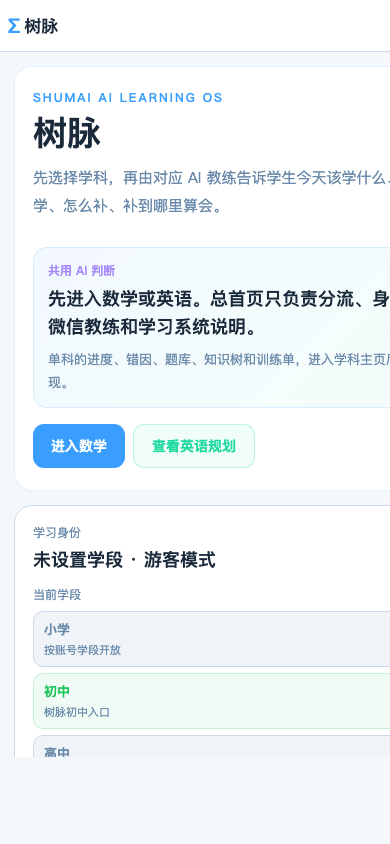


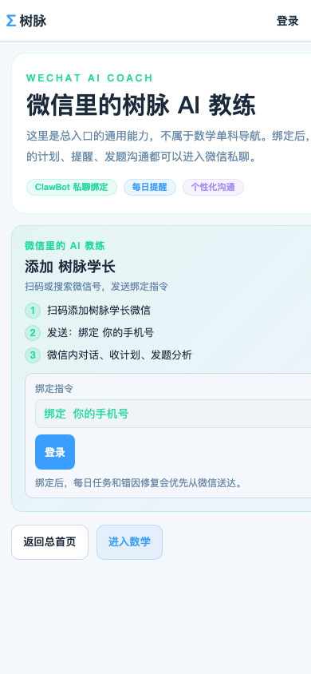

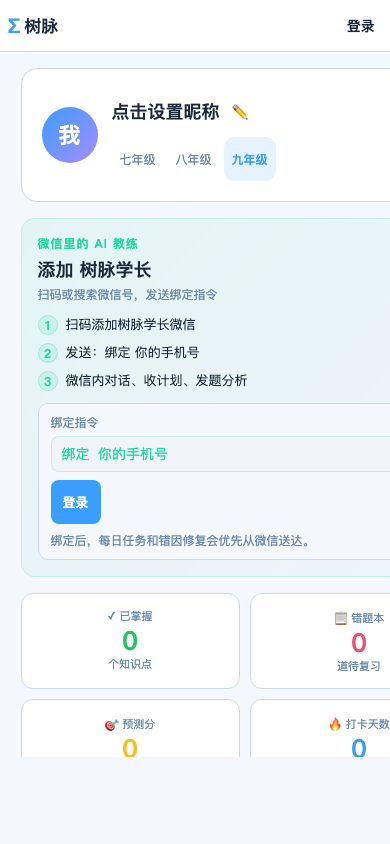

### 本次行动记录

- 复核 `home / english / wechat / me` 四个总入口移动页
- 确认通用页不出现数学底部导航
- 修正首页、英语页移动端文字裁切风险
- 修正总入口手机顶栏右侧挤压风险
- 保持微信 AI / 我的页绑定区窄屏安全
- 运行 `npm run build`，构建通过
- 更新 `tasks.md`
- 更新 `文档/树脉V4界面重建设计规范.md`

### 下一阶段

用真实浏览器响应式模式或手机实机复核 V4.19 总入口壳层，尤其是首页和英语页长文案。

### 下一步

如果真实设备确认无横向裁切，再进入下一个 V4 页面阶段。

### 后几步

- 继续保持总首页只做数学 / 英语双学科入口
- 英语体系后续专题讨论，不提前填太满
- 阶段稳定后再决定是否同步服务器

---

## 42. 2026-05-08：V4.20 总入口真实设备与深色主题复核

这一轮没有继续改功能，也没有急着部署线上，而是把 V4.19 留下的那个疑问认真看完：总入口在真实响应式浏览器里，到底是不是稳定。

V4.19 里，Chrome headless 的 PNG 曾经出现过右侧裁切感，但 DOM 又显示页面已经进入 390px 移动断点。这个矛盾很容易让人误判，所以 V4.20 换成应用内真实浏览器响应式视口 `390×844` 来复核，并同时看浅色和深色主题。

检查的页面是：

- `home`
- `english`
- `wechat`
- `me`

检查的重点是：

- 是否还有真实横向滚动
- 首页长文案是否完整可读
- 英语页标签是否自然换行
- 微信 AI 绑定区是否不挤压
- 我的页数据卡是否不超宽
- 手机端是否没有数学底部导航误入
- 深色主题是否仍然安静、清晰、有未来感
- 登录入口是否清楚但不喧宾夺主

结果是比较让人放心的。8 个组合都没有发现真实横向滚动；尝试横向拖动页面后，可见画面没有水平位移。DOM 快照也确认，总入口页没有出现“今日 / 知识树 / 练题 / 错因”这一组数学底部导航。也就是说，总入口壳层和数学壳层的边界，在手机端已经基本站稳。

浅色主题里，首页长文案可以完整阅读，英语页的标签能自然换行，微信 AI 的绑定指令没有挤压，“我的”页数据卡保持双列但没有超宽。深色主题里，页面没有变成炫技的后台感，仍然是安静、清晰、有方向的 AI 学习入口。

这次没有改 `src/App.jsx`。有时候最好的修复，是确认上一轮修复已经足够，不再为了工具截图里的假象继续打补丁。

截图记录如下：

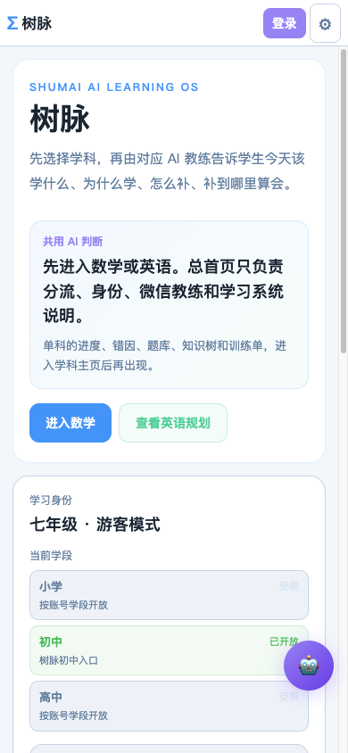

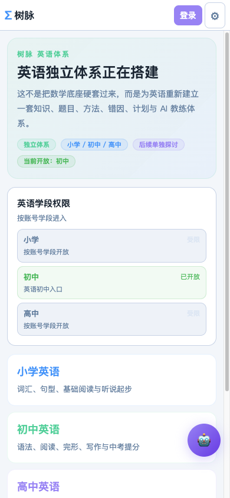

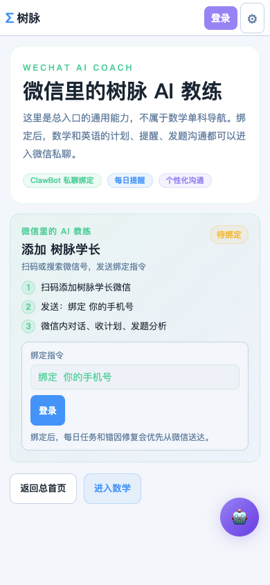

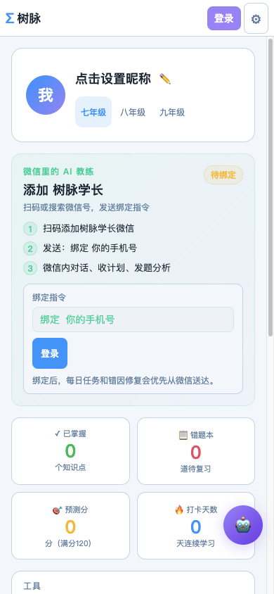

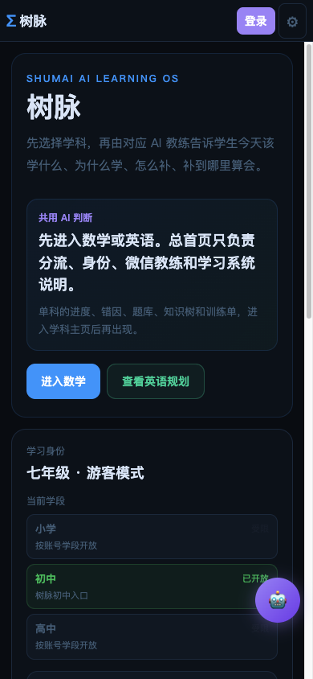

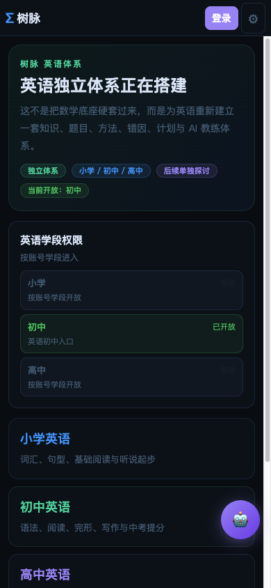

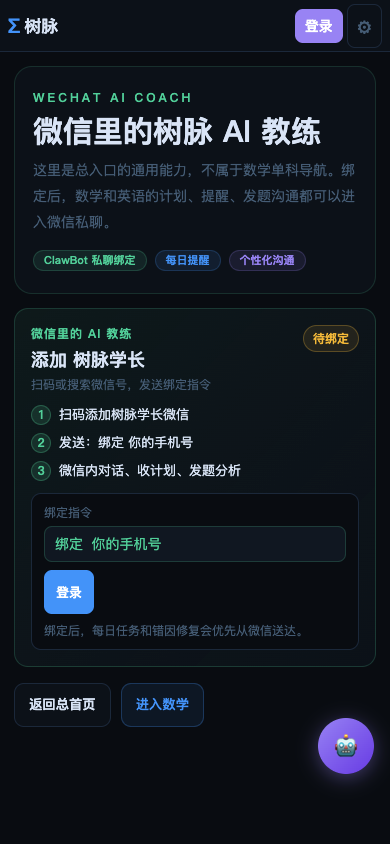

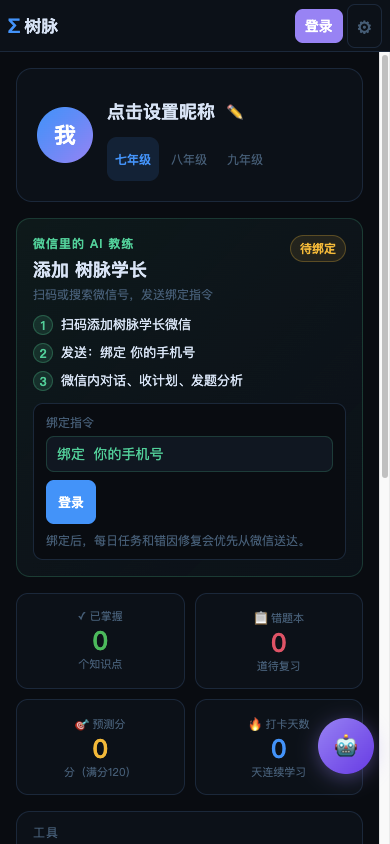

### 本次行动记录

- 启动本地 dev server
- 使用响应式浏览器视口 `390×844` 复核总入口四页
- 覆盖浅色主题和深色主题
- 确认没有真实横向滚动
- 确认总入口手机端没有数学底部导航误入
- 确认微信 AI 绑定区和我的页数据卡窄屏安全
- 保存 8 张 V4.20 关键截图到 `文档/截图记录/`
- 运行 `npm run build`，构建通过
- 更新 `tasks.md`
- 更新 `文档/树脉V4界面重建设计规范.md`

### 下一阶段

服务器同步前检查。

### 下一步

如果用户确认，可以进入部署前本地差异检查和线上同步准备。

### 后几步

- 部署前再跑一次本地构建
- 同步服务器后复查 `https://shumai.cc` 的总首页、英语、微信 AI、我的页
- 继续保持短信验证码暂缓接入，不写腾讯云敏感信息

---

## 43. 2026-05-08：V4.21 服务器同步前检查

这一轮没有直接部署。

V4.14 到 V4.20 已经把树脉总入口、账户中心、英语页、微信 AI 页和移动端壳层都复核到比较稳定的状态。按直觉很容易说“可以同步服务器了”，但真正上线前还要慢一步：先看清本地到底改了什么。

这次检查先读回了 `AGENTS.md`、`tasks.md`、`文档/树脉V4界面重建设计规范.md`、`文档/树脉系统建设记录.md` 和 `文档/重启后继续提示词.md`，确认 V4.21 的边界是服务器同步前检查，而不是继续改 UI，也不是直接部署。

`git status --short` 和 `git diff --stat` 的结果说明，当前工作区并不只是 V4 总入口的前端 UI 改动。主要前端文件 `src/App.jsx` 的确承载了 V4 首页、账户中心、总入口导航和移动端安全布局，但工作区同时还有一批后端、部署脚本、动画、语音、视频子项目和文档截图变更。

这让部署判断变得更清楚，也更需要克制：如果只从 V4.14-V4.20 的目标看，本次线上同步最像是前端静态页面更新；但从真实工作区看，`server/` 目录里已有 TTS、ASR、学习计划、动画补齐、管理端资源统计等后端改动，部署脚本和 PM2 路径也发生过调整。也就是说，不能把当前状态简单说成“只有前端，无需考虑后端”。

检查中还看到几个需要上线前避开的东西：

- `local-notes/` 是本地备忘目录，里面有腾讯云 TTS 配置提示；未发现明文密钥，但它不应该进入仓库或同步范围。
- `video/` 目录约 1GB，属于 AI 视频子项目和依赖内容，不适合混入本次服务器同步。
- `dist-singlefile/` 和 `public/animations/` 是生成产物或动画资产，需要在部署前明确是否纳入本阶段。
- `deploy/deploy.sh`、`deploy/deploy-backend.sh`、`server/ecosystem.config.cjs` 有部署用户、路径和执行方式调整，不能闭眼运行。

敏感信息扫描没有发现明文 SecretId、SecretKey、DeepSeek Key 或真实云密钥。看到的主要是环境变量名、占位值、安全说明和代码里正常读取环境变量的位置。这个结果让人松一口气，但上线前仍要保持原则：腾讯云和 AI Key 只能在服务器环境变量里，不能进入前端、文档或提交记录。

重新运行 `npm run build`，构建通过：

- `dist/index.html` gzip 约 1.39 kB
- `vendor-react` gzip 约 43.95 kB
- `index` 主应用包 gzip 约 97.28 kB
- `data` 数据包 gzip 约 222.85 kB

`git diff --check` 一开始发现 `tasks.md` 有 3 处行尾空格，这类小问题不会影响运行，但会让同步前检查显得不干净，所以已经顺手清理。

这次没有新增 UI 截图，因为 V4.21 的对象不是页面观感，而是上线前的变更范围和风险判断。截图记录继续沿用 V4.20 的 8 张本地真实浏览器复核图。真正需要新增截图的，是 V4.22 如果进入线上同步之后，对 `https://shumai.cc` 做桌面端和手机端复查。

### 本次行动记录

- 读取本阶段必读文档
- 执行 `git status --short`
- 执行 `git diff --stat`
- 抽查 `src/App.jsx`、`tasks.md`、后端文件和部署脚本差异
- 检查 `文档/截图记录/` 中 V4.20 截图文件
- 扫描敏感信息关键词，未发现明文云密钥
- 识别本地临时目录、大型目录和生成产物风险
- 运行 `npm run build`，构建通过
- 清理 `tasks.md` 行尾空格
- 更新 `tasks.md`
- 更新 `文档/树脉系统建设记录.md`

### 当前判断

当前不建议“无脑全量同步”。更稳的方式是把 V4.22 拆成两个选择：

- 如果只想把总入口、账户中心和移动端视觉同步到线上，优先做前端静态部署，并在部署前确认不会把 `local-notes/`、`video/`、未确认后端改动混入流程。
- 如果要把 TTS、ASR、动画、学习计划等后端能力也一起同步，则需要另开后端部署前检查，确认数据库迁移、环境变量、PM2 配置和接口回退策略。

### 下一阶段

等待用户确认是否进入 V4.22 线上同步与复查。

### 下一步

如果用户确认“部署 / 同步服务器”，先按前端静态同步路径执行，并保留后端不重启的默认策略，除非用户明确选择同步后端。

### 后几步

- 线上复查 `https://shumai.cc`
- 复查 `?view=english`、`?view=wechat`、`?view=me`
- 复查 `?auth=login`、`?auth=register`、`?auth=scan`、`?auth=sms`
- 保存线上复查截图到 `文档/截图记录/`
- 回写 V4.22 建设记录

---

## 44. 2026-05-08：V4.22 前端静态同步与线上复查

这一轮终于把 V4.14 到 V4.20 的总入口、账户中心、英语页、微信 AI 页和移动端壳层同步到了线上。

但这次同步没有走“整仓拉代码”。V4.21 已经看清楚了：当前工作区混有前端、文档、截图、后端、TTS/ASR、动画、视频和部署脚本等多阶段变更。如果服务器直接 `git pull`，就会把还没分组验收的后端和生成产物一起带上去。对一个正在内测的学习系统来说，这不是稳妥上线，而是把多个风险绑在一起。

所以 V4.22 只做一件事：同步前端 `dist/` 静态产物，复查线上页面。

开始前重新读取了 `AGENTS.md`、`tasks.md`、`文档/树脉V4界面重建设计规范.md`、`文档/树脉系统建设记录.md` 和 `文档/重启后继续提示词.md`。随后重新执行 `npm run build`，构建通过，生成了新的前端资源：

- `/assets/index-BqO7Cdc5.js`
- `/assets/data-D-iFhHDm.js`
- `/assets/vendor-react-Bpq61jYu.js`
- `/assets/vendor-libs-DYLXRpC5.js`

第一次按旧文档路径备份和覆盖 `/var/www/shumai`。备份成功后，线上复查发现一个关键问题：公网 `https://shumai.cc` 仍然返回旧资源 `/assets/index-BdMvuCdr.js`。继续查 `nginx -T` 后确认，当前 Nginx 实际根目录不是文档里写的 `/var/www/shumai`，而是：

`/opt/shumai/dist`

这一步很重要。它说明不是前端包没上传，也不是后端异常，而是部署文档与线上 Nginx 实际配置发生了漂移。于是没有重启 PM2，也没有动后端，只是按静态同步边界继续处理：额外备份 `/opt/shumai/dist`，再把同一份本地 `dist/` 静态文件同步到 Nginx 实际根目录。

本次服务器备份：

- `/var/www/shumai-backups/shumai-static-20260508-180018.tar.gz`
- `/var/www/shumai-backups/shumai-opt-dist-20260508-180923.tar.gz`

同步后复查，公网首页 HTML 已经指向新资源：

`/assets/index-BqO7Cdc5.js`

`https://shumai.cc/api/health` 返回正常：

`{"status":"ok","name":"树脉后端","version":"1.0.0"}`

这次明确没有执行：

- 没有 `git push`
- 没有服务器 `git pull`
- 没有同步 `server/`
- 没有同步 `local-notes/`
- 没有同步 `video/`
- 没有同步 `public/animations/`
- 没有重启 PM2
- 没有改数据库
- 没有接短信验证码
- 没有登录腾讯云
- 没有写入云密钥

线上复查重点看了总首页、英语页、微信 AI 页和注册弹窗。总首页已经不是数学首页，只负责分流数学 / 英语和说明共用 AI 学习 OS；数学单科进度、错题、知识树等信息没有堆在总首页。英语页和微信 AI 页继续使用通用总入口壳层，没有出现数学底部导航误入。注册弹窗在手机端不横向溢出，验证码入口仍是诚实占位，没有假装短信已经接入。

截图记录如下：

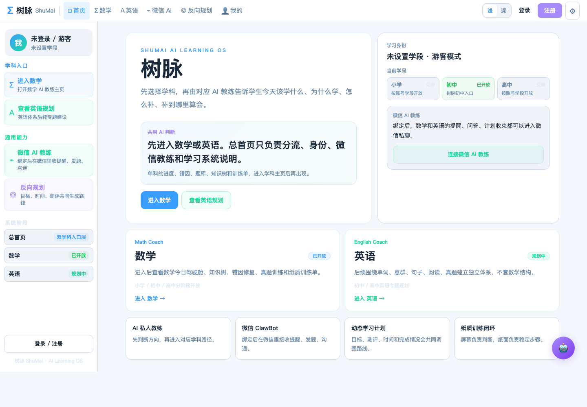

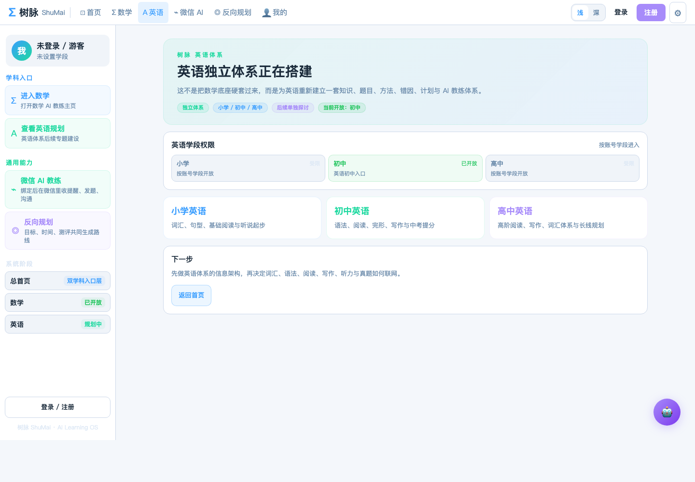

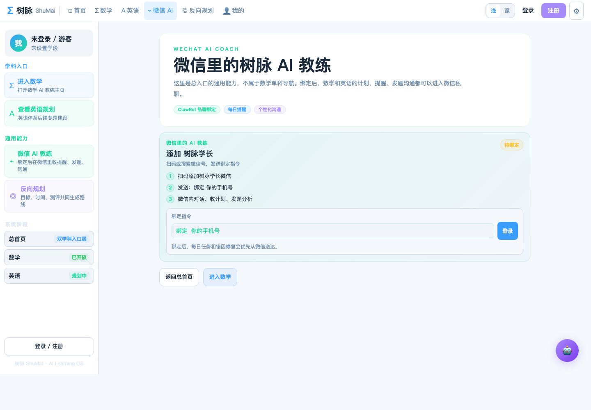


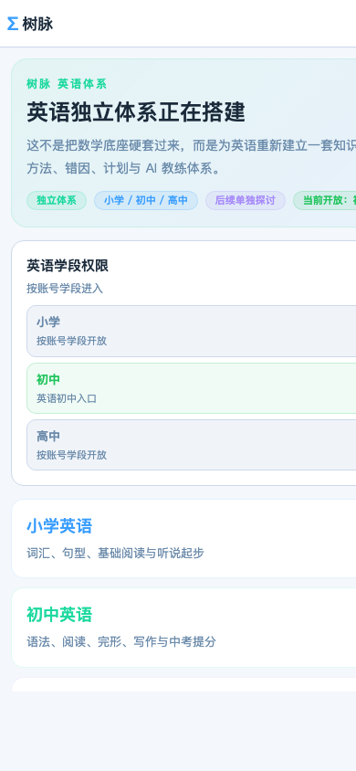

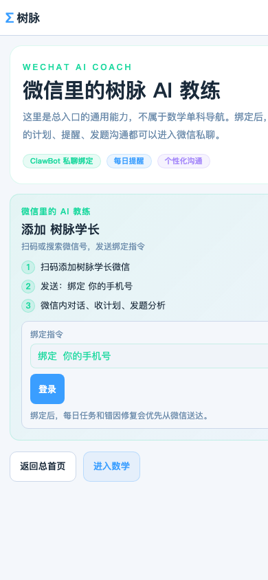

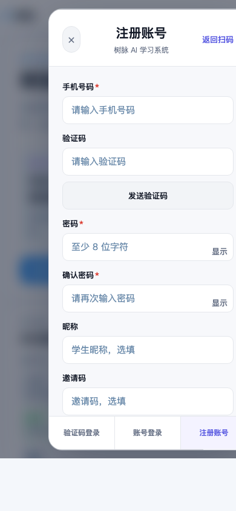

### 本次行动记录

- 读取本阶段必读文档
- 执行 `npm run build`，构建通过
- 检查 `dist/` 文件与生成时间
- 备份 `/var/www/shumai`
- 上传本地 `dist/` 静态文件到服务器临时目录
- 覆盖 `/var/www/shumai`
- 发现公网仍读取旧资源
- 通过 `nginx -T` 确认实际线上根目录为 `/opt/shumai/dist`
- 备份 `/opt/shumai/dist`
- 覆盖 `/opt/shumai/dist`
- 复查公网 HTML 指向新构建资源
- 复查 `/api/health` 正常
- 保存 7 张线上复查截图
- 更新 `tasks.md`
- 更新 `文档/树脉V4界面重建设计规范.md`
- 更新 `文档/树脉系统建设记录.md`

### 当前判断

V4.22 前端静态同步已经完成，线上页面已经进入 V4 总入口状态。

这次最大的收获不是“把页面传上去了”，而是确认了部署事实：线上 Nginx 当前使用 `/opt/shumai/dist`，不是旧文档里的 `/var/www/shumai`。后续部署文档和脚本需要统一，否则每次上线都会多一层误判。

### 下一阶段

V4.23｜本地工作区整理与后端变更分组。

### 下一步

先把当前混在一起的后端、TTS、ASR、动画、SKE 前置想法、部署脚本和本地笔记分组。

### 后几步

- 明确哪些变更可以提交
- 明确哪些只保留本地
- 明确哪些需要暂存或拆出单独阶段
- 为 SKE-1 数据库结构和 API 实施窗口做准备

---

## 45. 2026-05-08：V4.23 本地工作区整理与后端变更分组

V4.22 把前端静态文件稳稳同步到了线上，但真正进入下一步之前，需要先把地面扫清。当前本地工作区不是一个单纯的“前端 UI 改动”，而是几轮探索叠在一起：V4 总入口、账户中心、英语页、微信 AI 页、后端 API、TTS/ASR、压轴题动画、HyperFrames 视频子项目、部署脚本、截图、文档和本地私密笔记都在同一个工作区里。

这一轮按 2号窗口职责，只做本地与服务器相关的执行前整理：检查、分组、记录，不部署，不推送，不重启，不改数据库，也不删除文件。

本阶段运行了 `git status --short`、`git diff --stat`、敏感信息关键词扫描、大目录检查、大文件检查和 `.gitignore` 检查。结论非常明确：当前工作区不适合直接 `git push`，也不适合让服务器 `git pull`。原因不是“代码不能用”，而是边界还没有拆开。如果现在整仓提交或整仓同步，就会把前端稳定成果、后端实验、语音能力、动画定时任务和大型视频工作台一起带出去。

整理报告已写入：

- [V4.23 本地工作区整理报告](V4.23本地工作区整理报告.md)

本轮关键发现：

- V4 前端稳定成果主要集中在 `src/App.jsx`、入口文件、PWA 文件、必要数据文件、V4 文档和截图。
- 后端已有真实行为变化，包括 `server/index.js` 路由挂载、`server/schema.sql` 新表与字段、学习计划、微信绑定、题目 SVG、TTS 使用记录等，必须单独审查。
- TTS / ASR 文件已经成体系出现，包括 `server/api/tts.js`、`server/api/asr.js`、`server/services/tts.js`、`server/services/tencent-sign.js` 和预热脚本，需要独立上线窗口。
- 动画 / 视频能力也已进入后端启动路径和本地生成工作台，其中 `video/` 约 1.0G，不能进入 GitHub 或服务器同步。
- 敏感信息扫描未确认发现明文真实云密钥，但 `local-notes/` 与云服务配置相关，应保持本地私密，不提交、不同步。
- 当前 `.gitignore` 已覆盖 `node_modules/`、`dist/`、`.env`、`.env.*`，但还缺 `local-notes/`、`video/`、`server/cosyvoice/`、`dist-singlefile/` 等风险项。

这一轮的价值，是把“下一步能不能做”变成了清晰答案：能继续，但不能混着做。

### 本次行动记录

- 读取本阶段必读文档
- 查看 `git status --short`
- 查看 `git diff --stat`
- 检查 `.gitignore`
- 扫描敏感信息关键词
- 检查大目录和 50M 以上大文件
- 盘点后端、TTS/ASR、动画和部署脚本风险
- 新增 `文档/V4.23本地工作区整理报告.md`
- 更新 `tasks.md`
- 更新 `文档/树脉系统建设记录.md`

### 当前判断

V4.23 已完成工作区分组。当前不建议直接 GitHub 推送，也不建议服务器整仓 `git pull`。

最稳的下一步，是先补 `.gitignore` 和提交拆分计划，再由 1号总控窗口决定进入：

- SKE-1 教学 Skill 引擎数据库与种子 Skill
- 或 GitHub 提交拆分计划
- 或本地私密文件与大型产物隔离

### 下一阶段建议

先做一个短阶段：`.gitignore` 与提交拆分清单。

### 下一步

建议由 1号总控窗口判断优先级；2号窗口可以继续执行 `.gitignore` 补漏、GitHub 提交拆分、后端部署前审查或 SKE-1 后端实施。

---

## 46. 2026-05-08：V4.24 .gitignore 补漏与提交拆分清单

V4.23 把混在一起的工作区看清了，V4.24 就做一件很小但很重要的事：先把容易误提交、误同步的目录挡住，再把未来的提交拆成清楚的几组。

这一轮仍然按 2号窗口职责执行，只做本地与 GitHub / 服务器同步前的安全边界整理。不提交，不推送，不部署，不重启 PM2，不改数据库，不删除文件。

开始前重新读取了 `AGENTS.md`、`tasks.md`、`文档/树脉V4界面重建设计规范.md`、`文档/树脉系统建设记录.md`、`文档/V4.23本地工作区整理报告.md` 和 `文档/重启后继续提示词.md`。

先检查了当前 `.gitignore`，原本只有：

- `node_modules/`
- `dist/`
- `.DS_Store`
- `*.local`
- `.env`
- `.env.*`

随后检查危险目录是否已被 Git 跟踪。结果显示，`local-notes/`、`video/`、`server/cosyvoice/`、`public/animations/` 和 `dist/` 当前没有跟踪输出；但 `dist-singlefile/` 里已有 5 个文件被 Git 跟踪：

- `dist-singlefile/icon-192.svg`
- `dist-singlefile/icon-512.svg`
- `dist-singlefile/index.html`
- `dist-singlefile/manifest.json`
- `dist-singlefile/sw.js`

所以本轮只补 `.gitignore`，不执行 `git rm --cached`，也不移除任何文件。

本轮新增 `.gitignore` 规则：

- `local-notes/`
- `video/`
- `server/cosyvoice/`
- `dist-singlefile/`
- `*.log`

随后又按“最小安全补漏”要求单独复核了 `video/`。`git ls-files video` 没有输出，说明 `video/` 当前没有被 Git 跟踪；`.gitignore` 中已经有 `video/` 规则，可以防止后续误传 GitHub 或被带入服务器同步流程。本次没有执行 `git rm --cached`，没有删除 `video/`，也没有做任何服务器操作。

接着继续复核其他高风险忽略项。当前 `.gitignore` 已包含：

- `local-notes/`
- `.env`
- `.env.*`
- `*.local`
- `server/cosyvoice/`
- `dist-singlefile/`
- `*.log`
- `.DS_Store`

`git check-ignore` 确认 `local-notes/`、`.env`、`.env.local`、`server/cosyvoice/` 都能命中对应规则。`dist-singlefile/` 因为已有文件被 Git 跟踪，普通 `git check-ignore -v dist-singlefile/` 不输出；用 `git check-ignore -v --no-index dist-singlefile/` 可确认规则本身命中 `.gitignore` 中的 `dist-singlefile/`。

本轮 `git ls-files local-notes server/cosyvoice dist-singlefile .env .env.local` 只显示 `dist-singlefile/` 下 5 个已跟踪文件：

- `dist-singlefile/icon-192.svg`
- `dist-singlefile/icon-512.svg`
- `dist-singlefile/index.html`
- `dist-singlefile/manifest.json`
- `dist-singlefile/sw.js`

本阶段只记录，不执行 `git rm --cached`，不删除文件，不做 Git 提交，也不做服务器操作。

`public/animations/` 暂时没有加入 `.gitignore`。它虽然当前未跟踪、体积也不大，但可能是未来前端要访问的动画资源，不能简单当成垃圾产物处理。这个目录需要等动画 / B 站链接 / 本地生成策略明确后，再决定提交或忽略。

提交拆分清单已写入：

- [V4.24 提交拆分清单](V4.24提交拆分清单.md)

清单把未来提交分为：

- V4 总入口与账户中心前端稳定版
- V4 文档与截图记录
- 部署文档与脚本修正，需单独审查
- 后端稳定功能候选，需单独审查
- TTS / ASR 语音能力，暂缓
- 动画 / 视频 / HyperFrames，暂缓
- SKE 教学 Skill 引擎，后续新阶段

最后又把这份清单补成可执行顺序：每一组都写清目标、候选文件、包含内容和注意事项。特别强调后续不要用 `git add .`，不要把 V4 前端、后端、语音、动画、部署脚本和 SKE 混进一个提交。

当前 `dist-singlefile/` 仍是单独风险点：`.gitignore` 已覆盖它，但 `git ls-files dist-singlefile` 仍显示 5 个已跟踪文件。本阶段不处理，不执行 `git rm --cached`。后续如果确认它已不再用于部署，再单独开任务移出 Git 跟踪；如果仍有用途，则保留并写清用途。

V4.24 到这里完成了三件事：先挡住 `video/`，再复核高风险忽略项，最后产出提交拆分执行顺序。整个阶段没有 `git add`、没有 `git commit`、没有 `git push`、没有 `git rm --cached`、没有删除文件，也没有任何服务器操作。

### 本次行动记录

- 读取本阶段必读文档
- 检查 `.gitignore`
- 检查危险目录 Git 跟踪状态
- 使用 `apply_patch` 最小修改 `.gitignore`
- 新增 `文档/V4.24提交拆分清单.md`
- 更新 `文档/V4.24提交拆分清单.md` 为可执行提交顺序
- 更新 `tasks.md`
- 更新 `文档/树脉系统建设记录.md`

### 当前判断

V4.24 已完成第一层安全挡板。`local-notes/`、`video/`、`server/cosyvoice/` 和未来新增的 `dist-singlefile/` 文件会被 ignore 拦住。

但要注意：`dist-singlefile/` 里已经被跟踪的 5 个文件不会因为 `.gitignore` 自动消失。后续如果决定它们也不应留在版本库，需要另开一个小阶段，先确认，再执行非破坏性的 `git rm --cached`。

### 下一阶段候选

由 1号总控窗口决定：

- SKE-1 教学 Skill 引擎数据库与种子 Skill
- GitHub 提交拆分执行
- 部署脚本修正：以 `nginx -T` 实际 root `/opt/shumai/dist` 为准

---

## 47. 2026-05-08：V4.27 后端变更拆分与风险归档

V4.25 和 V4.26 已经把 V4 前端稳定成果、V4 文档与截图记录拆成两个干净提交，并推送到 GitHub：

- `9b67776 feat: rebuild ShuMai V4 portal and account experience`
- `e90e9fb docs: record V4 portal rollout and deployment findings`

这两个提交已经回到 `origin/main`，没有混入 `server/`、`deploy/`、`video/`、`local-notes/`、`public/animations/`、`server/cosyvoice/`、`dist-singlefile/`。V4.26 没有部署，没有服务器操作，没有重启 PM2，也没有改数据库。

V4.27 接着做剩余工作区归档。本阶段只检查、分类、写文档，不做提交、不推送、不部署、不服务器操作、不重启 PM2、不改数据库、不删除文件。

当前剩余变更仍然是混合状态，主要包括：

- 后端 API、微信 ClawBot、家长端、教师端、管理端资源统计、SVG 缓存等稳定能力候选。
- `server/schema.sql` 中的学习计划、微信上下文、系统配置、SVG 缓存、TTS 用量等数据库变化。
- TTS / ASR 语音能力，包括腾讯云签名、语音合成、语音识别、音频缓存和预热脚本。
- 动画 / HyperFrames 相关能力，包括 `public/animations/`、动画生成器和后端启动路径中的动画定时任务。
- 部署脚本与 PM2 / Nginx 路径认知修正，尤其要继续以 V4.22 发现的线上实际 root `/opt/shumai/dist` 为准。
- SKE 教学 Skill 引擎的战略与交接文档。
- 本地私密目录与绝不提交内容，例如 `local-notes/`、`.env*`、`video/`、`server/cosyvoice/` 和真实密钥。

本阶段已新增报告：

- [V4.27 后端变更拆分报告](V4.27后端变更拆分报告.md)

报告将剩余内容分为七组：

- A组：后端稳定能力候选
- B组：数据库 / schema 变更
- C组：TTS / ASR 语音能力，暂缓
- D组：动画 / HyperFrames / public animations，暂缓
- E组：部署脚本与线上路径修正
- F组：SKE 教学 Skill 引擎前置资料或代码
- G组：本地私密 / 绝不提交内容

敏感信息扫描继续保持克制：本阶段未确认发现明文真实云密钥。扫描结果主要是环境变量名、占位示例、安全说明和从 `process.env` 读取密钥的正常代码。`local-notes/` 继续视为私密目录，不展开、不复制、不提交。

当前需要特别注意两点：

1. `public/animations/` 约 1.4M、89 个文件，可能是未来前端访问资源，也可能改为 B 站链接策略下的可再生成产物，本阶段不提交、不忽略、不删除。
2. `dist-singlefile/` 约 1.1M，已经被 `.gitignore` 覆盖，但其中 5 个文件已被 Git 跟踪。本阶段不执行 `git rm --cached`，后续如要移出版本库，需要单独确认。

V4.27 的判断是：可以进入 SKE-1 的“设计与最小实施准备”，但不建议在当前混合后端状态上直接写大段 SKE 代码。更稳的下一步，要么由总控窗口决定先做 V4.28 后端稳定能力逐文件审查，要么只做 SKE-1 的 schema 草案、30-50 条种子 Skill 和 API 边界设计。

### 本次行动记录

- 读取本阶段必读文档
- 检查 `git status --short`
- 检查 `git diff --name-only`
- 检查 `git diff --stat`
- 复核 `server/`、`deploy/`、`public/animations/`、`dist-singlefile/`、`local-notes/` 等范围
- 做排除私密目录后的敏感关键词扫描
- 新增 `文档/V4.27后端变更拆分报告.md`
- 更新 `tasks.md`
- 更新 `文档/树脉系统建设记录.md`

### 下一阶段候选

由 1号总控窗口决定：

- V4.28 后端稳定能力逐文件审查与安全提交计划
- SKE-1 教学 Skill 引擎数据库结构与种子 Skill
- 部署脚本修正：以 `/opt/shumai/dist` 为线上前端静态 root
- `dist-singlefile/` 已跟踪文件是否移出 Git 跟踪的单独处理

---

## 48. 2026-05-08：V4.28 后端稳定能力逐文件审查与安全提交计划

V4.28 接着 V4.27 做更细的一步：不是只说“后端混在一起”，而是逐文件判断哪些可以进入下一轮安全提交，哪些必须拆小，哪些必须暂缓。

本阶段仍然只审查和写计划，不提交、不推送、不部署、不服务器操作、不重启 PM2、不改数据库、不删除文件。

开始前重新读取了：

- `AGENTS.md`
- `tasks.md`
- `文档/树脉V4界面重建设计规范.md`
- `文档/树脉系统建设记录.md`
- `文档/重启后继续提示词.md`
- `文档/V4.23本地工作区整理报告.md`
- `文档/V4.24提交拆分清单.md`
- `文档/V4.27后端变更拆分报告.md`

随后复核了：

- `git status --short`
- `git diff --name-only`
- `git diff --stat`
- `server/index.js`
- `server/api/*`
- `server/services/*`
- `server/bot.js`
- `server/schema.sql`
- `deploy/*`
- `public/animations/`
- `dist-singlefile/`

本阶段新增报告：

- [V4.28 后端稳定能力审查报告](V4.28后端稳定能力审查报告.md)

最重要的判断是：V4.29 不能做后端整体提交，只能做很窄的低风险后端提交。

可进入 V4.29 的候选：

- `server/api/ai.js`：仅品牌名从“数脉学长”改为“树脉学长”。
- `server/prompts/tutor.js`：品牌统一和语音讲解提示词升级，不依赖 schema。
- `server/api/teacher.js`：新增教师端 `tomorrowAdvice`，属于 additive response，不依赖 TTS / ASR / 动画。

需要拆小后再考虑：

- `server/index.js`：健康检查品牌名可以提交，但当前还挂载了 TTS、ASR、study-plan，并启动动画 cron，不能原样提交。
- `server/package.json`：description 改名可以提交，但动画 / TTS 脚本不能混入。
- `server/api/wechat.js`：绑定文案可以提交，但 `wechat_last_seen`、`wechat_context_token` 依赖 schema。
- `server/bot.js`：品牌和绑定文案可以提交，但保存上下文 token、读取 `study_plans`、主动推送 context token 都要等 schema 和微信实测。
- `server/api/parent.js`：weekly 字段修复可以单独确认，但每日摘要里的 activePlan / advice 依赖 `study_plans`。

必须暂缓：

- `server/schema.sql`
- `server/api/study-plan.js`
- `server/services/daily.js`
- `server/api/admin.js`
- `server/api/svg.js`
- `server/api/tts.js`
- `server/api/asr.js`
- `server/services/tts.js`
- `server/services/tencent-sign.js`
- `server/services/animation-cron.js`
- `server/services/final-animation-generator.js`
- `public/animations/`
- `deploy/*`
- `dist-singlefile/`

这次审查还确认了一个关键风险：`server/index.js` 当前同时引入 TTS、ASR、study-plan，并在后端启动时调用 `setupAnimationCron()`。如果原样上线，会把语音、学习计划和动画定时任务一起带到生产环境，不符合 2核2G 当前稳态策略。

敏感信息扫描未确认发现明文真实云密钥。结果主要是环境变量名、占位示例、示例密码和从 `process.env` 读取密钥的正常代码。`local-notes/` 没有读取，也没有进入报告。

### 本次行动记录

- 读取本阶段必读文档
- 复核当前剩余工作区
- 审查后端稳定候选 diff
- 审查 TTS / ASR 文件
- 审查动画 cron 与生成器
- 审查部署脚本和 PM2 配置
- 审查 `public/animations/` 与 `dist-singlefile/`
- 做排除私密目录后的敏感关键词扫描
- 新增 `文档/V4.28后端稳定能力审查报告.md`
- 更新 `tasks.md`
- 更新 `文档/树脉系统建设记录.md`

### 当前建议

建议先做 V4.29：后端低风险稳定提交计划执行。

V4.29 只纳入：

- `server/api/ai.js`
- `server/prompts/tutor.js`
- `server/api/teacher.js`

可选拆小纳入：

- `server/index.js` 的健康检查品牌名
- `server/package.json` 的 description 品牌名

暂时不要进入 SKE-1 代码实施。先把这几个低风险后端改动沉淀掉，再开 V4.30 做数据库 / schema 迁移拆分计划，之后进入 SKE-1 会更干净。

---

## 49. 2026-05-08：V4.29 后端低风险稳定提交执行

V4.29 开始真正把 V4.28 审查通过的低风险后端成果写入本地 Git 历史。这个阶段非常克制，只提交三份后端文件，不碰后端入口、不碰数据库、不碰语音、不碰动画、不碰部署。

开始前重新读取了：

- `AGENTS.md`
- `tasks.md`
- `文档/树脉V4界面重建设计规范.md`
- `文档/树脉系统建设记录.md`
- `文档/重启后继续提示词.md`
- `文档/V4.27后端变更拆分报告.md`
- `文档/V4.28后端稳定能力审查报告.md`
- `文档/V4.24提交拆分清单.md`

随后复核了当前状态：

- `git status --short`
- `git diff --name-only`
- `git diff --stat`

本轮允许进入后端 commit 的文件只有：

- `server/api/ai.js`
- `server/prompts/tutor.js`
- `server/api/teacher.js`

这三份文件的复核结论：

- 不依赖 `server/index.js` 的新增 TTS / ASR / study-plan / animation cron 挂载。
- 不依赖未部署的 `server/schema.sql`。
- 不依赖 TTS / ASR / 动画服务。
- 不包含真实密钥、token、账号密码。
- 不改变危险线上 API 行为。
- 即使暂不部署，也可以作为干净后端成果沉淀。

其中：

- `server/api/ai.js` 只把学习路径 system prompt 中的“数脉学长”统一为“树脉学长”。
- `server/prompts/tutor.js` 完成品牌统一，并把语音讲解脚本提示词升级为名师式讲解。
- `server/api/teacher.js` 给班级报告增加 `tomorrowAdvice`，属于 additive response，不删除旧字段。

本阶段运行检查：

- `node --check server/api/ai.js`
- `node --check server/prompts/tutor.js`
- `node --check server/api/teacher.js`
- `git diff --check`

三份后端文件语法检查均通过。敏感关键词复核未确认发现明文真实云密钥，看到的是已有 OpenAI SDK 引用和 token 数量参数等正常代码。

本阶段新增记录：

- [V4.29 后端低风险稳定提交记录](V4.29后端低风险稳定提交记录.md)

本阶段明确不提交：

- `server/index.js`
- `server/schema.sql`
- `server/package.json`
- `server/api/wechat.js`
- `server/bot.js`
- `server/api/parent.js`
- `server/api/study-plan.js`
- `server/services/daily.js`
- `server/api/admin.js`
- `server/api/svg.js`
- TTS / ASR
- 动画 / HyperFrames
- `public/animations/`
- `deploy/`
- `dist-singlefile/`
- `local-notes/`
- `.env*`

V4.29 的提交策略是两个本地 commit：

1. `feat: refine low-risk AI tutoring backend modules`
2. `docs: record backend review and low-risk commit boundary`

本阶段不执行 `git push`，不部署，不服务器操作，不重启 PM2，不改数据库，不删除文件。

### 下一阶段候选

由 1号总控窗口决定：

- V4.30：推送 V4.29 两个干净 commit 到 GitHub
- 或 V4.30：数据库 / schema 迁移拆分计划
- 或进入 SKE-1，但建议先把 schema 拆分计划做清楚

---

## 50. 2026-05-08：V4.30 推送 V4.29 干净提交到 GitHub

V4.30 的目标很窄：只把 V4.29 已经拆干净的两个本地 commit 推送到 GitHub，不部署、不碰服务器、不重启后端、不改数据库。

本阶段先复核了：

- 当前分支：`main`
- 本地领先：`main...origin/main [ahead 2]`
- 待推送提交：
  - `c4d06be feat: refine low-risk AI tutoring backend modules`
  - `0546eb0 docs: record backend review and low-risk commit boundary`

推送前确认 `origin/main..HEAD` 只包含：

- `server/api/ai.js`
- `server/api/teacher.js`
- `server/prompts/tutor.js`
- `tasks.md`
- `文档/树脉系统建设记录.md`
- `文档/V4.27后端变更拆分报告.md`
- `文档/V4.28后端稳定能力审查报告.md`
- `文档/V4.29后端低风险稳定提交记录.md`

确认没有包含：

- `server/index.js`
- `server/schema.sql`
- `server/package.json`
- `server/api/wechat.js`
- `server/bot.js`
- `server/api/parent.js`
- `server/api/study-plan.js`
- `server/services/daily.js`
- `server/api/admin.js`
- `server/api/svg.js`
- TTS / ASR
- `public/animations/`
- `deploy/`
- `dist-singlefile/`
- `local-notes/`
- `.env*`

第一次在 Codex 环境中推送时，GitHub 443 端口连接失败；随后用户在本机终端成功执行 `git push origin main`。推送后复核：

- 当前 HEAD：`0546eb0a7852685582584f105a799bf55c5d9d02`
- `main...origin/main` 不再 ahead
- 工作区仍有大量未提交本地变更，这是预期状态，后续继续拆分

本阶段没有部署、没有服务器操作、没有重启 PM2、没有改数据库、没有新增 commit、没有删除文件。

---

## 51. 2026-05-08：V4.31 schema / 数据库变更拆分计划

V4.31 接着做数据库层面的整理。前面 V4.27-V4.29 已经证明，后端不是不能推进，而是必须一根线一根线拆。到了 schema 这一步，更不能急：数据库一旦上线，就不只是代码变更，而是会影响真实学生账号、学习记录、微信绑定、管理端权限和后续迁移路径。

开始前重新读取了：

- `AGENTS.md`
- `tasks.md`
- `文档/树脉V4界面重建设计规范.md`
- `文档/树脉系统建设记录.md`
- `文档/重启后继续提示词.md`
- `文档/V4.27后端变更拆分报告.md`
- `文档/V4.28后端稳定能力审查报告.md`
- `文档/V4.29后端低风险稳定提交记录.md`

本阶段复核了当前剩余工作区：

- `git status --short`
- `git diff --name-only`
- `git diff --stat`

重点审查了：

- `server/schema.sql`
- `server/index.js`
- `server/api/study-plan.js`
- `server/services/daily.js`
- `server/api/parent.js`
- `server/api/admin.js`
- `server/api/svg.js`
- `server/api/wechat.js`
- `server/bot.js`
- `server/api/tts.js`
- `server/api/asr.js`

核心结论：

- 当前 `server/schema.sql` 的未提交 diff 混有多条能力线，不适合整体提交或直接上线。
- `study_plans`、`users.exam_date` 属于反向规划 / 学习计划 / 每日任务链路。
- `users.role` 属于家长端、教师端、管理端权限链路。
- `wechat_context_token`、`wechat_last_seen` 属于微信上下文持久化链路。
- `resource_billing` 属于管理端服务器套餐和 TTS 资源包提醒链路。
- `tts_usage` 属于 TTS 用量和资源统计链路。
- `question_svgs` 表在当前 HEAD 中已经存在，本轮风险主要来自 `server/api/svg.js` 新增的文件缓存和 SVG 直出能力，而不是新增整表。

本阶段新增：

- [V4.31 数据库变更拆分计划](V4.31数据库变更拆分计划.md)

最重要的判断：

SKE-1 不应该建立在当前混合 schema diff 上。SKE-1 最小数据库范围应单独设计两张表：

- `prompt_skills`
- `prompt_skill_events`

它们可以使用现有 `users`、`progress`、`wrong_questions`、`chat_history` 提供上下文，但不需要依赖：

- `study_plans`
- `tts_usage`
- `resource_billing`
- `wechat_context_token`
- `wechat_last_seen`
- SVG 文件缓存改造
- 动画 cron

建议后续新增 `server/migrations/`，把数据库变化拆成独立 migration，而不是继续依赖后端启动时执行整份 `schema.sql`。

建议拆分：

- SKE-1：`prompt_skills` + `prompt_skill_events`
- 学习计划：`study_plans` + `users.exam_date`
- 用户角色：`users.role`
- 微信上下文：`wechat_context_token` + `wechat_last_seen`
- TTS 用量：`tts_usage`
- 资源提醒：`resource_billing`

本阶段没有执行：

- `git add`
- `git commit`
- `git push`
- 服务器操作
- 部署
- PM2 重启
- 数据库连接
- SQL 执行
- 文件删除
- 写入真实密钥、账号、token、SecretId、SecretKey

### 下一阶段建议

优先进入：

- V4.32：SKE-1 最小 migration 与种子 Skill 草案

或者，如果总控希望继续先清工作区：

- V4.32：学习计划数据库与 API 拆分审查

---

## 52. 2026-05-08：V4.32 SKE-1 最小 migration 与种子 Skill 草案

V4.32 开始真正把 SKE-1 从战略文档推进到可落地的技术草案。这个阶段依然非常克制：只做独立 migration 草案和种子 Skill 草案，不执行 SQL，不连接数据库，不部署，不提交，不推送。

开始前重新读取了：

- `AGENTS.md`
- `tasks.md`
- `文档/树脉V4界面重建设计规范.md`
- `文档/树脉系统建设记录.md`
- `文档/重启后继续提示词.md`
- `文档/树脉教学Skill引擎与商业模式设计.md`
- `文档/任务交接卡-SKE教学Skill引擎.md`
- `文档/V4.31数据库变更拆分计划.md`

本阶段先复核当前工作区：

- `git status --short`
- `git diff --name-only`
- `git diff --stat`

随后确认 SKE-1 的最小边界：

- 不改 `server/schema.sql`
- 不碰 `study_plans`
- 不碰 TTS / ASR
- 不碰 SVG
- 不碰微信上下文
- 不碰动画 cron
- 不碰线上数据库

本阶段新增 migration 草案：

- `server/migrations/20260508_ske_minimal.sql`

该 migration 只包含两张表：

- `prompt_skills`
- `prompt_skill_events`

并包含必要索引：

- Skill 按学科、学段、知识点、场景、状态查找
- Skill 按类型和权重排序
- Skill 按方法标签查询
- 事件按用户、Skill、题目、事件类型查询

本阶段新增种子 Skill 草案：

- `server/seeds/prompt_skills_seed.json`

种子数量：

- 41 条

已做校验：

- JSON 解析通过
- `skill_key` 无重复

这些种子 Skill 聚焦初中数学，不做英语。覆盖：

- 概念修复
- 审题拆解
- 计算纠错
- 方法提示
- 变式训练
- 真题迁移
- 向下补差
- 向上提升
- 压轴分层
- 错因复盘

同时覆盖树脉数学根基：

- 基础知识
- 基础题
- 题组训练
- 压轴题组
- 10 年中考真题
- 23 种方法
- 向上提升
- 向下补差
- 题目、方法、错因、知识点、真题之间的网状关联

本阶段新增文档：

- [V4.32 SKE-1 最小 migration 与种子 Skill 草案](V4.32-SKE1最小migration与种子Skill草案.md)

关键判断：

SKE-1 不是提示词大全，而是让系统开始记录“哪一种引导对哪一类学生、哪一类题、哪一个错因有效”。因此两张表就足够启动最小闭环：

- `prompt_skills` 保存教学策略
- `prompt_skill_events` 记录展示、点击、调用、反馈

未来推荐逻辑可以从题目、知识点、方法、错因、学生状态和场景中选择 Skill。第一版不需要复杂模型，先按 `topic_code`、`method_code`、`scene`、`question_type`、`weight` 做可解释推荐。

本阶段没有执行：

- SQL
- 数据库连接
- 线上数据库修改
- 部署
- 服务器操作
- PM2 重启
- `git add`
- `git commit`
- `git push`
- `server/schema.sql` 修改
- TTS / ASR / 动画 / study-plan / SVG / 微信上下文改动
- 真实密钥、账号、token 写入

### 下一阶段建议

建议进入：

- V4.33：SKE-1 推荐 API 与事件记录最小实现

建议 V4.33 只新增后端 API 和 service 草案：

- `server/api/skills.js`
- `server/services/prompt-skills.js`

先实现：

- 推荐 3 条 Skill
- 记录 `impression`
- 记录 `click`

暂时不接前端、不接 `/api/ai/skill`、不部署。

---

## 53. 2026-05-08：V4.33 SKE-1 推荐 API 与事件记录最小实现

V4.33 把 SKE-1 往“后端可调用”推进了一步，但仍然没有碰线上系统。这个阶段只新增 service 和 API Router 文件，不挂载、不执行 SQL、不部署。

开始前重新读取了：

- `AGENTS.md`
- `tasks.md`
- `文档/树脉V4界面重建设计规范.md`
- `文档/树脉系统建设记录.md`
- `文档/重启后继续提示词.md`
- `文档/树脉教学Skill引擎与商业模式设计.md`
- `文档/任务交接卡-SKE教学Skill引擎.md`
- `文档/V4.31数据库变更拆分计划.md`
- `文档/V4.32-SKE1最小migration与种子Skill草案.md`

本阶段先复核当前工作区：

- `git status --short`
- `git diff --name-only`
- `git diff --stat`

新增文件：

- `server/services/prompt-skills.js`
- `server/api/skills.js`
- `文档/V4.33-SKE1推荐API与事件记录实现记录.md`

`server/services/prompt-skills.js` 做了四件事：

- 标准化推荐参数。
- 优先从 `prompt_skills` 数据库表读取 Skill。
- 数据库不可用或表尚未迁移时，降级读取 `server/seeds/prompt_skills_seed.json`。
- 支持记录 `prompt_skill_events`，数据库不可用时降级为 no-op。

`server/api/skills.js` 提供 Router 草案：

- `POST /recommend`
- `POST /event`

后续挂载方式写在文档里，但本阶段没有修改 `server/index.js`：

```js
import skillsRouter from './api/skills.js';
app.use('/api/skills', skillsRouter);
```

推荐 API 的设计目标：

- 输入 `topic_code`、`question_id`、`question_type`、`stage`、`error_type`、`student_state`、`scene`、`limit`
- 返回 3 条 Skill
- 返回 `source: db` 或 `source: seed`
- 返回简短 `reason`

事件 API 的设计目标：

- 支持 `impression`
- 支持 `click`
- 可用 `skill_key` 或 `skill_id` 定位 Skill
- 数据库不可用时返回 `stored:false`，而不是让接口崩溃

本阶段运行检查：

- `node --check server/services/prompt-skills.js`
- `node --check server/api/skills.js`
- service seed fallback 导入验证
- `git diff --check`

结果：

- 两个新增 JS 文件语法检查通过。
- 本地 PostgreSQL 不可用时，service 成功从 seed 返回 3 条 Skill。
- `git diff --check` 通过。

本阶段明确没有做：

- 没有修改 `server/index.js`
- 没有挂载 `/api/skills`
- 没有修改 `server/schema.sql`
- 没有执行 migration
- 没有连接线上数据库
- 没有修改线上数据库
- 没有接前端
- 没有接 `/api/ai/skill`
- 没有接 TTS / ASR
- 没有接动画
- 没有接 study-plan
- 没有接 SVG
- 没有接微信上下文
- 没有部署
- 没有服务器操作
- 没有 PM2 重启
- 没有 `git add`
- 没有 `git commit`
- 没有 `git push`

### 下一阶段建议

有两个稳妥选择：

1. V4.34：SKE-1 路由挂载与本地 API 验证
   - 只修改 `server/index.js` 挂载 `skillsRouter`
   - 本地验证 seed fallback
   - 不部署
   - 不执行线上 SQL

2. V4.34：提交 V4.31-V4.33 SKE 草案与最小 API
   - 先把干净的 SKE 草案、service/API 和文档提交到 GitHub
   - 再进入挂载和本地验证

---

## 54. 2026-05-08：V4.34 提交 V4.31-V4.33 SKE 草案与最小 API

V4.34 的目标是把 V4.31-V4.33 中已经拆干净的 SKE 草案和最小后端骨架形成一个独立 commit，方便后续继续推进挂载和验证。

本阶段提交：

- `554828f feat: add minimal SKE skill recommendation backend`

提交范围：

- `server/migrations/20260508_ske_minimal.sql`
- `server/seeds/prompt_skills_seed.json`
- `server/services/prompt-skills.js`
- `server/api/skills.js`
- `tasks.md`
- `文档/树脉系统建设记录.md`
- `文档/V4.31数据库变更拆分计划.md`
- `文档/V4.32-SKE1最小migration与种子Skill草案.md`
- `文档/V4.33-SKE1推荐API与事件记录实现记录.md`

提交前已复核：

- `node --check server/services/prompt-skills.js`
- `node --check server/api/skills.js`
- `git diff --check`

确认没有提交：

- `server/index.js`
- `server/schema.sql`
- `server/package.json`
- `server/api/study-plan.js`
- `server/services/daily.js`
- TTS / ASR
- 动画
- SVG
- 微信上下文
- 部署脚本
- `public/animations/`
- `dist-singlefile/`
- `local-notes/`
- `.env*`

本阶段没有执行 SQL、没有连接线上数据库、没有部署、没有服务器操作、没有重启 PM2、没有 push。

---

## 55. 2026-05-08：V4.35 推送 SKE 最小后端骨架到 GitHub

V4.35 的目标很窄：只把 V4.34 的一个干净 commit 推送到 GitHub。

推送前确认：

- 当前分支：`main`
- 待推送 commit：`554828f feat: add minimal SKE skill recommendation backend`
- 文件范围只包含 SKE migration、seed、service/API 和阶段文档
- 禁止路径过滤未命中 `server/index.js`、`server/schema.sql`、TTS / ASR、部署脚本、动画、私密目录等高风险内容

已推送到：

- `origin/main`

推送后的 HEAD：

- `554828f7a2323c35c1f13d7b2921a11fd0c6167b`

推送后复核：

- `main...origin/main` 不再 ahead
- `origin/main..HEAD` 无输出

本阶段没有新增 commit、没有部署、没有服务器操作、没有 `git pull`、没有重启 PM2、没有改数据库、没有删除文件。

---

## 56. 2026-05-08：V4.36 /api/skills 本地挂载验证

V4.36 进入 `/api/skills` 的本地验证。这个阶段最重要的工程判断是：不直接修改 `server/index.js`。

原因是 V4.28 / V4.31 已确认 `server/index.js` 当前混有多条高风险能力线，包括 TTS / ASR、study-plan、动画 cron 等。如果直接提交 `server/index.js`，容易把不该上线的能力一起带入后续同步流程。

因此本阶段新增独立验证脚本：

- `server/scripts/verify-skills-api.js`

脚本创建本地临时 Express app，将 `skillsRouter` 挂载到 `/api/skills`，使用本地短期测试 JWT 调用接口，验证完成后自动关闭临时服务。

本阶段验证结果：

- `POST /api/skills/recommend`
  - HTTP 200
  - `source: seed`
  - 返回 3 条 Skill：
    - `math_topic_quadratic_function_breakthrough_001`
    - `math_topic_function_image_reading_001`
    - `math_common_hint_first_step_001`
- `POST /api/skills/event`，`event_type=impression`
  - HTTP 200
  - `ok:true`
  - `stored:false`
- `POST /api/skills/event`，`event_type=click`
  - HTTP 200
  - `ok:true`
  - `stored:false`

`stored:false` 是当前预期行为：本地 PostgreSQL 未连接或 SKE 表尚未迁移时，事件记录降级为 no-op，不阻断前端未来展示和点击流程。

已运行：

- `node --check server/scripts/verify-skills-api.js`
- `node --check server/api/skills.js`
- `node --check server/services/prompt-skills.js`
- `node server/scripts/verify-skills-api.js`

说明：

- 沙盒内首次监听 `127.0.0.1` 临时端口被权限限制拦截。
- 随后按 Codex 权限流程，仅对 `node server/scripts/verify-skills-api.js` 提权运行。
- 提权只用于本机临时端口验证，没有服务器操作。

本阶段新增文档：

- [V4.36 SKE-1 本地挂载验证记录](V4.36-SKE1本地挂载验证记录.md)

本阶段没有修改 `server/index.js`，没有修改 `server/schema.sql`，没有执行 SQL，没连接线上数据库，没有部署，没有服务器操作，没有重启 PM2，没有 push，没有接前端，没有写入真实密钥、账号或 token。

### 下一阶段建议

优先进入：

- V4.37：SKE 路由干净挂载方案设计

目标是只设计如何最小修改 `server/index.js` 挂载 `/api/skills`，继续隔离 TTS / ASR、study-plan、动画 cron、SVG、微信上下文。

---

## 57. 2026-05-08：V4.37 提交 SKE 本地验证脚本与记录

V4.37 的目标是把 V4.36 的本地验证脚本和记录沉淀为一个干净 commit，不 push、不部署。

本阶段创建本地 commit：

- `0adcf09 test: add local verification for SKE skills API`

提交范围：

- `server/scripts/verify-skills-api.js`
- `文档/V4.36-SKE1本地挂载验证记录.md`
- `tasks.md`
- `文档/树脉系统建设记录.md`

提交前确认：

- `node --check server/scripts/verify-skills-api.js` 通过
- `git diff --check` 通过
- staged 文件只有允许清单
- 禁止路径过滤没有命中高风险文件

确认没有提交：

- `server/index.js`
- `server/schema.sql`
- TTS / ASR
- study-plan
- SVG
- 微信
- deploy
- `public/animations/`
- `dist-singlefile/`
- `local-notes/`
- `.env*`

本阶段没有 push、没有部署、没有服务器操作、没有重启 PM2、没有执行 SQL、没有修改数据库、没有删除文件。

---

## 58. 2026-05-08：V4.38 推送 SKE 本地验证 commit 到 GitHub

V4.38 只把 V4.37 的一个干净 commit 推送到 GitHub。

推送前复核：

- 当前分支：`main`
- 待推送 commit：`0adcf09 test: add local verification for SKE skills API`
- 文件范围只包含：
  - `server/scripts/verify-skills-api.js`
  - `文档/V4.36-SKE1本地挂载验证记录.md`
  - `tasks.md`
  - `文档/树脉系统建设记录.md`

确认没有包含：

- `server/index.js`
- `server/schema.sql`
- TTS / ASR
- study-plan
- SVG
- 微信
- deploy
- `public/animations/`
- `dist-singlefile/`
- `local-notes/`
- `.env*`

已推送到：

- `origin/main`

推送后的 HEAD：

- `0adcf09a3e986c0657c95fc08bb2113cbfa4551d`

推送后 `main...origin/main` 已同步，不再 ahead。本阶段没有新增 commit、没有部署、没有服务器操作、没有 `git pull`、没有重启 PM2、没有执行 SQL、没有修改数据库、没有删除文件。

---

## 59. 2026-05-08：V4.39 /api/skills 干净挂载实现与本地验证

V4.39 的目标是把 SKE-1 的 `/api/skills` 真正挂到 `server/index.js`，但必须避开 `server/index.js` 当前已有的高风险混合改动。

开始前重新读取了：

- `AGENTS.md`
- `tasks.md`
- `文档/树脉系统建设记录.md`
- `文档/V4.28后端稳定能力审查报告.md`
- `文档/V4.31数据库变更拆分计划.md`
- `文档/V4.33-SKE1推荐API与事件记录实现记录.md`
- `文档/V4.36-SKE1本地挂载验证记录.md`

本阶段复核了：

- `git status --short`
- `git diff --name-only`
- `git diff --stat`
- `git diff -- server/index.js`
- `server/api/skills.js`
- `server/services/prompt-skills.js`

关键判断：

`server/index.js` 当前仍是高风险混合文件，里面已有未提交的 TTS / ASR、study-plan、动画 cron、品牌文案等改动。它不能整体提交。

本阶段只允许新增两处 `/api/skills` 相关改动：

```js
import skillsRouter from './api/skills.js';
```

```js
app.use('/api/skills', skillsRouter);
```

本阶段没有启动真实 `server/index.js`，因为当前工作区里的真实入口仍包含动画 cron 等未拆逻辑。为了验证 `/api/skills`，继续使用 V4.36 的本地临时验证脚本：

- `server/scripts/verify-skills-api.js`

验证结果：

- `POST /api/skills/recommend`
  - HTTP 200
  - `source: seed`
  - 返回 3 条 Skill：
    - `math_topic_quadratic_function_breakthrough_001`
    - `math_topic_function_image_reading_001`
    - `math_common_hint_first_step_001`
- `POST /api/skills/event`，`event_type=impression`
  - HTTP 200
  - `ok:true`
  - `stored:false`
- `POST /api/skills/event`，`event_type=click`
  - HTTP 200
  - `ok:true`
  - `stored:false`

`stored:false` 是当前预期行为：本地数据库不可用或 SKE 表尚未迁移时，事件记录降级为 no-op。

已运行：

- `node --check server/index.js`
- `node --check server/api/skills.js`
- `node --check server/services/prompt-skills.js`
- `node server/scripts/verify-skills-api.js`
- `git diff --check`

本阶段新增文档：

- [V4.39 SKE-1 路由干净挂载与验证记录](V4.39-SKE1路由干净挂载与验证记录.md)

提交策略：

- 允许提交 `server/index.js`，但只能提交 `/api/skills` 两行挂载。
- 不能用普通 `git add server/index.js` 整体暂存。
- 需要用部分暂存方式，确保 TTS / ASR、study-plan、动画 cron 等已有改动不进入本轮 commit。

本阶段没有部署、没有服务器操作、没有重启 PM2、没有执行 SQL、没有修改数据库、没有 push、没有提交 `server/schema.sql`、没有提交 TTS / ASR、没有提交 study-plan / daily / admin / svg / wechat / parent / bot、没有提交 deploy、没有提交动画和私密目录。

### 下一阶段建议

如果 V4.39 已形成干净本地 commit，下一阶段进入：

- V4.40：推送 SKE 路由挂载 commit 到 GitHub

推送前必须复核 `origin/main..HEAD` 只包含：

- `server/index.js` 的 `/api/skills` 两行挂载
- `文档/V4.39-SKE1路由干净挂载与验证记录.md`
- `tasks.md`
- `文档/树脉系统建设记录.md`

---

## 60. 2026-05-08：提问斜杠与树脉搜索进入 SKE 路线

今天在总控窗口讨论了两个学生端入口级能力：

1. 提问斜杠
2. 树脉搜索

这两个能力都不是普通小功能。

提问斜杠的判断：

学生在题目询问框里输入 `/`，系统弹出 3-5 条动态提问词。它不是快捷提示词菜单，而是学生卡住时的思维扶手。系统根据题目、知识点、错因、学生基础、历史点击效果和 SKE Skill 权重，推荐最可能让学生开窍的问法。

首版交互决定采用下拉式：

- 桌面端贴着输入框下方出现
- 手机端贴着输入框上方出现
- 暂不采用卷帘式或瀑布式，避免打断做题节奏

典型提问词包括：

- 先提醒我第一步
- 帮我找题眼
- 我卡在哪个知识点
- 给我一个不直接泄答案的提示
- 换一道同类题练一下

长期目标：

- 展示记录为 `impression`
- 点击记录为 `click`
- AI 调用记录为 `ai_used`
- 有帮助反馈记录为 `helpful`
- 后续根据学生基础、错因、题型和效果反馈动态调整提问词排序

树脉搜索的判断：

树脉需要搜索，但不做普通资料站搜索。搜索栏应成为学生和家长进入系统的第二入口：

- 第一入口：今日学习驾驶舱，系统告诉学生今天最该做什么
- 第二入口：树脉搜索，学生主动寻找知识点、题目、方法、错因、真题和 AI 问法

树脉搜索未来支持：

- 知识点
- 题目
- 方法
- 错因
- 真题
- 学习路径
- AI 问法

成熟形态不是返回资料列表，而是返回补法建议：

- 当前最该补的节点
- 基础题
- 题组训练
- 中考真题
- 相关错因
- 可直接问 AI 的提问词
- 是否加入今日任务

本次已更新：

- `tasks.md`
- `文档/树脉教学Skill引擎与商业模式设计.md`
- V4.40 已将 `/api/skills` 路由挂载 commit `ee4259a` 推送到 GitHub，本轮没有部署、没有服务器操作、没有数据库变更。

任务路线新增：

- SKE-4：题目页引导气泡与提问斜杠
- SKE-4.1：提问斜杠权重回流
- SKE-4.2：树脉搜索接入 SKE
- V4.42：提问斜杠产品设计
- V4.43：题目页提问斜杠前端最小版
- V4.44：提问词事件记录与权重回流
- V4.45：树脉搜索产品设计
- V4.46：树脉搜索最小版
- V4.47：树脉搜索 AI 化

这次决策的意义：

SKE 不应只是后端推荐 API。它必须在学生真正卡住的瞬间出现。提问斜杠负责把教学 Skill 变成可点击的思维扶手，树脉搜索负责把主动检索变成回到学习路径的入口。两者一起，把树脉从“能回答问题”推向“能引导学生问对问题、走对路径”。

---

## 61. 2026-05-08：V4.41 `/api/ai/skill` 最小实现

今天继续把 SKE 往真正可用的 AI 回答推进了一步。

前面 V4.33 已经能推荐 Skill，V4.39 已经把 `/api/skills` 挂到后端主入口。V4.41 做的是中间最关键的一段：让 AI 回答不再只是普通聊天，而是能带着一个具体教学 Skill 去回答学生。

本阶段新增：

- `server/services/ai-skill.js`
- `POST /api/ai/skill`
- `文档/V4.41-SKE1C-ai-skill最小实现记录.md`

接口逻辑：

- 如果前端传入 `skill_key`，优先使用指定 Skill。
- 如果没有传入 `skill_key`，后端调用 SKE 推荐逻辑选 1 条最合适 Skill。
- 如果数据库不可用或 SKE 表尚未迁移，继续使用 seed Skill fallback。
- 将 Skill 内容、题目信息、错因、学生状态和树脉学长学生画像组合成系统提示词。
- DeepSeek Key 未配置或 AI 服务不可用时，接口返回本地降级提示，不让前端流程崩死。

这一步的意义：

树脉开始从“推荐你可以这样问”进入“真的按这个问法回答”。Skill 不再只是前台按钮或提示词库，而是进入 AI 调用链路，成为一次讲解、提示、追问或错因判断的教学策略。

本阶段仍然保持边界：

- 没有 push
- 没有部署
- 没有服务器操作
- 没有重启 PM2
- 没有执行 SQL
- 没有修改数据库
- 没有修改 `server/schema.sql`
- 没有接 TTS / ASR
- 没有接动画
- 没有接前端

下一步建议：

- 先本地验证 `/api/ai/skill` 的三种情况：指定 Skill、自动推荐 Skill、AI Key 缺失 fallback。
- 验证通过后再单独 push。
- 前端“你可以这样问”和提问斜杠继续单独阶段推进。

---

## 62. 2026-05-08：V4.42 `/api/ai/skill` 本地验证

今天没有继续加功能，而是把 V4.41 刚做好的 `/api/ai/skill` 拉到本地临时 Express app 里验证。

本阶段新增：

- `server/scripts/verify-ai-skill-api.js`
- `文档/V4.42-SKE1C-ai-skill本地验证记录.md`

验证脚本没有启动真实 `server/index.js`，也没有连接线上服务器。它只在本机开一个临时端口，挂载 `aiRouter` 到 `/api/ai`，用测试 JWT 请求 `POST /api/ai/skill`。

为了验证“数据库尚未迁移也能工作”，脚本临时 mock 了本地 `pool.query`：

- 学生画像查询返回测试数据
- `prompt_skills` 查询故意抛出“表不可用”
- DeepSeek Key 刻意置空

这样可以确认两个关键降级路径：

1. SKE 表不可用时，从 seed Skill 选中教学 Skill。
2. AI Key 不存在时，返回本地降级回答，而不是让接口崩掉。

验证结果：

- 指定 `skill_key=math_topic_quadratic_function_breakthrough_001`：HTTP 200，`ok:true`，命中 seed Skill，返回降级回答。
- 不传 `skill_key`，按 `quad_fn` 和 `stuck_before_solution` 自动推荐：HTTP 200，命中 `math_topic_quadratic_function_breakthrough_001`。
- `question` 为空：HTTP 400，返回 `缺少问题内容`。
- 未知 `topic_code`：HTTP 200，退回通用 `math_common_hint_first_step_001`。

已运行：

- `node --check server/scripts/verify-ai-skill-api.js`
- `node --check server/api/ai.js`
- `node --check server/services/ai-skill.js`
- `node --check server/services/prompt-skills.js`
- `node server/scripts/verify-ai-skill-api.js`
- `git diff --check`

这一步的意义：

SKE 的第一条后端链路已经开始闭环：推荐 Skill、使用 Skill 调 AI、AI 不可用时降级、缺参时清晰报错。它还没有接前端，也没有进线上数据库，但它已经有了产品骨骼。

本阶段仍然保持边界：

- 没有 push
- 没有部署
- 没有服务器操作
- 没有重启 PM2
- 没有执行 SQL
- 没有修改数据库
- 没有提交高风险后端文件

下一步建议：

- V4.43：推送 V4.41-V4.42 三个干净 commit 到 GitHub。
- 推送后再进入提问斜杠产品设计或前端最小接入。

---

## 62. 2026-05-08：AI 产品范式参考的总控校准

0号战略窗口补充了 Tabbit AI 浏览器带来的产品启发。1号总控窗口重新判断后，决定保留其中有价值的底层范式，但弱化外部产品名，避免树脉跑偏成浏览器或通用 AI 工具。

保留的核心判断：

- 未来 AI 产品竞争不是模型本身，而是上下文、Skill、自动执行和记忆系统的组合。
- 树脉不做浏览器，但要让当前题目、知识点、错因、学习目标自动进入 AI 上下文。
- 学生端不暴露 Prompt、Skill、API Key 等技术词，而是使用“你可以这样问”“给我一个突破口”“学长妙招”等学习动作语言。
- AI 不只回答题目，还要逐步执行学习任务：今日任务、错因修复路径、纸质训练单、家长建议、教师建议。
- 树脉的长期定位是学习场景里的 AI 教练操作系统。

本次调整：

- 将 `文档/树脉教学Skill引擎与商业模式设计.md` 中的章节标题从“Tabbit AI 浏览器带来的产品启发”改为“AI 产品范式带来的启发”。
- 将 Tabbit 明确降级为观察样本，而不是树脉要模仿的产品形态。
- 将 `文档/任务交接卡-SKE教学Skill引擎.md` 中的“产品参考提醒”改为“AI 产品范式提醒”。
- 补充说明：提问斜杠和树脉搜索是这个范式在学生端的两个入口，一个负责卡住时怎么问，一个负责主动寻找补法。

这次校准的意义：

树脉可以学习先进 AI 产品的范式，但必须坚持自己的教育目标。我们吸收的是上下文自动化、Skill 调度、任务执行和记忆沉淀，不吸收浏览器外壳，也不把学生端做成模型超市。

---

## 63. 2026-05-08：V4.44 提问斜杠产品设计与交互规格

今天没有改前端代码，而是先把“提问斜杠”这件事讲清楚。

V4.41 / V4.42 已经让后端具备了 `/api/skills/recommend`、`/api/skills/event` 和 `/api/ai/skill` 的基础能力。V4.44 解决的是学生端怎么把这些能力变成一个自然、安静、不打扰做题节奏的交互。

本阶段新增：

- `文档/V4.44提问斜杠产品设计与交互规格.md`

核心结论：

- 提问斜杠不是普通快捷菜单，而是 SKE 在学生卡住时递出的“思维扶手”。
- 学生在题目 AI 输入框输入 `/` 后，出现 3-5 条动态提问词。
- 首版采用下拉式菜单，不做卷帘式、不做瀑布式、不做全屏浮层。
- 桌面端贴着输入框下方出现，手机端优先贴着输入框上方出现，避免被键盘遮挡。
- 点击提问词后直接发送，不再让学生多点一次发送按钮。
- 展示时记录 `impression`，点击时记录 `click`，后续预留 `ai_used`、`helpful`、`not_helpful`。
- 数据库不可用时允许 seed fallback，不阻断学生提问。

前端落点建议：

- 优先查 `src/App.jsx` 中的 `AskTutor`。
- 再看 `PageDetail` 和 `PagePractice` 中的复用位置。
- 首版抽一个轻量 `SlashPromptMenu` 小组件。
- 不大改题目详情页和真题刷题页整体布局。

本阶段没有：

- 修改 `src/App.jsx`
- 修改后端代码
- `git add`
- `git commit`
- `git push`
- 部署
- 服务器操作
- 执行 SQL
- 修改数据库

下一步建议：

- V4.45：按规格进入前端最小实现。
- 重点验证题目详情页、真题解析区、移动端键盘场景、深浅主题和无横向滚动。

---

## 64. 2026-05-08：V4.45 提问斜杠前端最小实现

今天把 V4.44 里写清楚的“提问斜杠”，放进了真实题目教练场。

这一步没有重建题目页，也没有把页面做成新的大面板，而是选择了最小、最稳的落点：`AskTutor` 的追问输入框。学生已经在看题、已经打开“问学长”，这时输入 `/`，系统递出 3-5 条可以直接点击的问法。

本阶段实现：

- 在 `src/App.jsx` 新增 `SlashPromptMenu`。
- 在 `AskTutor` 的追问输入框里监听 `/`。
- 优先调用 `POST /api/skills/recommend` 获取推荐提问词。
- 推荐接口失败或未登录时，用本地 5 条 fallback 问法兜底。
- 点击提问词后直接调用 `POST /api/ai/skill`。
- 点击后关闭菜单、清空 `/`，不要求学生再点一次发送。
- `POST /api/skills/event` 已接入 `impression` 和 `click`，失败不阻断 AI 回答。

首版 fallback 问法：

- 先提醒我第一步
- 帮我找题眼
- 我卡在哪个知识点
- 给我一个不直接泄答案的提示
- 换一道同类题练一下

视觉验证里发现一个很有价值的小问题：

手机端原本追问输入框和“语音追问 / 发送”按钮挤在同一行，菜单宽度跟着变窄，提问词被挤成竖排。这个问题如果不截图，很容易在代码里看不出来。

解决方式：

- 窄屏下让追问输入框独占一行。
- “语音追问”和“发送”按钮下移。
- 菜单贴输入框上方，完整宽度展开。

验证结果：

- `npm run build` 通过。
- 桌面端菜单贴输入框下方，显示 5 条问法，无横向滚动。
- 手机端菜单贴输入框上方，文字自然换行，不遮挡输入框。
- 点击“先提醒我第一步”后，菜单关闭并直接进入 AI Skill 调用流程。
- 游客态下后端鉴权不可用，前端显示“学长这一步没接上，你可以再点一次。”，页面不崩。

截图：

- `文档/截图记录/2026-05-08-v4-45-slash-prompt-desktop.png`
- `文档/截图记录/2026-05-08-v4-45-slash-prompt-mobile.png`

本阶段仍保持 3号执行窗口边界：

- 不 push
- 不部署
- 不服务器操作
- 不重启 PM2
- 不执行 SQL
- 不修改数据库
- 不提交高风险后端、TTS / ASR、study-plan、daily、admin、svg、wechat、parent、bot、deploy、动画或本地私密文件

这一步的意义：

树脉的 AI 不再只是一个“问我问题”的输入框。它开始在学生卡住的那一刻，主动给出可以开口的方式。提问这件事本身，也开始被系统教会。

下一步建议：

- V4.46：接入更完整的事件回流，包括 `ai_used` 和“有帮助 / 没帮助”。
- 登录态下联调真实 SKE 推荐和 AI Skill 回答。
- 开始让推荐顺序根据题目、知识点、错因和历史点击效果微调。

---

## 65. 2026-05-09：V4.46 树脉搜索产品设计

今天进入“树脉搜索”的产品定义阶段，没有改前端代码，也没有改后端。

V4.45 已经把提问斜杠放进题目教练场。学生卡住时，可以在 AI 输入框输入 `/`，让系统给出 3-5 条能直接点击的问法。V4.46 继续往前走一步：当学生不是卡在一道题里，而是主动想找一个知识点、题型、方法、错因、真题或补法时，树脉应该给他一个更大的搜索入口。

本阶段新增：

- `文档/V4.46树脉搜索产品设计.md`

核心结论：

- 树脉搜索不是普通资料搜索，而是“主动找补法”的入口。
- 今日学习驾驶舱回答“今天最该做什么”，树脉搜索回答“我现在想找这个，该怎么补”。
- 提问斜杠服务题目内的“我不知道怎么问”，树脉搜索服务页面级的“我知道自己想找什么”。
- 首版搜索范围包括知识点、题目、方法、错因、中考真题和 AI 问法 / 提问词。
- 首版结果按最相关、知识点、题目、方法、错因、真题、AI 建议分组。
- 总首页只放轻量搜索，不能抢今日任务主动作。
- 数学主页可以放更强搜索，作为 V4.47 前端最小实现的主要落点。
- 手机端点击后打开轻量搜索层，桌面端使用下拉结果面板。
- V4.47 先做本地索引搜索，V4.48 再把结果升级为补法建议。

首版数据来源：

- `src/data/topics.js`
- `src/data/exam-qs.js`
- `src/data/basics.js`
- `src/data/constants.js` 中的 `METHODS`
- SKE seed / `/api/skills/recommend` 后续接入
- 错题 / 学生画像后续接入

本阶段没有：

- 修改 `src/App.jsx`
- 修改后端代码
- `git add`
- `git commit`
- `git push`
- 部署
- 服务器操作
- 执行 SQL
- 修改数据库
- 触碰高风险目录

下一步建议：

- V4.47：进入树脉搜索前端最小实现。
- 先在本地构建轻量索引，不接服务端搜索。
- 优先验证总首页、数学主页、知识树、题目教练场。
- 截图覆盖桌面端搜索下拉、手机端搜索层、数学主页结果分组。

---

## 66. 2026-05-09：V4.47 树脉搜索前端最小版

今天把 V4.46 定义的“树脉搜索”，先做成了本地前端最小版。

这一步仍然保持克制：没有做服务端搜索，没有接数据库，没有把搜索做成新的首页主动作。它只是出现在学生最自然会主动寻找的位置：总首页和数学主页。

本阶段新增：

- `文档/V4.47树脉搜索前端最小版记录.md`

本阶段实现：

- 在 `src/App.jsx` 新增 `ShuMaiSearchBox`。
- 新增 `ShuMaiSearchResults`。
- 新增本地索引构建函数 `buildShuMaiSearchIndex()`。
- 新增轻量排序函数 `searchShuMaiIndex()`。
- 总首页加入轻量搜索，不抢“进入数学”等主动作。
- 数学主页加入更强搜索，作为数学学习中的主动定位入口。
- 桌面端使用下拉结果面板。
- 手机端点击后打开轻量搜索层。

首版搜索范围：

- 知识点：`TOPICS`
- 题目：`BASICS_BY_TOPIC`
- 方法：`METHODS`
- 错因：静态错因词条
- 真题：`EXAM_QS`
- AI 问法：提问斜杠 fallback 问法

首版点击动作：

- 知识点进入对应知识点详情 / 题目教练场。
- 真题进入真题刷题页，并按 topic / year / city 过滤，尝试高亮对应题目。
- 方法进入 23 种方法页。
- 错因进入错因修复页。
- 基础题先进入基础题模块，精确单题定位后续补。
- AI 问法先进入题目练习入口，真正填入或触发 `AskTutor` 留给后续题目上下文版本。

验证结果：

- `npm run build` 通过。
- `git diff --check` 通过。
- 桌面端总首页搜索下拉结果可见。
- 手机端总首页搜索层可见，关闭按钮可见，结果文字在视口内换行。
- 桌面端数学主页搜索下拉结果可见。
- 手机端数学主页搜索层可见。

截图：

- `文档/截图记录/2026-05-09-v4-47-search-home-desktop.png`
- `文档/截图记录/2026-05-09-v4-47-search-home-mobile.png`
- `文档/截图记录/2026-05-09-v4-47-search-math-desktop.png`
- `文档/截图记录/2026-05-09-v4-47-search-math-mobile.png`

本阶段仍保持 3号执行窗口边界：

- 不 push
- 不部署
- 不服务器操作
- 不重启 PM2
- 不执行 SQL
- 不修改数据库
- 不提交高风险后端、TTS / ASR、study-plan、daily、admin、svg、wechat、parent、bot、deploy、动画或本地私密文件

这一步的意义：

树脉第一次有了“学生主动找补法”的入口。学生不必只等系统安排今日任务，也不必只在某一道题里问 AI。他可以主动搜索一个知识点、题型、方法、错因或真题，然后回到树脉已有的学习动作里。

下一步建议：

- V4.48：让搜索结果从列表升级为“补法建议”。
- 基础题结果精确定位到单题。
- AI 问法在题目上下文中填入或直接触发 `AskTutor`。
- 搜索行为后续写入学习路径数据。

---

## 67. 2026-05-09：V4.47a 微信标题与 PWA 元信息校准

今天做了一个很小但对外观感很关键的校准：把网页标题和 PWA 元信息从“中考数学”单科定位，改回“AI 学习教练”总入口定位。

V4.47 之后，树脉总首页已经是数学与英语的 AI 学习入口。微信顶部如果继续显示“树脉 ShuMai · 中考数学”，会让用户误以为树脉仍只是中考数学题库或单科工具。

本阶段新增：

- `文档/V4.47a微信标题与PWA元信息校准记录.md`

本阶段修改：

- `index.html`
- `public/manifest.json`
- `tasks.md`
- `文档/树脉系统建设记录.md`

校准结果：

- `title`：`树脉 ShuMai · AI 学习教练`
- `description`：`树脉 ShuMai · 数学与英语 AI 学习教练，帮助学生知道今天学什么、为什么学、怎么补。`
- `application-name`：`树脉 ShuMai · AI 学习教练`
- `og:title`：`树脉 ShuMai · AI 学习教练`
- `og:description`：总入口描述
- manifest `name`：`树脉 ShuMai · AI 学习教练`
- manifest `short_name`：`树脉`

验证结果：

- `npm run build` 通过。
- `git diff --check` 通过。

本阶段没有：

- 部署
- 服务器操作
- 修改后端
- 修改 `.env*`
- 修改 `deploy/`
- 修改 `server/schema.sql`
- 提交 TTS / ASR
- 提交 animations

这一步的意义：

树脉对外露出的第一行文字，终于和当前产品形态对齐了：它不是一个只写着“中考数学”的单科题库，而是面向数学与英语的 AI 学习教练入口。

---

## 68. 2026-05-09：V4.50 后台 Skill 管理

今天继续把 SKE 做成“能养起来”的系统，而不是只在前台生成几条推荐问法。前台有了补法建议、题目追问和权重回流之后，后台必须能看到这些 Skill 的状态、权重和基础分布，不然系统会越来越像“会说话”，但不够“可经营”。

这一阶段我把后台管理页补成了一个最小可操作面板：

- 新增 `Skill 管理` tab
- 支持按 `skill_key / 名称 / 内容` 搜索
- 支持按 `type / status / scene / subject` 筛选
- 支持查看基础统计：总数、启用数、停用数、前台可用数
- 支持直接修改单条 Skill 的 `weight` 和 `status`
- 新增管理员 API：`GET /api/admin/skills` 与 `PUT /api/admin/skills/:id`

这一步的判断很朴素，也很重要：

- 先让 Skill 有后台
- 再让 Skill 能被看见
- 再让 Skill 能被调参
- 最后才谈更复杂的批量运营、效果分析和自动降权

本阶段修改文件：

- `src/App.jsx`
- `server/api/admin.js`
- `tasks.md`
- `文档/V4.50后台Skill管理记录.md`

验证说明：

- 仍需继续跑 `npm run build`
- 仍需继续跑 `git diff --check`

本阶段边界没有变：

- 没有部署
- 没有服务器操作
- 没有 SSH
- 没有碰 `server/schema.sql`
- 没有碰 `deploy/`
- 没有碰 `.env*`
- 没有碰 TTS / ASR

---

## 69. 2026-05-09：V4.51 模型路由与 AI 点数预案

今天把 SKE-6 的底层口径先放进工程里：树脉不把学生端做成模型超市，学生不需要知道底层是哪个模型，只需要得到更合适的学习服务。

本阶段新增：

- `server/services/ai-routing.js`
- `文档/V4.51模型路由与AI点数预案记录.md`

本阶段接入：

- `/api/ai/skill` 调用前会按场景选择 AI 档位
- 响应新增 `aiRoute`
- 响应新增 `points`

内部档位：

- `fast`：极速答疑，用于第一步提示、读题眼、短追问
- `standard`：标准教练，用于日常讲题和普通错因
- `deep`：深度教练，用于压轴题、综合题、深度诊断
- `review`：质检教练，用于答案质量检查

这一步只做“预案”和“路由口径”，不做真实扣点。原因是现在最重要的是先把教学场景、成本档位和套餐权限的关系定住，避免后面每个 AI 功能各写一套模型选择逻辑。

本阶段修改文件：

- `server/api/ai.js`
- `server/services/ai-routing.js`
- `tasks.md`
- `文档/api-design.md`
- `文档/backend-design.md`
- `文档/树脉系统建设记录.md`
- `文档/V4.51模型路由与AI点数预案记录.md`

本阶段边界：

- 不部署
- 不服务器操作
- 不 SSH
- 不 PM2 / Nginx
- 不执行 SQL
- 不改 `server/schema.sql`
- 不真实扣点
- 不把模型选择暴露到学生端

---

## 70. 2026-05-09：V4.52 SKE-7 Skill 质量评测

今天把 SKE 的最后一个第一阶段环节补上：后台不仅能管理 Skill，还能看到它们有没有被学生真正用起来。

本阶段没有新增表，也没有执行 SQL，而是直接复用已有的 `prompt_skill_events`。后台 `GET /api/admin/skills` 会聚合最近 30 天事件，并给每条 Skill 返回：

- 展示次数 `impressions`
- 点击次数 `clicks`
- 实际 AI 使用 `ai_used`
- 有帮助 `helpful`
- 没帮助 `not_helpful`
- 质量观察分 `quality_score`

质量分公式：

```text
(clicks * 0.5 + ai_used * 1.2 + helpful * 3 - not_helpful * 4) / max(impressions, 1)
```

后台 Skill 管理页也新增了质量列。管理员现在可以在同一个页面看到配置、权重、状态和效果反馈。

这一步先只做“看见”，不做自动降权。自动降权要等样本量、误伤保护和人工确认规则更稳以后再接。

本阶段修改文件：

- `server/api/admin.js`
- `src/App.jsx`
- `tasks.md`
- `文档/api-design.md`
- `文档/backend-design.md`
- `文档/树脉系统建设记录.md`
- `文档/V4.52-SKE7-Skill质量评测记录.md`

本阶段边界：

- 不部署
- 不服务器操作
- 不 SSH
- 不 PM2 / Nginx
- 不执行 SQL
- 不新增数据库表
- 不改 `server/schema.sql`
- 不真实自动降权

---

## 71. 2026-05-09：V4.53 PET-1 树脉学伴前端第一版

今天开始进入 PET 阶段。这个阶段的目标不是做一个网页挂件，而是先把“学习成长可视化分身”的入口放到树脉里。

本阶段新增：

- `LearningPet`
- `PetSprite`

第一版能力：

- 右下角学伴入口
- 支持展开 / 收起
- 支持小猫 / 小狗切换
- 支持 5 种状态：`idle / thinking / waiting / review / happy`
- 显示 XP、等级和成长阶段
- 使用 `localStorage` 保存状态
- 桌面默认展开，手机默认收起成入口
- 手机端避开底部导航和主要按钮

这一步先只做前端本地版。XP 还没有接真实学习行为，因为成长奖励必须绑定有效学习动作，不能奖励停留时间或反复点击。真实 XP 增长放到 PET-2。

截图：

- `文档/截图记录/2026-05-09-v4-53-pet-desktop.png`
- `文档/截图记录/2026-05-09-v4-53-pet-mobile.png`

本阶段修改文件：

- `src/App.jsx`
- `tasks.md`
- `文档/V4.53-PET1树脉学伴前端第一版记录.md`
- `文档/树脉系统建设记录.md`

本阶段边界：

- 不接后端
- 不新增数据库表
- 不部署
- 不服务器操作
- 不 SSH
- 不 PM2 / Nginx
- 不接微信

---

## 72. 2026-05-09：V4.54 PET-2 有效学习行为 XP

今天把学伴成长从“展示状态”推进到“有效学习才成长”。

本阶段新增本地奖励通道：

- `awardLearningPetXp()`
- `shumai-pet-xp` 事件
- `shumai_learning_pet_rewards_v1` 去重记录

已接入的 XP 行为：

- 掌握一个知识点：`+30 XP`
- 完成一道真题错题订正：`+15 XP`
- 修复一道基础错题：`+15 XP`
- 完成今日晨读：`+20 XP`

学伴面板现在会显示最近一次奖励，例如“+30 XP · 掌握 二次函数”。

截图：

- `文档/截图记录/2026-05-09-v4-54-pet-xp-desktop.png`

这一步刻意没有奖励：

- 页面停留
- 打开解析
- 切换学伴状态
- 反复点击学伴
- 刷新页面

“做对一道新题”的奖励暂时没有接，因为当前题目页还没有统一的独立作答判定入口。后续等作答区统一化后再接，避免误奖励。

本阶段修改文件：

- `src/App.jsx`
- `tasks.md`
- `文档/V4.54-PET2有效学习行为XP记录.md`
- `文档/树脉系统建设记录.md`

本阶段边界：

- 不接后端
- 不新增数据库表
- 不执行 SQL
- 不部署
- 不服务器操作
- 不 SSH
- 不 PM2 / Nginx

### V4.54a 补充：学生端 XP 规则透明化

学伴面板新增“成长规则”折叠区，学生可以直接看到当前 XP 计分标准：

- 掌握知识点：`+30 XP`
- 订正错题：`+15 XP`
- 修复基础错题：`+15 XP`
- 完成晨读：`+20 XP`

同时在面板里说明：只奖励有效学习，不奖励停留、刷新或反复点击。

截图：

- `文档/截图记录/2026-05-09-v4-54a-pet-xp-rules-desktop.png`

---

## 73. 2026-05-09：V4.55 PET-3 学伴 AI 状态联动

今天把学伴和 AI 过程接上了。它现在不只是显示 XP，也会感知 AI 是否正在帮学生理思路。

本阶段新增：

- `setLearningPetMode()`
- `shumai-pet-mode` 本地事件

已接入：

- 题目讲解卡 `AskTutor`
- 斜杠提问词触发的 Skill 回答
- 右下角全局 AI 浮窗 `AIFloat`

状态流转：

- AI 开始生成：`thinking`
- AI 回答成功：`review`
- AI 失败或网络异常：`idle`

这一步继续保持克制：学伴只改变自己的状态和一句短提示，不弹窗、不震动、不遮挡题目。

截图：

- `文档/截图记录/2026-05-09-v4-55-pet-ai-thinking-desktop.png`

本阶段修改文件：

- `src/App.jsx`
- `tasks.md`
- `文档/V4.55-PET3学伴AI状态联动记录.md`
- `文档/树脉系统建设记录.md`

本阶段边界：

- 不接后端
- 不改数据库
- 不执行 SQL
- 不部署
- 不服务器操作
- 不 SSH
- 不 PM2 / Nginx

---

## 74. 2026-05-09：V4.56 PET-4 学伴接入教学 Skill

今天继续把学伴往“能递下一步”的方向推了一格。

之前的学伴已经能显示 XP，也能在 AI 思考时进入 thinking 状态。但它还偏像一个会陪伴的状态灯。PET-4 这一步让它开始变成一个很小、很克制的行动入口：学生卡住时，不需要先组织复杂问题，只要点一下“给我一个突破口”“判断错因”“来一道更简单的”，系统就把合适的提问词递到 AI 浮窗里。

本阶段新增：

- `PET_SKILL_ACTIONS`
- `triggerLearningPetSkillAction()`
- `shumai-pet-skill-action` 本地事件

学伴面板新增三个动作：

- 给我一个突破口
- 判断错因
- 来一道更简单的

全局 AI 浮窗现在会监听学伴动作，自动打开，并把对应提问词填入输入框。如果当前在知识点详情页，还会带上当前知识点名称。

这一步刻意没有自动发送 AI 请求。学生仍然要自己点“发送”。这个小停顿很重要：学伴负责降低提问门槛，但不替学生把学习现场全部接管。

本阶段修改文件：

- `src/App.jsx`
- `tasks.md`
- `文档/V4.56-PET4学伴接入教学Skill记录.md`
- `文档/树脉系统建设记录.md`

截图：

- `文档/截图记录/2026-05-09-v4-56-pet-skill-actions-desktop.png`
- `文档/截图记录/2026-05-09-v4-56-pet-skill-ai-float-desktop.png`

本阶段边界：

- 不接新后端
- 不改数据库
- 不执行 SQL
- 不部署
- 不服务器操作
- 不 SSH
- 不 PM2 / Nginx

下一步：

- 进入 PET-5，设计学伴状态与事件的后端同步
- 再把学伴动作纳入 Skill 事件统计
- 后续统一题目教练场上下文，让“来一道更简单的”真正按当前题型降阶生成

---

## 75. 2026-05-09：V4.57 PET-5 学伴后端同步

今天把学伴从“这台设备上的小伙伴”，推进到“登录后可以跟着学生走”的方向。

前面几步里，学伴已经能显示 XP、响应 AI 状态、递出教学动作。但这些都还主要存在浏览器本地。PET-5 要解决两个更底层的问题：第一，学生换设备以后成长状态不能丢；第二，XP 不能只靠前端本地判断，否则后面很难防止反复刷奖励。

本阶段新增：

- `server/api/pet.js`
- `server/migrations/20260509_pet_sync.sql`
- `GET /api/pet`
- `PUT /api/pet`
- `POST /api/pet/events`

后端草案包含两张表：

- `pet_states`：保存用户当前学伴形态、状态、XP、等级和最近奖励
- `pet_events`：保存奖励事件，用 `event_key` 对同一用户做去重

前端 `LearningPet` 现在会在有登录 token 时尝试同步：

- 进入页面时读取云端学伴状态
- XP 奖励事件带上 `rewardKey` 写入后端
- 切换小猫 / 小狗、切换状态时同步到云端
- 如果后端没部署或表没创建，前端静默降级，继续本地保存

这一步刻意没有修改 `server/schema.sql`。当前工作区里数据库相关文件已有历史脏改，直接混进去会让后续提交和上线风险变高。所以 PET-5 只新增独立 migration 草案，等真正上线前再由总控确认数据库窗口执行。

本阶段修改文件：

- `src/App.jsx`
- `server/api/pet.js`
- `server/index.js`
- `server/migrations/20260509_pet_sync.sql`
- `tasks.md`
- `文档/V4.57-PET5学伴后端同步记录.md`
- `文档/树脉系统建设记录.md`

本阶段边界：

- 不执行 SQL
- 不部署
- 不服务器操作
- 不 SSH
- 不 PM2 / Nginx
- 不修改 `server/schema.sql`

下一步：

- 进入 PET-6，做成长图鉴与家长端展示
- 先定义学生端本周成长摘要
- 再把家长端文案写成“看到修复与努力”，不做焦虑排名

---

## 76. 2026-05-09：V4.58 PET-6 成长图鉴与家长端

今天把学伴成长从“数值变化”推进到“可以被看见、可以被鼓励”的层面。

XP 本身只是一个数字。真正对孩子有用的，是他能看到自己这周做了哪些有效动作：掌握了几个知识点，修复了几个错因，最近一次认真完成了什么。真正对家长有用的，也不是看到一个排名，而是知道今晚该肯定孩子哪一个具体动作。

本阶段新增：

- `PET_ACTIVITY_LOG_KEY`
- 学伴“成长图鉴”
- 家长端“学伴成长信号”

学生端学伴面板现在可以展开成长图鉴，看到：

- 当前成长徽章
- 本周 XP
- 本周掌握知识点数量
- 本周修复错因数量
- 最近三条有效学习记录

家长端新增“学伴成长信号”，把周报里的学习数据翻译成更温和的陪伴证据：

- 新掌握：说明有新的知识点开始变稳
- 修复错因：比“又做了几题”更值得被看见
- 坚持痕迹：有出现、有开始，就在建立节奏

这一步继续保持一个判断：树脉不做焦虑排名。家长端不应该告诉家长“孩子落后了多少”，而应该告诉家长“孩子哪一步值得被看见，今晚怎么说更有帮助”。

本阶段修改文件：

- `src/App.jsx`
- `tasks.md`
- `文档/V4.58-PET6成长图鉴与家长端记录.md`
- `文档/树脉系统建设记录.md`

截图：

- `文档/截图记录/2026-05-09-v4-58-pet-growth-gallery-desktop.png`

本阶段边界：

- 不新增后端接口
- 不改数据库
- 不执行 SQL
- 不部署
- 不服务器操作
- 不 SSH
- 不 PM2 / Nginx

下一步：

- PET 第一轮可以收束
- 下一阶段建议进入 SKE/PET 联合：把学伴动作和 Skill 效果评估接起来
- 再后续可做学伴月报、家长端成长摘要和后台行为统计

---

## 77. 2026-05-09：V4.59 PET/SKE 学伴动作接入 Skill 事件

今天把学伴和教学 Skill 的关系接上了第一根线。

前面学伴已经能递出三个动作：“给我一个突破口”“判断错因”“来一道更简单的”。但如果这些动作只是前端按钮，系统就不知道它们到底有没有帮助学生。V4.59 这一步，把它们接入 SKE 事件体系，让每次点击都能留下来源。

本阶段完成：

- `给我一个突破口` 映射到 `math_common_hint_first_step_001`
- `判断错因` 映射到 `math_common_error_diagnose_001`
- `来一道更简单的` 映射到 `math_common_simplify_same_type_001`
- 新增 `recordPetSkillActionEvent()`
- 学伴动作触发时记录 `/api/skills/event`
- metadata 标记 `entry: learning_pet`

这一步没有新增事件类型，而是继续使用现有 `click`。这样可以避免改数据库和后端事件白名单，同时让后台已有的 Skill 质量统计能自然吸收学伴来源的数据。

本阶段修改文件：

- `src/App.jsx`
- `tasks.md`
- `文档/V4.59-PET-SKE学伴动作事件记录.md`
- `文档/树脉系统建设记录.md`

本阶段边界：

- 不新增后端接口
- 不改数据库
- 不执行 SQL
- 不部署
- 不服务器操作
- 不 SSH
- 不 PM2 / Nginx

下一步：

- 后台 Skill 质量页增加来源维度：斜杠提问 / 搜索 / 学伴
- 再补学伴动作后的 `ai_used` 与 `helpful`
- 后续让高效学伴动作沉淀为默认推荐

---

## 78. 2026-05-09：V4.60 SKE/PET 后台 Skill 来源统计

今天把“学伴动作是否真的被使用”往后台推进了一步。

V4.59 已经让学伴按钮把点击事件写进 Skill 事件流，但后台如果只能看到总点击，就还不知道这些点击来自哪里。V4.60 这一步，让后台 Skill 管理页开始区分来源：斜杠提问、AI 回答、学伴、搜索和未知来源。

本阶段完成：

- `GET /api/admin/skills` 按 `prompt_skill_events.meta.entry` 聚合来源
- 每条 Skill 返回来源计数：
  - `source_slash_prompt`
  - `source_skill_answer`
  - `source_learning_pet`
  - `source_search`
  - `source_unknown`
- 后台 Skill 管理页新增来源汇总 chip
- Skill 表格新增“来源”列

这一步继续保持克制：不改数据库，不新增表，只复用已有 `meta.entry`。这样后台质量评分、事件记录和学伴动作可以先在同一条数据流里跑起来。

本阶段修改文件：

- `server/api/admin.js`
- `src/App.jsx`
- `tasks.md`
- `文档/V4.60-SKE-PET后台Skill来源统计记录.md`
- `文档/树脉系统建设记录.md`

本阶段边界：

- 不新增数据库表
- 不执行 SQL
- 不部署
- 不服务器操作
- 不 SSH
- 不 PM2 / Nginx
- 不触碰 TTS / ASR / study-plan / deploy / schema 等禁止或历史脏改文件

下一步：

- 学伴动作触发 AI 后补记 `ai_used`
- 再给学伴来源回答补 `helpful` / `not_helpful`
- 后续后台可增加来源筛选，而不只是展示来源统计

---

## 79. 2026-05-09：V4.61 SKE/PET 学伴动作效果回流

今天把学伴动作从“被点了”继续推进到“有没有真正帮到学生”。

V4.60 后台已经能看到事件来源，但只有 `click` 还不够。一个动作被点了，不代表它真的让学生继续学下去；更关键的是，它有没有触发 AI 使用，学生看完后觉得有没有帮助。

本阶段完成：

- `recordPetSkillActionEvent()` 支持传入事件类型
- 学伴动作点击记录 `click`
- 学伴动作触发 AI 浮窗并成功回答后记录 `ai_used`
- AI 浮窗对学伴来源回答显示“有帮助 / 没帮助”
- 反馈继续写入 `/api/skills/event`

这一步依然不新增后端接口和数据库字段，继续复用 SKE 事件类型：`click`、`ai_used`、`helpful`、`not_helpful`。这样后台质量评分可以自然吸收学伴动作效果。

本阶段修改文件：

- `src/App.jsx`
- `tasks.md`
- `文档/V4.61-SKE-PET学伴动作效果回流记录.md`
- `文档/树脉系统建设记录.md`

本阶段边界：

- 不新增后端接口
- 不改数据库
- 不执行 SQL
- 不部署
- 不服务器操作
- 不 SSH
- 不 PM2 / Nginx

下一步：

- 后台 Skill 管理页增加来源筛选
- 学伴动作根据 `helpful / not_helpful` 做默认排序
- 高效学伴动作可沉淀为题目页默认建议

---

## 80. 2026-05-09：V4.62 SKE/PET 后台 Skill 来源筛选

今天把后台 Skill 来源统计继续往可操作推进。

V4.60 已经能看到来源统计，V4.61 已经让学伴动作补上 `ai_used` 和反馈。接下来后台需要能单独筛出“来自学伴”的 Skill，否则管理员只能在总表里扫，很难判断学伴动作是不是有效。

本阶段完成：

- `GET /api/admin/skills` 新增 `source` 查询参数
- 支持按来源筛选：
  - 斜杠提问 `slash_prompt`
  - AI 回答 `skill_answer`
  - 学伴 `learning_pet`
  - 搜索 `search`
  - 未知 `unknown`
- 后台 Skill 管理页新增“全部来源”下拉筛选

这一步依然不改数据库，只复用 `prompt_skill_events.meta.entry`。后端用白名单映射来源字段，避免把任意查询值拼进 SQL。

本阶段修改文件：

- `server/api/admin.js`
- `src/App.jsx`
- `tasks.md`
- `文档/V4.62-SKE-PET后台Skill来源筛选记录.md`
- `文档/树脉系统建设记录.md`

本阶段边界：

- 不新增数据库表
- 不执行 SQL
- 不部署
- 不服务器操作
- 不 SSH
- 不 PM2 / Nginx
- 不触碰 TTS / ASR / study-plan / deploy / schema 等禁止或历史脏改文件

下一步：

- 学伴动作根据 `helpful / not_helpful` 做默认排序
- 高效动作沉淀为题目页默认建议
- 后续再考虑把来源筛选和质量分组合成“推荐调整建议”

---

## 81. 2026-05-09：V4.63 SKE/PET 学伴动作反馈排序

今天把学伴动作从“固定按钮”推进到“会吸收反馈的建议”。

V4.59 到 V4.62 已经让学伴动作进入 Skill 事件流：点击、AI 使用、有帮助、没帮助都能被记录。V4.63 这一步让学生端先形成一个最小闭环：哪个动作在当前设备上更常被使用、更常被认为有帮助，哪个动作就排到前面；如果某个动作被反馈没帮助，就进入观察。

本阶段完成：

- 本地 Skill 统计变化后派发 `shumai-skill-local-stats` 事件
- 学伴面板监听统计变化并重新排序动作
- 新增学伴动作评分：
  - `click` 小幅加分
  - `ai_used` 中等加分
  - `helpful` 强加分
  - `not_helpful` 强扣分
- 学伴动作按钮展示状态标签：
  - 优先建议
  - 反馈较好
  - 已被使用
  - 有人点击
  - 需观察
  - 默认建议

这一步先用本地统计完成闭环，不新增接口，不改数据库。它的意义不是做复杂推荐系统，而是让学伴开始“记得哪些帮助方式更适合这个学生”。

本阶段修改文件：

- `src/App.jsx`
- `tasks.md`
- `文档/V4.63-SKE-PET学伴动作反馈排序记录.md`
- `文档/树脉系统建设记录.md`

本阶段边界：

- 不新增后端接口
- 不改数据库
- 不执行 SQL
- 不部署
- 不服务器操作
- 不 SSH
- 不 PM2 / Nginx
- 不触碰 TTS / ASR / study-plan / deploy / schema 等禁止或历史脏改文件

下一步：

- 把高效学伴动作沉淀为题目页默认建议
- 后台增加“低效学伴动作”观察清单
- 后续可把来源筛选、质量分、学生反馈组合成推荐调整建议

---

## 82. 2026-05-09：V4.64 SKE/PET 高效学伴动作进入题目页

今天把学伴动作从右下角面板，推进到题目现场。

V4.63 已经能根据本地 Skill 统计给学伴动作排序。但如果学生正在题目详情页里卡住，他未必会先去点右下角学伴。真正自然的位置，是题目教练场的 AI 教练区：这里本来就承接“提示、讲解、追问”，现在再补上一条更轻的“学伴建议”。

本阶段完成：

- 新增 `PetSkillSuggestionStrip`
- 在 `CoachWorkbench` 的 AI 教练区展示按反馈排序的学伴建议
- 题目页学伴建议复用 V4.63 的评分逻辑
- 点击建议后会：
  - 带入当前知识点
  - 带入当前题目
  - 打开全局 AI 浮窗
  - 继续记录 Skill 事件
- 全局 AI 浮窗记录学伴动作时支持 `entry_point`

这一步没有替换原来的 `AskTutor`，也没有把题目页变重。它只是把“给我一个突破口 / 判断错因 / 来一道更简单的”放到学生最可能需要它的位置。

本阶段修改文件：

- `src/App.jsx`
- `tasks.md`
- `文档/V4.64-SKE-PET高效学伴动作进入题目页记录.md`
- `文档/树脉系统建设记录.md`
- `文档/截图记录/2026-05-09-v4-64-pet-skill-suggestion-question-coach.png`

本阶段边界：

- 不新增后端接口
- 不改数据库
- 不执行 SQL
- 不部署
- 不服务器操作
- 不 SSH
- 不 PM2 / Nginx
- 不触碰 TTS / ASR / study-plan / deploy / schema 等禁止或历史脏改文件

下一步：

- 后台增加“低效学伴动作”观察清单
- 把题目页学伴建议的 `entry_point` 纳入后台来源细分
- 后续可把高效动作升级成不同题型的默认策略

---

## 83. 2026-05-09：V4.65 SKE/PET 后台低效学伴动作观察清单

今天把后台 Skill 管理从“能看来源”推进到“能发现需要调整的学伴动作”。

V4.59 到 V4.64 已经让学伴动作形成了完整事件链：点击、AI 使用、有帮助、没帮助、题目页入口、学伴面板入口。后台如果只显示总表，管理员还要手动扫很多列。V4.65 这一步增加了一个更直接的观察区：把最近 30 天来自学伴、反馈偏弱或缺少正反馈的 Skill 放到一起。

本阶段完成：

- `GET /api/admin/skills` 新增 `summary.petWatchlist`
- 后端聚合最近 30 天学伴来源事件：
  - 学伴事件总数
  - 点击
  - AI 使用
  - 有帮助
  - 没帮助
  - 题目页入口事件
  - 学伴面板入口事件
- 后台 Skill 管理页新增“学伴低效观察”卡片区
- 点击观察卡片后，自动筛到对应 Skill，并切到学伴来源

观察清单的第一版规则保持克制：

- 出现 `not_helpful` 就进入观察
- 或者学伴事件不少于 2 次，但没有正反馈 / 没帮助不低于有帮助

这不是自动降权，也不是自动禁用。它只是把需要人看一眼的动作放到管理员面前，避免系统在数据还少时过早做强决策。

本阶段修改文件：

- `server/api/admin.js`
- `src/App.jsx`
- `tasks.md`
- `文档/V4.65-SKE-PET后台低效学伴动作观察清单记录.md`
- `文档/树脉系统建设记录.md`
- `文档/截图记录/2026-05-09-v4-65-pet-skill-watchlist-admin.png`

本阶段边界：

- 不新增数据库表
- 不执行 SQL
- 不新增后端接口
- 不部署
- 不服务器操作
- 不 SSH
- 不 PM2 / Nginx
- 不触碰 TTS / ASR / study-plan / deploy / schema 等禁止或历史脏改文件

下一步：

- 把 `entry_point` 做成后台来源细分
- 形成“推荐调整建议”：降权、改写提示词、保留观察
- 后续可把高效动作升级成不同题型的默认策略

---

## 84. 2026-05-09：V4.66 SKE/PET 后台入口来源细分

今天把“来自学伴”的统计继续拆细了一层。

V4.65 已经能列出低效学伴动作，但只知道来源是 `learning_pet` 还不够。真正要优化学伴动作，需要知道问题发生在入口的哪一段：是右下角学伴面板、题目页学伴建议、AI 浮窗使用，还是回答后的反馈按钮。

本阶段完成：

- `GET /api/admin/skills` 新增 `summary.byEntryPoint`
- 后端只统计最近 30 天 `entry = learning_pet` 的入口分布
- 当前入口包括：
  - `learning_pet_panel`：右下角学伴面板
  - `question_coach_suggestion`：题目教练场学伴建议
  - `ai_float`：AI 浮窗实际使用
  - `ai_float_feedback`：AI 浮窗反馈按钮
  - `unknown`：旧事件或未标记入口
- 后台 Skill 管理页顶部新增“学伴入口”汇总 chip
- 学伴低效观察卡片新增入口拆分：
  - 题目页
  - 面板
  - 浮窗
  - 反馈

这一步仍然不自动降权，也不改数据库。它的作用是让后台从“这个 Skill 反馈弱”继续推进到“它在哪个入口反馈弱”。

本阶段修改文件：

- `server/api/admin.js`
- `src/App.jsx`
- `tasks.md`
- `文档/V4.66-SKE-PET后台入口来源细分记录.md`
- `文档/树脉系统建设记录.md`
- `文档/截图记录/2026-05-09-v4-66-pet-entry-point-admin.png`

本阶段边界：

- 不新增数据库表
- 不执行 SQL
- 不新增后端接口
- 不部署
- 不服务器操作
- 不 SSH
- 不 PM2 / Nginx
- 不触碰 TTS / ASR / study-plan / deploy / schema 等禁止或历史脏改文件

下一步：

- 形成“推荐调整建议”：降权、改写提示词、保留观察
- 后续按题型和入口组合，沉淀不同题型的默认学伴动作
- 如需线上查看真实数据，再单独申请服务器授权

---

## 85. 2026-05-09：V4.67 SKE/PET 推荐调整建议

今天把后台低效观察清单推进到“能给出下一步建议”。

V4.65 让后台知道哪些学伴 Skill 需要观察，V4.66 让后台知道问题主要发生在哪个入口。V4.67 继续保持克制：不自动降权、不自动禁用，而是在观察卡片上显示建议标签和原因，交给管理员判断。

本阶段完成：

- 观察清单新增 `pet_recommendation`
- 观察清单新增 `pet_recommendation_reason`
- 建议类型包括：
  - `lower_weight`：建议降权
  - `rewrite_prompt`：建议改写
  - `adjust_entry`：调整入口
  - `keep_observing`：保留观察
- 后台学伴低效观察卡片显示建议标签和原因

建议规则：

- 没帮助反馈连续偏高，且高于有帮助：建议降权
- 已有没帮助反馈：建议改写提示词
- 多次触发但未进入 AI 使用：建议调整入口
- 样本仍少：保留观察

这一步仍然只展示建议，不做自动操作。因为数据量还处在早期阶段，自动降权容易误伤有效 Skill。先让管理员看到“为什么建议调整”，比直接改参数更稳。

本阶段修改文件：

- `server/api/admin.js`
- `src/App.jsx`
- `tasks.md`
- `文档/V4.67-SKE-PET推荐调整建议记录.md`
- `文档/树脉系统建设记录.md`
- `文档/截图记录/2026-05-09-v4-67-pet-recommendation-admin.png`

本阶段边界：

- 不自动改权重
- 不自动禁用 Skill
- 不新增数据库表
- 不执行 SQL
- 不新增后端接口
- 不部署
- 不服务器操作
- 不 SSH
- 不 PM2 / Nginx
- 不触碰 TTS / ASR / study-plan / deploy / schema 等禁止或历史脏改文件

下一步：

- 增加管理员一键调权草案，但默认仍需人工确认
- 后续按题型和入口组合，沉淀不同题型的默认学伴动作
- 如需线上真实数据验证，再单独申请服务器授权

---

## 86. 2026-05-09：V4.68 SKE/PET 管理员一键调权草案

今天把“建议降权”从只读建议，推进到人工确认后的后台动作。

V4.67 已经能在学伴低效观察清单里给出“建议降权 / 建议改写 / 调整入口 / 保留观察”。V4.68 做的是最小、可控的一步：只有被判断为 `lower_weight` 的卡片，才出现“确认降权 20%”。管理员点下去前必须确认，确认后才调用已有 Skill 保存接口。

本阶段完成：

- 学伴低效观察卡片增加“查看 Skill”
- 只有 `pet_recommendation = lower_weight` 的卡片显示“确认降权 20%”
- 点击降权前弹出确认框
- 确认后把当前权重乘以 0.8，最低保留 0.1
- 复用已有 `PUT /api/admin/skills/:id`
- 调权成功后刷新 Skill 列表和观察清单

这一步仍然不是自动运营。系统只给建议和辅助按钮，最终动作由管理员确认。

本阶段修改文件：

- `src/App.jsx`
- `tasks.md`
- `文档/V4.68-SKE-PET管理员一键调权草案记录.md`
- `文档/树脉系统建设记录.md`
- `文档/截图记录/2026-05-09-v4-68-pet-weight-adjust-admin.png`

本阶段边界：

- 不新增后端接口
- 不自动调权
- 不自动禁用 Skill
- 不新增数据库表
- 不执行 SQL
- 不部署
- 不服务器操作
- 不 SSH
- 不 PM2 / Nginx
- 不触碰 TTS / ASR / study-plan / deploy / schema 等禁止或历史脏改文件

下一步：

- 补充后台操作提示或调权记录展示
- 后续可以做“建议改写”的人工改写入口
- 如需线上真实数据验证，再单独申请服务器授权

---

## 87. 2026-05-09：V4.69 SKE/PET 建议改写入口草案

今天把“建议改写”从后台提示，推进到人工可编辑入口。

V4.68 已经能让管理员对“建议降权”的 Skill 做人工确认调权。V4.69 继续补齐另一个常见动作：当系统认为某个学伴 Skill 有没帮助反馈，但还不应该降权时，管理员可以先改写提示词内容。

本阶段完成：

- 扩展已有 `PUT /api/admin/skills/:id`，支持保存 `content`
- 不新增接口
- 学伴低效观察卡片中，`pet_recommendation = rewrite_prompt` 时显示“人工改写”
- 点击后打开“人工改写 Skill”编辑面板
- 保存前校验内容不能为空
- 保存后刷新 Skill 列表和观察清单

这一步同样不自动生成、不自动保存。系统只提供入口，真正改写仍由管理员完成。

本阶段修改文件：

- `server/api/admin.js`
- `src/App.jsx`
- `tasks.md`
- `文档/V4.69-SKE-PET建议改写入口草案记录.md`
- `文档/树脉系统建设记录.md`
- `文档/截图记录/2026-05-09-v4-69-pet-rewrite-admin.png`

本阶段边界：

- 不自动生成改写内容
- 不自动保存
- 不新增后端接口
- 不新增数据库表
- 不执行 SQL
- 不部署
- 不服务器操作
- 不 SSH
- 不 PM2 / Nginx
- 不触碰 TTS / ASR / study-plan / deploy / schema 等禁止或历史脏改文件

下一步：

- 增加后台操作提示或调权 / 改写记录展示
- 后续可以做改写前后对比
- 如需线上真实数据验证，再单独申请服务器授权

---

## 88. 2026-05-09：V4.70 SKE/PET 后台轻量操作提示

今天给后台 Skill 管理补了一个很小但有用的反馈闭环。

V4.68 和 V4.69 已经允许管理员人工降权、人工改写。做完以后，页面只弹一个提示还不够稳，管理员很容易忘记刚才改了哪个 Skill。V4.70 先不做数据库审计表，只在当前页面里保留最近人工操作。

本阶段完成：

- Skill 管理页新增“最近人工操作”
- 人工降权成功后记录：
  - 操作类型
  - Skill 名称
  - 权重变化
  - 操作时间
- 人工改写成功后记录：
  - 操作类型
  - Skill 名称
  - 保存结果
  - 操作时间
- 最近只保留 6 条

这一步是前端临时记录，刷新后会清空。它不是审计日志，也不用于权限追责。真正持久化审计要单独设计表结构和后端接口。

本阶段修改文件：

- `src/App.jsx`
- `tasks.md`
- `文档/V4.70-SKE-PET后台轻量操作提示记录.md`
- `文档/树脉系统建设记录.md`
- `文档/截图记录/2026-05-09-v4-70-pet-skill-operation-tips-admin.png`

本阶段边界：

- 不新增数据库表
- 不新增后端接口
- 不做持久化审计日志
- 不执行 SQL
- 不部署
- 不服务器操作
- 不 SSH
- 不 PM2 / Nginx
- 不触碰 TTS / ASR / study-plan / deploy / schema 等禁止或历史脏改文件

下一步：

- 如果需要真正审计，再设计独立后台操作日志表
- 后续可做改写前后对比
- 如需线上真实数据验证，再单独申请服务器授权

---

## 89. 2026-05-09：V4.71 SKE/PET 改写前后对比

今天继续补后台 Skill 人工改写的确认感。

V4.70 已经能记录最近人工操作，但管理员点“人工改写”时，仍然主要是在一个文本框里编辑。V4.71 把这个动作再稳一点：编辑前先看见原内容，编辑时能看见是否已经变化，保存后能看到字数变化。

本阶段完成：

- 打开“人工改写”时保留 Skill 原始内容
- 人工改写面板新增“原内容”预览
- 新增“改写后”状态提示
- 显示原内容字数和改写后字数
- 内容变化时用琥珀色提醒管理员确认
- 保存后在“最近人工操作”里记录字数变化

本阶段修改文件：

- `src/App.jsx`
- `tasks.md`
- `文档/V4.71-SKE-PET改写前后对比记录.md`
- `文档/树脉系统建设记录.md`
- `文档/截图记录/2026-05-09-v4-71-pet-rewrite-diff-admin.png`

本阶段边界：

- 不新增数据库表
- 不新增后端接口
- 不做持久化审计日志
- 不自动生成改写内容
- 不执行 SQL
- 不部署
- 不服务器操作
- 不 SSH
- 不 PM2 / Nginx
- 不触碰 TTS / ASR / study-plan / deploy / schema 等禁止或历史脏改文件

下一步：

- 设计后台操作日志持久化方案
- 或继续做“保存前 AI 质检”，检查改写后的 Skill 是否仍符合“给学生下一步扶手、不直接泄答案”的原则
- 如需线上真实数据验证，再单独申请服务器授权

---

## 90. 2026-05-09：V4.72 SKE/PET 后台操作日志持久化方案

今天没有急着写后端，而是先把后台操作日志的持久化边界定清楚。

V4.70 和 V4.71 已经能让管理员看到“刚才做了什么”，但那只是当前页面的临时状态。真正要长期追踪人工调权、人工改写，就需要独立日志表和接口，不能混进学生行为事件表里。

本阶段完成：

- 新增后台操作日志方案文档
- 设计 `admin_operation_logs` 表结构草案
- 明确操作类型：Skill 降权、Skill 改写等
- 明确目标字段：`target_type`、`target_id`、`target_key`、`target_name`
- 明确前后值记录方式：`before_value` / `after_value` 使用摘要 JSON
- 设计写入接口草案：`POST /api/admin/operation-logs`
- 设计读取接口草案：`GET /api/admin/operation-logs`
- 明确前端策略：持久化日志优先，本地临时记录作为降级
- 明确不复用 `prompt_skill_events`，避免学生行为事件和管理员审计日志混表
- 明确上线步骤：先 migration 草案，再 API，本地验证后再申请服务器授权

本阶段修改文件：

- `tasks.md`
- `文档/V4.72-SKE-PET后台操作日志持久化方案.md`
- `文档/树脉系统建设记录.md`

本阶段边界：

- 不写 migration
- 不写 API
- 不执行 SQL
- 不连接服务器
- 不部署
- 不 SSH
- 不 PM2 / Nginx / PostgreSQL
- 不触碰 `server/schema.sql`、`deploy/`、TTS / ASR、study-plan、public animations、dist-singlefile、local-notes、`.env*`

下一步：

- V4.73：新增 `admin_operation_logs` 最小 migration 草案，不执行 SQL
- V4.74：新增后台操作日志 API 草案，数据库不可用时安全降级
- V4.75：Skill 管理页“最近人工操作”升级为持久化优先、本地降级

---

## 91. 2026-05-09：V4.73 SKE/PET 后台操作日志 migration 草案

今天把 V4.72 的后台操作日志方案落成了最小 migration 草案。

这一步仍然没有碰数据库。它只是把将来要执行的表结构写成独立 SQL 文件，继续避开 `server/schema.sql` 这类混合风险文件。

本阶段完成：

- 新增 `server/migrations/20260509_admin_operation_logs.sql`
- 新增 `admin_operation_logs` 表草案
- 记录管理员、操作类型、目标对象、前后摘要、原因、来源、排查 request_id 和创建时间
- 增加 `action`、`target_type` 非空白约束
- 增加 `source`、`request_id` 长度约束
- 增加按时间、目标对象、操作类型、管理员和 target_key 的索引
- 新增阶段记录文档 `文档/V4.73-SKE-PET后台操作日志migration草案.md`

本阶段修改文件：

- `server/migrations/20260509_admin_operation_logs.sql`
- `tasks.md`
- `文档/V4.73-SKE-PET后台操作日志migration草案.md`
- `文档/树脉系统建设记录.md`

本阶段边界：

- 不执行 SQL
- 不连接数据库
- 不修改 `server/schema.sql`
- 不新增 API
- 不改前端
- 不部署
- 不服务器操作
- 不 SSH
- 不 PM2 / Nginx / PostgreSQL
- 不触碰 TTS / ASR / study-plan / deploy / public animations / dist-singlefile / local-notes / `.env*`

下一步：

- V4.74：新增后台操作日志 API 草案，数据库不可用时安全降级
- V4.75：Skill 管理页最近人工操作改为持久化优先、本地降级
- 如需线上执行 migration，必须另开授权任务并先备份数据库

---

## 92. 2026-05-09：V4.74 SKE/PET 后台操作日志 API 草案

今天把后台操作日志从 migration 草案推进到 API 草案。

这一步仍然没有执行 SQL，也没有连接服务器。代码层面先提供最小读写接口，并把数据库未迁移时的行为设计成安全降级，方便后续前端先接入。

本阶段完成：

- 新增 `server/services/admin-operation-logs.js`
- 在 `server/api/admin.js` 新增 `GET /api/admin/operation-logs`
- 在 `server/api/admin.js` 新增 `POST /api/admin/operation-logs`
- 写入日志支持 Skill 降权、改写、状态变更和人工备注
- 目标类型首版只允许 `prompt_skill`
- 表不存在时写入返回 `stored:false`
- 表不存在时读取返回空列表和 `stored:false`
- 读取接口支持按操作类型、目标类型、目标 ID、目标 key 筛选

本阶段修改文件：

- `server/services/admin-operation-logs.js`
- `server/api/admin.js`
- `tasks.md`
- `文档/V4.74-SKE-PET后台操作日志API草案.md`
- `文档/树脉系统建设记录.md`

本阶段验证：

- `node --check server/services/admin-operation-logs.js`
- `node --check server/api/admin.js`
- `git diff --check`

本阶段边界：

- 不执行 SQL
- 不连接数据库
- 不修改 `server/schema.sql`
- 不部署
- 不服务器操作
- 不 SSH
- 不 PM2 / Nginx / PostgreSQL
- 不触碰 TTS / ASR / study-plan / deploy / public animations / dist-singlefile / local-notes / `.env*`

下一步：

- V4.75：Skill 管理页“最近人工操作”读取持久化日志，失败或 `stored:false` 时使用本地临时记录
- 后续再把 Skill 调权 / 改写成功后自动写入后台操作日志
- 如需线上执行 migration 或验证 API，必须另开授权任务并先备份数据库

---

## 93. 2026-05-09：V4.75 SKE/PET 后台操作日志前端接入

今天把后台操作日志的前端接入做成了“持久化优先，本地降级”。

V4.70 的最近人工操作只是本页临时记录，V4.74 已经有了读写 API 草案。V4.75 把两者接起来：如果后台日志表已经迁移，Skill 管理页会优先显示持久化日志；如果接口不可用或表还没迁移，页面不会中断，继续显示本地临时记录。

本阶段完成：

- Skill 管理页进入时尝试读取 `GET /api/admin/operation-logs`
- 最近人工操作支持展示持久化日志
- 接口失败或返回 `stored:false` 时自动退回本地临时记录
- 人工降权成功后尝试写入后台操作日志
- 人工改写成功后尝试写入后台操作日志
- 最近人工操作卡片显示“持久化 / 本地降级”状态
- 最近人工操作卡片增加刷新按钮

本阶段修改文件：

- `src/App.jsx`
- `tasks.md`
- `文档/V4.75-SKE-PET后台操作日志前端接入记录.md`
- `文档/树脉系统建设记录.md`
- `文档/截图记录/2026-05-09-v4-75-operation-log-fallback-admin.png`

本阶段边界：

- 不执行 SQL
- 不连接数据库
- 不修改 `server/schema.sql`
- 不部署
- 不服务器操作
- 不 SSH
- 不 PM2 / Nginx / PostgreSQL
- 不触碰 TTS / ASR / study-plan / deploy / public animations / dist-singlefile / local-notes / `.env*`

下一步：

- 可以继续做 Skill 行内“最近一次人工操作”提示
- 如需真实持久化验证，需要单独授权执行 migration 并部署后端

---

## 94. 2026-05-09：V4.76 SKE/PET 后台 Skill 行内最近操作提示

今天把后台操作日志继续往 Skill 列表里贴近了一步。

V4.75 已经有顶部“最近人工操作”卡片，但管理员浏览具体 Skill 行时，还需要自己对应名称。V4.76 在每个 Skill 行内增加最近一次人工操作提示：如果这个 Skill 最近被降权或改写过，行内会显示“已留痕 / 本地记录”和具体变化。

本阶段完成：

- 后台操作日志读取数量从 6 条扩展到 50 条
- 顶部“最近人工操作”仍只展示最近 6 条
- 新增 `skillOpByKey` 映射，按 `skill_key` 匹配最近操作
- Skill 行内显示最近一次人工操作
- 持久化日志显示“已留痕”
- 未迁移数据库或接口不可用时，本地临时操作显示“本地记录”
- 人工降权 / 改写成功后，行内提示立即更新

本阶段修改文件：

- `src/App.jsx`
- `tasks.md`
- `文档/V4.76-SKE-PET后台Skill行内最近操作提示记录.md`
- `文档/树脉系统建设记录.md`
- `文档/截图记录/2026-05-09-v4-76-skill-inline-operation-admin.png`

本阶段边界：

- 不执行 SQL
- 不连接数据库
- 不修改 `server/schema.sql`
- 不新增后端接口
- 不部署
- 不服务器操作
- 不 SSH
- 不 PM2 / Nginx / PostgreSQL
- 不触碰 TTS / ASR / study-plan / deploy / public animations / dist-singlefile / local-notes / `.env*`

下一步：

- 可继续做“行内查看操作历史”轻量入口
- 如需真实持久化验证，需要单独授权执行 migration 并部署后端

---

## 95. 2026-05-09：V4.77 SKE/PET 后台 Skill 操作历史入口

今天把 Skill 行内的最近操作提示继续扩成一个轻量历史入口。

V4.76 只能看到最近一次操作。V4.77 让管理员在某个 Skill 行点击“历史”，打开这个 Skill 的操作历史面板。它优先读持久化后台日志；如果数据库还没迁移或接口不可用，就显示本地降级记录，不影响调权、改写和保存主流程。

本阶段完成：

- Skill 行操作区新增“历史”按钮
- 新增 Skill 操作历史面板
- 按 `targetKey` 查询单个 Skill 最近操作
- 最多读取 20 条操作日志
- 历史面板显示持久化 / 本地降级 / 读取中状态
- 历史面板支持刷新
- 历史面板支持收起

本阶段修改文件：

- `src/App.jsx`
- `tasks.md`
- `文档/V4.77-SKE-PET后台Skill操作历史入口记录.md`
- `文档/树脉系统建设记录.md`
- `文档/截图记录/2026-05-09-v4-77-skill-operation-history-admin.png`

本阶段边界：

- 不执行 SQL
- 不连接数据库
- 不修改 `server/schema.sql`
- 不新增后端接口
- 不部署
- 不服务器操作
- 不 SSH
- 不 PM2 / Nginx / PostgreSQL
- 不触碰 TTS / ASR / study-plan / deploy / public animations / dist-singlefile / local-notes / `.env*`

下一步：

- 可做“操作历史详情 diff 展开”
- 如需真实持久化验证，需要单独授权执行 migration 并部署后端

---

## 96. 2026-05-09：V4.78 SKE/PET 后台操作历史详情展开

今天把 Skill 操作历史从“能看到列表”，推进到“能看清一次操作改了什么”。

V4.77 的历史面板只有操作类型、摘要和时间。V4.78 给每条历史记录增加“详情 / 收起”，展开后显示操作前、操作后和原因 / 来源。这样管理员回看某个 Skill 的改写或降权时，不需要只凭一句话猜改动。

本阶段完成：

- 操作历史每条记录新增“详情 / 收起”
- 展开后显示操作前摘要
- 展开后显示操作后摘要
- 展开后显示原因 / 来源
- `formatOperationLog()` 保留前后值和原因
- 本地降级记录也保留前后摘要，未迁移数据库时仍可查看

本阶段修改文件：

- `src/App.jsx`
- `tasks.md`
- `文档/V4.78-SKE-PET后台操作历史详情展开记录.md`
- `文档/树脉系统建设记录.md`
- `文档/截图记录/2026-05-09-v4-78-operation-history-detail-admin.png`

本阶段边界：

- 不执行 SQL
- 不连接数据库
- 不修改 `server/schema.sql`
- 不新增后端接口
- 不部署
- 不服务器操作
- 不 SSH
- 不 PM2 / Nginx / PostgreSQL
- 不触碰 TTS / ASR / study-plan / deploy / public animations / dist-singlefile / local-notes / `.env*`

下一步：

- 可做更友好的中文 diff 摘要
- 如需真实持久化验证，需要单独授权执行 migration 并部署后端

---

## 97. 2026-05-09：V4.79 SKE/PET 后台操作历史中文摘要

今天把后台操作历史详情从“能看懂数据”，推进到“能快速扫读”。

V4.78 的详情展开已经显示操作前、操作后和原因，但主要是 JSON 摘要。V4.79 把它转成中文摘要：降权显示权重变化，改写显示字数变化和前后预览，未知字段再用通用字段变化兜底。

本阶段完成：

- 操作历史详情从 JSON 展示改为中文摘要
- 降权记录显示权重变化
- 改写记录显示内容字数变化
- 改写记录显示改写前预览
- 改写记录显示改写后预览
- 未知字段使用“字段：前 → 后”兜底
- 保留原因 / 来源区

本阶段修改文件：

- `src/App.jsx`
- `tasks.md`
- `文档/V4.79-SKE-PET后台操作历史中文摘要记录.md`
- `文档/树脉系统建设记录.md`
- `文档/截图记录/2026-05-09-v4-79-operation-history-summary-admin.png`

本阶段边界：

- 不执行 SQL
- 不连接数据库
- 不修改 `server/schema.sql`
- 不新增后端接口
- 不部署
- 不服务器操作
- 不 SSH
- 不 PM2 / Nginx / PostgreSQL
- 不触碰 TTS / ASR / study-plan / deploy / public animations / dist-singlefile / local-notes / `.env*`

下一步：

- 可做“操作历史按类型筛选”
- 如需真实持久化验证，需要单独授权执行 migration 并部署后端

---

## 98. 2026-05-09：V4.80 SKE/PET 后台操作历史类型筛选

今天给 Skill 操作历史面板补了一个小筛选。

V4.79 已经让历史详情能用中文摘要读懂，但当记录变多后，管理员需要快速只看“降权”或只看“改写”。V4.80 在历史面板里增加全部 / 降权 / 改写筛选，并显示当前筛选数量。

本阶段完成：

- Skill 操作历史面板新增类型筛选
- 支持全部、降权、改写
- 显示当前筛选数量 / 总数量
- 筛选只作用于当前已加载记录
- 不新增后端接口
- 不改变数据库查询逻辑

本阶段修改文件：

- `src/App.jsx`
- `tasks.md`
- `文档/V4.80-SKE-PET后台操作历史类型筛选记录.md`
- `文档/树脉系统建设记录.md`
- `文档/截图记录/2026-05-09-v4-80-operation-history-filter-admin.png`

本阶段边界：

- 不执行 SQL
- 不连接数据库
- 不修改 `server/schema.sql`
- 不新增后端接口
- 不部署
- 不服务器操作
- 不 SSH
- 不 PM2 / Nginx / PostgreSQL
- 不触碰 TTS / ASR / study-plan / deploy / public animations / dist-singlefile / local-notes / `.env*`

下一步：

- 后续可做后台操作日志真实上线验证任务：执行 migration、部署后端、实测读写
- 服务器 / 数据库操作必须单独授权

## 99. 2026-05-09：V4.81 SKE/PET 后台操作日志上线验证前检查清单

今天没有直接碰服务器，而是把后台操作日志真实上线验证前的执行边界先写清楚。

V4.73-V4.80 已经把 migration 草案、API 草案、前端接入、行内留痕、历史详情、中文摘要和类型筛选都准备好。下一步如果要真实上线，就会涉及服务器、PostgreSQL、PM2 和线上验证，因此 V4.81 先补一份可执行检查清单：什么需要授权、什么必须先备份、migration 只执行哪一份、验证哪些接口和页面、失败时怎么停下来。

本阶段完成：

- 新增后台操作日志上线验证前检查清单
- 明确服务器 / 数据库 / PM2 / Nginx / PostgreSQL 操作必须单独授权
- 明确授权后执行顺序：版本确认、数据库备份、migration、后端重启、API 验证、前端验证
- 明确失败时优先停止操作并保留现场，不做破坏性回滚
- 明确本阶段不执行 SQL、不连接服务器、不部署

本阶段修改文件：

- `tasks.md`
- `文档/V4.81-SKE-PET后台操作日志上线验证前检查清单.md`
- `文档/树脉系统建设记录.md`

本阶段边界：

- 不连接服务器
- 不 SSH
- 不执行 SQL
- 不备份或操作线上数据库
- 不部署前端
- 不部署后端
- 不重启 PM2
- 不修改 Nginx
- 不触碰 `server/schema.sql`
- 不触碰 TTS / ASR / study-plan / deploy / public animations / dist-singlefile / local-notes / `.env*`

下一步：

- 如果授权服务器和数据库操作，可进入 V4.82 后台操作日志真实上线验证
- 如果暂不授权，可做 V4.82 本地 dry-run 核对清单

## 100. 2026-05-09：V4.82 SKE/PET 后台操作日志服务器连接预检

今天用户明确授权可以连接服务器，因此开始进入后台操作日志真实上线验证的服务器预检。

本地先确认 V4.81 已提交并推送，`main` 与 `origin/main` 一致，远端最新 commit 为 `d7c08fb docs: plan admin operation log rollout`。随后尝试连接香港服务器：主机可达，SSH 服务有响应，公钥免密不可用；用户修正密码后，成功以 `ubuntu` 登录服务器。

登录后做了只读与最小安全预检，发现真正阻塞点不是账号，而是服务器代码目录状态：`/opt/shumai` 和 `.git` 都属于 `root:root`，`ubuntu` 不能直接 fetch/pull；使用 `sudo git fetch origin main` 后确认服务器当前 `HEAD` 仍是 `833e245`，而 GitHub 最新 `origin/main` 是 `d7c08fb`，线上目录落后 50 个提交。同时服务器工作区有 43 个 tracked 脏改、23 个未跟踪项，且 `server/api/admin.js`、`src/App.jsx`、`tasks.md` 与 GitHub 最新改动重叠。

因此本阶段停止上线，没有执行 `git pull`、migration、部署或 PM2 重启。这个停顿是必要的：如果直接拉取或覆盖，会把线上已有脏改、root 进程管理和后台操作日志上线混在一起，风险不可控。

本阶段完成：

- 确认本地 `main` 已同步到 `origin/main`
- 确认 V4.81 已推送到 GitHub
- 尝试服务器连接预检
- 确认主机和 SSH 服务可达，并成功登录
- 确认 `/opt/shumai` 为 root-owned
- 确认服务器代码落后 GitHub 最新 50 个提交
- 确认服务器存在大量 tracked 脏改和未跟踪项
- 确认后台操作日志所需关键文件未上线
- 确认后端健康检查仍正常
- 确认 3001 端口由 root 用户 Node 进程监听
- 记录上线验证被代码目录状态阻塞

本阶段修改文件：

- `tasks.md`
- `文档/V4.82-SKE-PET后台操作日志服务器连接预检记录.md`
- `文档/树脉系统建设记录.md`

本阶段边界：

- 未执行 `git pull`
- 未修改服务器工作区文件
- 未修改 `/var/www/shumai`
- 未读取服务器环境变量
- 未备份 PostgreSQL
- 未执行 SQL
- 未部署前端
- 未部署后端
- 未重启 PM2
- 未修改 Nginx
- 未触碰线上数据库
- 不触碰 `server/schema.sql`
- 不触碰 TTS / ASR / study-plan / deploy / public animations / dist-singlefile / local-notes / `.env*`

下一步：

- 先做 V4.83 服务器代码目录治理与上线前备份
- 再做 V4.84 后台操作日志真实上线验证

## 101. 2026-05-09：V4.83 服务器代码目录上线前备份与清单导出

今天没有继续推进后台操作日志上线，而是先把服务器当前现场保护下来。

V4.82 已经确认 `/opt/shumai` 落后 GitHub 最新 `main` 50 个提交，并且服务器工作区有大量脏改。V4.83 做了上线前备份和清单导出：备份 `/opt/shumai` 与 `/var/www/shumai`，同时保存 Git 状态、diff 统计、未跟踪文件、落后文件、权限、PM2、进程、端口和健康检查记录。

本阶段服务器备份结果：

- 备份目录：`/home/ubuntu/shumai-backups/v4.83-20260509-173223`
- 备份归档：`opt-shumai-and-var-www-shumai.tar.gz`
- 备份范围：`/opt/shumai`、`/var/www/shumai`
- 归档大小：`36M`
- tar 状态：`0`
- SHA256：`a7081a8ef4c1e1daae989098293cb3613f298dd841eeaa3f9a06a14bb97f0e6d`

本阶段关键诊断：

- 服务器当前 `HEAD`：`833e245d0bd9b361ef20d996befe09298de53ff8`
- 服务器 `origin/main`：`d7c08fba958f7cdd5677a2c242aad5dd0e00be0c`
- 服务器相对 GitHub 最新：落后 50 个提交
- GitHub 最新相对服务器修改 / 新增文件数：142
- 服务器 tracked 脏改：43
- 服务器未跟踪项：23
- 脏改统计：43 files changed, 1884 insertions(+), 230 deletions(-)
- `/opt/shumai`、`.git`、`server` 均为 `root:root`
- `/var/www/shumai` 为 `www-data:www-data`
- root PM2 中 `shumai-api` 在线
- `ubuntu` PM2 列表为空
- 3001 端口由 root 用户 Node 进程监听
- 本地和公网 health 均正常

与后台操作日志上线强相关的冲突文件：

- 服务器已有脏改：`server/api/admin.js`、`server/index.js`、`server/schema.sql`、`src/App.jsx`、`tasks.md`
- GitHub 最新也涉及：`server/api/admin.js`、`server/migrations/20260509_admin_operation_logs.sql`、`server/services/admin-operation-logs.js`、`src/App.jsx`、`tasks.md`

本阶段修改文件：

- `tasks.md`
- `文档/V4.83-服务器代码目录上线前备份与清单导出记录.md`
- `文档/树脉系统建设记录.md`

本阶段边界：

- 未执行 `git pull`
- 未执行 `git checkout`
- 未覆盖服务器代码
- 未修改 `/opt/shumai` 工作区文件
- 未修改 `/var/www/shumai`
- 未执行 SQL
- 未备份或修改 PostgreSQL
- 未部署前端
- 未部署后端
- 未重启 PM2
- 未修改 Nginx
- 未切换线上服务路径

下一步：

- V4.84 建议改为服务器干净 release 目录方案：不覆盖 `/opt/shumai`，先设计或创建独立干净目录进行 GitHub 最新代码拉取、依赖安装和构建验证
- V4.85 再做线上切换前演练
- V4.86 再做后台操作日志真实上线验证

## 102. 2026-05-09：V4.84 服务器干净 release 目录方案

今天没有直接在服务器创建新目录，而是先把干净 release 路线设计清楚。

V4.83 已经确认原 `/opt/shumai` 目录不适合直接上线：它由 root 管理、落后 GitHub 最新 50 个提交、有大量脏改，并且后台操作日志相关文件与线上脏改重叠。V4.84 的判断是：后续上线不应继续在原目录里 `git pull`，而应使用独立 release 目录完成 clone、安装、构建和验证。

本阶段方案要点：

- 保留 `/opt/shumai` 现状，不覆盖
- 保留 `/var/www/shumai` 现状，不覆盖
- 新增独立 release 根目录 `/opt/shumai-releases/`
- 每次实操创建带时间戳目录，例如 `/opt/shumai-releases/v4.85-YYYYMMDD-HHMMSS/repo`
- 在新目录 clone GitHub 最新 `main`
- 前端只在 release 目录内执行 `npm ci` 和 `npm run build`
- 后端只在 release 目录内执行 `npm ci --omit=dev` 和 `node --check index.js`
- 后台操作日志文件在 release 目录内做存在性验证
- 不直接使用当前写死 `/opt/shumai/server` 的 PM2 配置切换
- 后端旁路验证建议使用 3002，不抢当前 3001
- 数据库 migration 放到 release 验证之后、正式切换之前

本阶段修改文件：

- `tasks.md`
- `文档/V4.84-服务器干净release目录方案.md`
- `文档/树脉系统建设记录.md`

本阶段边界：

- 未连接服务器
- 未创建 `/opt/shumai-releases`
- 未 clone GitHub
- 未安装依赖
- 未构建前端
- 未启动旁路后端
- 未执行 SQL
- 未部署
- 未重启 PM2
- 未修改 Nginx
- 未修改 `/opt/shumai`
- 未修改 `/var/www/shumai`

下一步：

- V4.85 干净 release 目录实操验证：创建新 release 目录、clone GitHub 最新代码、安装依赖、构建前端、后端语法检查、确认后台操作日志文件存在
- V4.86 线上切换前演练：3002 旁路后端验证、PM2 root 管理方式、环境变量传递与回滚路径
- V4.87 后台操作日志真实上线验证：数据库备份、执行 migration、正式切换和前后端验证

## 103. 2026-05-09：V4.85 服务器干净 release 目录实操验证

今天先把 V4.84 的本地 commit 推到了 GitHub，然后按方案在服务器创建了独立 release 目录做实操验证。

本阶段没有覆盖原 `/opt/shumai`，没有动 `/var/www/shumai`，没有部署，也没有重启 PM2。服务器只在 `/opt/shumai-releases/` 下 clone GitHub 最新 `main`，并在新目录内完成前端构建和后端语法检查。

本阶段服务器验证结果：

- release 目录：`/opt/shumai-releases/v4.85-20260509-175454`
- 代码目录：`/opt/shumai-releases/v4.85-20260509-175454/repo`
- Git HEAD：`7e034e35bf640c0d5b9512ec5c0e984bd387e6bd`
- Git 状态：`## main...origin/main`
- 前端 `npm ci`：通过
- 前端 `npm run build`：通过
- `dist/index.html`：存在
- `dist` 大小：`1.5M`
- 后端 `npm ci --omit=dev`：通过
- 后端 `node --check index.js`：通过
- 后台操作日志 migration 文件存在
- 后台操作日志 service 文件存在
- 后端 `/operation-logs` GET / POST 路由存在
- 前端后台操作日志读取与写入调用存在

本阶段补充发现：

- 前端依赖安装后提示 2 个 moderate severity vulnerabilities
- 本阶段未执行 `npm audit fix`
- 后端依赖审计显示 0 vulnerabilities

本阶段清理：

- 删除临时 `/home/ubuntu/shumai-v4.84.bundle`
- 删除临时 `/home/ubuntu/shumai-push-v4.84-*`

本阶段修改文件：

- `tasks.md`
- `文档/V4.85-服务器干净release目录实操验证记录.md`
- `文档/树脉系统建设记录.md`

本阶段边界：

- 未修改 `/opt/shumai`
- 未修改 `/var/www/shumai`
- 未复制 `dist`
- 未 reload Nginx
- 未执行 SQL
- 未备份或修改 PostgreSQL
- 未启动 3001
- 未启动 3002
- 未重启 PM2
- 未保存 PM2
- 未切换线上服务路径
- 未部署前端
- 未部署后端

下一步：

- V4.86 做 3002 旁路后端演练：基于 release 目录生成临时 PM2 配置，验证生产环境变量传递和 health，不抢当前 3001
- V4.87 做数据库备份与 migration 验证
- V4.88 做后台操作日志正式上线验证

## 104. 2026-05-09：V4.86 服务器 3002 旁路后端演练

今天在服务器上做了 3002 旁路后端演练。

本阶段基于 V4.85 的干净 release 目录 `/opt/shumai-releases/v4.85-20260509-175454/repo/server`，临时启动 root PM2 应用 `shumai-api-v4.86`，端口使用 3002，不抢当前线上 3001。验证完成后已 stop/delete 临时 PM2 应用，并删除临时配置文件。

本阶段执行结果：

- 线上 3001 health 执行前正常
- 当前线上 root PM2 `shumai-api` pid：`700656`
- 第一次复制环境变量启动失败，原因是 PM2 进程环境里存在非标准键名，直接 export 不合法
- 第二次增加合法环境变量名过滤后启动成功
- 临时应用：`shumai-api-v4.86`
- 临时 pid：`1395067`
- 3002 端口监听成功
- `http://localhost:3002/api/health` 返回 ok
- 临时应用已 stop/delete
- `/tmp/shumai-api-v4.86.config.cjs` 已删除
- 3002 端口清理后不再监听
- root PM2 清理后只剩 `shumai-api`
- 线上 3001 health 执行后仍正常

本阶段发现：

- 3001 health name：`树脉后端`
- 3002 health name：`数脉后端`
- 正式切换前需要确认后端名称差异是否符合当前产品命名

本阶段修改文件：

- `tasks.md`
- `文档/V4.86-服务器3002旁路后端演练记录.md`
- `文档/树脉系统建设记录.md`

本阶段边界：

- 未修改 `/opt/shumai`
- 未修改 `/var/www/shumai`
- 未复制 `dist`
- 未 reload Nginx
- 未执行 SQL
- 未备份或修改 PostgreSQL
- 未启动或改动 3001
- 未保存 PM2
- 未切换线上服务路径
- 未部署前端
- 未部署后端

下一步：

- V4.87 做数据库备份与 migration 预检
- V4.88 执行后台操作日志 migration
- V4.89 做后台操作日志正式上线验证

## 105. 2026-05-09：V4.87 数据库备份与 migration 预检

今天进入数据库阶段，但没有直接执行 migration，而是先做 PostgreSQL 备份与只读预检。

本阶段从服务器配置中读取数据库连接，但没有输出连接串。第一次尝试发现 root PM2 进程环境里没有 `DATABASE_URL`，后续改为读取服务器现有配置文件中的连接信息；中间有两次脚本传输 / 解析方式问题，均在真正连接数据库前退出，没有执行 SQL 变更。

最终成功完成线上数据库备份：

- 备份目录：`/home/ubuntu/shumai-backups/v4.87-db-precheck-20260509-180636`
- 数据库：`shumai`
- 数据库用户：`shumai`
- 备份文件：`postgres-pre-v4.88.dump`
- 备份格式：`pg_dump -Fc`
- 备份大小：`172K`
- 备份 SHA256：`5b66077890da4394b41a3290b5d1de3443f881bf0eba28e4212b3287fea812e3`

本阶段 migration 校验：

- migration 文件：`server/migrations/20260509_admin_operation_logs.sql`
- migration SHA256：`f44b2c9dceea93a82c246e866f9c539e0c480fbf756607c7b92e03a94ec62081`
- 已在备份目录保存 migration 副本

本阶段表结构预检：

- `admin_operation_logs`：不存在
- `users`：存在
- `prompt_skills`：不存在
- `admin_operation_logs` 相关索引：无
- public 表数量：11
- 当前 public 表：`chat_history`、`checkins`、`class_students`、`classes`、`daily_tasks`、`progress`、`question_svgs`、`system_config`、`tts_usage`、`users`、`wrong_questions`

本阶段清理：

- 清理失败尝试生成的空预检目录
- 删除临时 `/home/ubuntu/v487_db_precheck.sh`
- 删除临时 `/home/ubuntu/v487_table_list.sh`
- 只保留成功备份目录

本阶段修改文件：

- `tasks.md`
- `文档/V4.87-数据库备份与migration预检记录.md`
- `文档/树脉系统建设记录.md`

本阶段边界：

- 未执行 `server/migrations/20260509_admin_operation_logs.sql`
- 未创建 `admin_operation_logs`
- 未修改任何数据库表
- 未执行破坏性 SQL
- 未部署前端
- 未部署后端
- 未复制 `dist`
- 未 reload Nginx
- 未重启 PM2
- 未保存 PM2
- 未切换线上服务路径
- 未修改 `/opt/shumai`
- 未修改 `/var/www/shumai`

下一步：

- V4.88 可执行后台操作日志 migration，并验证表与索引
- V4.89 需要单独评估 `prompt_skills` schema 差异，因为 GitHub 最新后台 Skill 管理依赖该表，但线上库当前不存在
- V4.90 再做后台操作日志正式上线验证

## 106. 2026-05-09：V4.88 后台操作日志 migration 执行

今天执行了后台操作日志 migration。

本阶段严格基于 V4.87 的 PostgreSQL 备份执行，只跑 `server/migrations/20260509_admin_operation_logs.sql` 这一份 additive migration，没有执行其他 SQL，也没有部署、重启 PM2 或改 Nginx。

执行前置：

- V4.87 备份目录：`/home/ubuntu/shumai-backups/v4.87-db-precheck-20260509-180636`
- V4.87 备份文件：`postgres-pre-v4.88.dump`
- 备份校验：`postgres-pre-v4.88.dump: OK`

本阶段执行记录：

- migration 记录目录：`/home/ubuntu/shumai-backups/v4.88-admin-operation-logs-migration-20260509-181249`
- migration 文件：`/opt/shumai-releases/v4.85-20260509-175454/repo/server/migrations/20260509_admin_operation_logs.sql`
- migration SHA256：`f44b2c9dceea93a82c246e866f9c539e0c480fbf756607c7b92e03a94ec62081`

执行结果：

- 执行前 `admin_operation_logs` 不存在
- 执行后 `admin_operation_logs` 已存在
- 记录数：0
- public 表数量：12
- 字段数量：14
- 索引数量：6
- 约束数量：6
- 3001 health 正常

索引清单：

- `admin_operation_logs_pkey`
- `idx_admin_operation_logs_action_time`
- `idx_admin_operation_logs_admin_time`
- `idx_admin_operation_logs_created_at`
- `idx_admin_operation_logs_target`
- `idx_admin_operation_logs_target_key`

约束清单：

- `admin_operation_logs_action_not_blank:c`
- `admin_operation_logs_admin_user_id_fkey:f`
- `admin_operation_logs_pkey:p`
- `admin_operation_logs_request_id_length:c`
- `admin_operation_logs_source_length:c`
- `admin_operation_logs_target_type_not_blank:c`

幂等性复核：

- 第二次执行 migration 成功
- 返回 already exists / skipping notices
- 记录数仍为 0
- 索引数量仍为 6

本阶段清理：

- 删除临时 `/home/ubuntu/v488_migration.sh`
- 删除临时 `/home/ubuntu/v488_idempotency.sh`
- 保留 migration 执行记录目录

本阶段修改文件：

- `tasks.md`
- `文档/V4.88-后台操作日志migration执行记录.md`
- `文档/树脉系统建设记录.md`

本阶段边界：

- 未修改 `/opt/shumai`
- 未修改 `/var/www/shumai`
- 未复制 `dist`
- 未 reload Nginx
- 未重启 PM2
- 未保存 PM2
- 未切换线上服务路径
- 未部署前端
- 未部署后端
- 未创建 `prompt_skills`
- 未执行其他 migration
- 未执行破坏性 SQL

下一步：

- V4.89 做 `prompt_skills` schema 差异评估
- V4.90 做后台操作日志 API 旁路写读验证
- V4.91 再做后台操作日志正式上线验证

## 107. 2026-05-09：V4.89 prompt_skills schema 差异评估

今天没有继续执行 SQL，而是先评估 `prompt_skills` 缺表对正式切换的影响。

V4.88 已经成功创建 `admin_operation_logs`，但 V4.87 预检发现线上数据库没有 `prompt_skills`。本阶段对照本地代码、migration 草案和种子数据后确认：后台 Skill 管理正式可用前，必须补齐 SKE 最小 schema。

本阶段确认的本地资源：

- SKE 最小 migration：`server/migrations/20260508_ske_minimal.sql`
- 种子 Skill：`server/seeds/prompt_skills_seed.json`
- 种子 Skill 数量：41
- 唯一 `skill_key`：41
- 状态：41 条均为 `active`

SKE 最小 migration 包含：

- `prompt_skills`
- `prompt_skill_events`
- 3 个 `prompt_skills` 索引
- 4 个 `prompt_skill_events` 索引

代码依赖结论：

- 学生端 / AI Skill 推荐：表不存在时可降级读取 seed，事件记录降级 no-op
- 后台 Skill 管理：直接查询 `prompt_skills` 和 `prompt_skill_events`，没有 seed fallback
- 后台 Skill 降权 / 改写：直接更新 `prompt_skills`
- 因此 release 后端正式切换前如果不补表，后台 Skill 管理会 500

与后台操作日志的关系：

- `admin_operation_logs` 已具备持久化能力
- 但真实业务验证需要 Skill 降权 / 改写触发日志
- Skill 降权 / 改写依赖 `prompt_skills`
- 所以后续必须先补 SKE 表和种子数据，再做后台操作日志业务链路验证

本阶段修改文件：

- `tasks.md`
- `文档/V4.89-prompt_skills-schema差异评估记录.md`
- `文档/树脉系统建设记录.md`

本阶段边界：

- 未连接服务器执行 SQL
- 未创建 `prompt_skills`
- 未创建 `prompt_skill_events`
- 未导入种子 Skill
- 未修改线上数据库
- 未部署前端
- 未部署后端
- 未重启 PM2
- 未 reload Nginx
- 未切换线上服务路径
- 未修改 `/opt/shumai`
- 未修改 `/var/www/shumai`

下一步：

- V4.90 执行 SKE 最小 schema migration 与 41 条种子 Skill 导入
- V4.91 做后台 Skill 管理 3002 旁路验证
- V4.92 再做后台操作日志正式上线验证

## 108. 2026-05-09：V4.90 SKE 最小 schema 与种子导入

今天执行了 V4.89 确认的前置项：为线上 PostgreSQL 补齐后台 Skill 管理所需的 SKE 最小数据库基础。

本阶段模型建议为 GPT-5.5 high，因为涉及服务器连接与数据库 schema 变更。实际执行边界严格限制在 PostgreSQL 备份、`prompt_skills` / `prompt_skill_events` additive migration、41 条 seed 导入和验证。

执行前状态：

- `admin_operation_logs`：存在
- `users`：存在
- `prompt_skills`：不存在
- `prompt_skill_events`：不存在
- public 表数量：12
- 3001 健康检查正常

备份信息：

- 备份目录：`/home/ubuntu/shumai-backups/v4.90-ske-minimal-migration-20260509-182443`
- 备份文件：`postgres-pre-v4.90.dump`
- 备份大小：`176K`
- 备份 SHA256：`930894e2ec8167f903ed559822748617bb2992eda8efde0bec3e428070197487`

执行材料：

- schema：`server/migrations/20260508_ske_minimal.sql`
- schema SHA256：`27480cc472d57571116f5a1fa072877ecbf3ae0fceeaa95efd9e26b2dbca90a7`
- seed：由 `server/seeds/prompt_skills_seed.json` 生成幂等导入 SQL
- seed SQL SHA256：`c5a6c7a160fd511be3885b29ecd077017db7358c351a2bd9138bb2b54642fd06`

执行结果：

- `prompt_skills` 创建成功
- `prompt_skill_events` 创建成功
- 7 个 SKE 索引创建成功
- 41 条 prompt Skill 导入成功
- `skill_key` 唯一数为 41
- active Skill 为 41
- `prompt_skill_events` 当前为 0 条，符合预期

幂等性验证：

- 复跑 schema migration 正常跳过已存在表和索引
- 复跑 seed import 正常通过 `ON CONFLICT (skill_key) DO UPDATE`
- 复跑后 `prompt_skills` 仍为 41 条
- 复跑后唯一 `skill_key` 仍为 41

最终线上状态：

- public 表数量：14
- SKE 索引：7
- `prompt_skills` 约束数：16
- `prompt_skill_events` 约束数：6
- root PM2：`shumai-api:online`
- 3001 健康检查正常

本阶段修改文件：

- `tasks.md`
- `文档/V4.90-SKE最小schema与种子导入记录.md`
- `文档/树脉系统建设记录.md`

本阶段边界：

- 未部署前端
- 未部署后端
- 未启动 3002 旁路后端
- 未切换 release 目录
- 未重启 PM2
- 未保存 PM2
- 未 reload Nginx
- 未修改 `/opt/shumai`
- 未修改 `/var/www/shumai`
- 未修改 `server/schema.sql`
- 未执行 study-plan / TTS / ASR / SVG / 微信 / 动画相关 SQL

下一步：

- V4.91 做后台 Skill 管理 3002 旁路验证
- V4.92 做后台操作日志正式上线验证

## 109. 2026-05-09：V4.91 后台 Skill 管理 3002 旁路验证

今天基于 V4.90 已补齐的 SKE 数据库基础，启动最新 GitHub main 的干净 release 后端做 3002 旁路验证。

本阶段模型建议为 GPT-5.5 high，因为涉及服务器、临时 PM2 进程、数据库权限、管理员鉴权和 API 写读验证。

release 信息：

- release 目录：`/opt/shumai-releases/v4.91-20260509-183522/repo`
- Git HEAD：`a22954e87a31ee1c79b0308162621d74da0c61c2`
- `server npm ci --omit=dev`：通过
- `node --check index.js`：通过
- server npm audit：0 moderate / high / critical

3002 启动状态：

- 3001：`树脉后端`，正常
- 3002：`数脉后端`，正常
- PM2：`shumai-api:online,shumai-api-v4.91:online`

首次验证发现了一个正式上线前必须处理的问题：

- 3002 请求 `prompt_skills` 时返回 `permission denied for table prompt_skills`
- 原因是 V4.90 migration 由 postgres 用户执行，新表权限没有自动授予应用连接用户 `shumai`

随后补齐最小权限：

- `admin_operation_logs`
- `prompt_skills`
- `prompt_skill_events`
- 三张表对应 id sequence

权限补齐记录目录：

- `/home/ubuntu/shumai-backups/v4.91-admin-skills-sidecar-20260509-183826`

后台 Skill 管理验证结果：

- 基线：`prompt_skills=41`
- 基线：`admin_operation_logs=0`
- 创建临时测试 Skill：成功
- `GET /api/admin/skills`：通过
- `PUT /api/admin/skills/:id`：通过，能更新 status / weight / content
- `POST /api/admin/operation-logs`：通过，`stored:true`
- `GET /api/admin/operation-logs`：通过，能查回测试日志
- 测试 Skill 与测试日志已清理
- 清理后：`prompt_skills=41`
- 清理后：`admin_operation_logs=0`

SKE 推荐与事件验证结果：

- `POST /api/skills/recommend`：通过，source 为 `db`
- `POST /api/skills/event`：通过，能写入 `prompt_skill_events`
- 测试事件已清理
- 清理后：`prompt_skill_events=0`

本阶段还发现一个接口契约细节：

- `recordPromptSkillEvent` 读取的是 `metadata`
- 如果前端传 `meta`，事件会写入但 metadata 为空
- 当前已按 `metadata` 契约完成验证
- 后续如果要让前端更宽容，可以考虑兼容 `meta` 别名，但这不是本阶段改动

收尾状态：

- 临时 PM2 `shumai-api-v4.91` 已 stop/delete
- 删除后 PM2 只剩 `shumai-api:online`
- 3002 已连接拒绝，符合已停止预期
- 3001 健康检查正常
- 最终 `prompt_skills=41`
- 最终 `prompt_skill_events=0`
- 最终 `admin_operation_logs=0`

本阶段修改文件：

- `tasks.md`
- `文档/V4.91-后台Skill管理3002旁路验证记录.md`
- `文档/树脉系统建设记录.md`

本阶段边界：

- 未切换正式 3001
- 未部署前端
- 未部署后端到正式路径
- 未复制 `dist`
- 未 reload Nginx
- 未重启正式 PM2
- 未保存 PM2
- 未修改 `/opt/shumai`
- 未修改 `/var/www/shumai`
- 未修改 `server/schema.sql`
- 未执行 study-plan / TTS / ASR / SVG / 微信 / 动画相关 SQL

下一步：

- V4.92 做后台操作日志正式上线前切换方案复核
- V4.93 再执行后台操作日志正式上线

## 110. 2026-05-09：V4.92 后台操作日志正式上线前切换方案复核

今天没有继续连接服务器，而是把 V4.84-V4.91 的 release、数据库、PM2、3002 旁路验证和回滚路径整理成正式上线前操作卡。

本阶段模型建议为 GPT-5.5 high。虽然本阶段不执行服务器命令，但它决定下一阶段正式切换动作，需要按服务器任务标准复核。

已经确认的上线前地基：

- V4.83 已备份 `/opt/shumai` 和 `/var/www/shumai`
- V4.85 已证明干净 release 目录能安装依赖、构建前端、检查后端语法
- V4.86 已证明 release 后端可用 3002 临时启动并完整 stop/delete
- V4.88 已创建 `admin_operation_logs`
- V4.90 已创建 `prompt_skills` / `prompt_skill_events` 并导入 41 条 seed
- V4.91 已补齐应用用户 `shumai` 对三张后台表和 sequence 的权限
- V4.91 已通过后台 Skill 管理、操作日志、SKE 推荐与事件写入旁路验证

本次复核发现的上线前决策点：

- 当前线上旧 3001 health name 是 `树脉后端`
- GitHub release 后端 health name 是 `数脉后端`
- 功能上不阻塞，但品牌命名不一致
- 建议正式切换前先做极小代码校准，把 release 后端 health 与启动日志统一为 `树脉后端`

正式切换建议拆成两个阶段：

- V4.93：后端 health 命名校准 + 3002 快速复验
- V4.94：正式后端 3001 切换 + 前端发布 + 验收

V4.94 正式切换顺序建议：

1. 新建最新 GitHub main 的 release 目录
2. 前端 `npm ci && npm run build`
3. 后端 `npm ci --omit=dev && node --check index.js`
4. 快照 `/var/www/shumai` 与 PM2 列表
5. 3002 最终旁路确认
6. 停止旧 `shumai-api`
7. 用 release 后端启动 `shumai-api-v4.94` 监听 3001
8. 验证本机与公网 `/api/health`
9. 验证后台 Skill 管理、操作日志、SKE 推荐
10. rsync 前端 `dist` 到 `/var/www/shumai`
11. 验证公网首页与 `?view=admin`
12. 观察 10-15 分钟

PM2 策略建议：

- 正式切换时先保留旧 `shumai-api` stopped 状态
- 新 release 进程暂命名为 `shumai-api-v4.94`
- 切换当天暂不 `pm2 save`
- 稳定观察后另开 V4.95 决定是否删除旧进程、长期命名和 `pm2 save`

回滚原则：

- 后端异常：停止并删除 `shumai-api-v4.94`，重新启动旧 `shumai-api`
- 前端异常：从切换前 `/var/www/shumai` 快照 rsync 回去
- 数据库异常：先回滚应用后端和前端，不做破坏性 SQL 回滚，除非单独授权

本阶段新增文档：

- `文档/V4.92-后台操作日志正式上线前切换方案复核.md`

本阶段修改文件：

- `tasks.md`
- `文档/V4.92-后台操作日志正式上线前切换方案复核.md`
- `文档/树脉系统建设记录.md`

本阶段边界：

- 未连接服务器
- 未新建 release 目录
- 未启动 3002
- 未停止 3001
- 未部署前端
- 未部署后端
- 未复制 `dist`
- 未 reload Nginx
- 未重启 PM2
- 未保存 PM2
- 未修改 `/opt/shumai`
- 未修改 `/var/www/shumai`
- 未执行 SQL

下一步：

- V4.93 做后端 health 命名校准与 3002 快速复验
- V4.94 再执行正式后端 3001 切换与前端发布

## 111. 2026-05-09：V4.93 后端 health 命名校准与 3002 快速复验

今天处理 V4.92 发现的正式上线前命名差异：GitHub release 后端 health name 原本是 `数脉后端`，而当前线上旧 3001 是 `树脉后端`。

本阶段模型建议为 GPT-5.5 high，因为它包含小代码改动、GitHub 推送、服务器 release 和临时 PM2 旁路验证。

本地 `server/index.js` 工作树仍有历史脏改，包括 TTS / ASR / study-plan / animation cron。为了不混入无关改动，本阶段没有直接 stage 全文件，而是只提交 HEAD 中两处命名校准：

- `/api/health` 返回 name：`数脉后端` -> `树脉后端`
- 启动日志：`数脉后端` -> `树脉后端`

代码提交：

- `bd146411642f56de23874f4465f293f481ef2bd9`
- `fix: align backend health name`

服务器 release：

- release 目录：`/opt/shumai-releases/v4.93-20260509-185646/repo`
- release HEAD：`bd146411642f56de23874f4465f293f481ef2bd9`
- `git status --short`：0
- `server/index.js` 中 `树脉后端` 命中：1
- `server/index.js` 中 `数脉后端` 命中：0
- `npm ci --omit=dev`：通过
- `node --check index.js`：通过

3002 快速复验：

- 启动临时 PM2：`shumai-api-v4.93`
- 端口：3002
- 启动后 PM2：`shumai-api:online,shumai-api-v4.93:online`
- 3002 health：`树脉后端`
- 3001 health：`树脉后端`

后台 API 快速验证：

- 服务器内生成短期管理员 token，未输出 token
- `GET /api/admin/skills?limit=20`：通过
- 返回 items：20
- summary total：41
- `POST /api/skills/recommend`：通过
- source：`db`
- returned：2

数据库计数：

- `prompt_skills=41`
- `prompt_skill_events=0`
- `admin_operation_logs=0`

收尾状态：

- 临时 PM2 `shumai-api-v4.93` 已 stop/delete
- 删除后 PM2：`shumai-api:online`
- 3002 已连接拒绝，符合停止预期
- 3001 健康检查正常

本阶段新增文档：

- `文档/V4.93-后端health命名校准与3002复验记录.md`

本阶段修改文件：

- `server/index.js`
- `tasks.md`
- `文档/V4.93-后端health命名校准与3002复验记录.md`
- `文档/树脉系统建设记录.md`

本阶段边界：

- 未切换正式 3001
- 未部署前端
- 未复制 `dist`
- 未 reload Nginx
- 未重启正式 PM2
- 未保存 PM2
- 未修改 `/opt/shumai`
- 未修改 `/var/www/shumai`
- 未执行 SQL
- 未触碰 study-plan / TTS / ASR / SVG / 微信 / 动画相关线上能力

下一步：

- V4.94 执行后台操作日志正式上线：正式 release、切换 3001、验证 API、发布前端，并保留回滚路径

## 112. 2026-05-09：V4.94 后台操作日志正式上线执行

今天按 V4.92 操作卡执行正式上线。

本阶段模型建议为 GPT-5.5 high，因为它涉及正式 3001 后端切换、前端发布和回滚路径。

release 信息：

- release 目录：`/opt/shumai-releases/v4.94-20260509-190052/repo`
- release HEAD：`95d155b2f452707fc68da6a1329c242cabe94f28`
- 快照目录：`/home/ubuntu/shumai-backups/v4.94-cutover-20260509-190052`
- `git status --short`：0

构建与检查：

- 前端 `npm ci`：通过
- 前端 `npm run build`：通过
- `dist` 大小：`1.5M`
- 后端 `npm ci --omit=dev`：通过
- 后端 `node --check index.js`：通过

3002 最终预检：

- 临时 PM2：`shumai-api-v4.94-precheck`
- 3002 health：`树脉后端`
- `GET /api/admin/skills?limit=20`：通过，summary total 为 41
- `GET /api/admin/operation-logs?limit=10`：通过，items 为 0
- `POST /api/skills/recommend`：通过，source 为 `db`
- 预检后临时 PM2 已 stop/delete

后端正式切换：

- 旧 `shumai-api` 已 stop
- 新 `shumai-api-v4.94` 已启动并监听 3001
- 本机 3001 health：ok，name 为 `树脉后端`
- 公网 `/api/health`：ok，name 为 `树脉后端`
- 旧 `shumai-api` 保留为 stopped，便于回滚
- 未执行 `pm2 save`

3001 API 验证：

- `GET /api/admin/skills?limit=20`：通过，summary total 为 41
- `GET /api/admin/operation-logs?limit=10`：通过，items 为 0
- `POST /api/skills/recommend`：通过，source 为 `db`
- 数据库计数：`prompt_skills=41,prompt_skill_events=0,admin_operation_logs=0`

前端发布：

- 已将 release `dist` rsync 到 `/var/www/shumai`
- 发布后 `/var/www/shumai` 顶层文件数：5
- `manifest.json` 存在
- `index.html` 大小：2950 bytes

公网验证：

- `https://shumai.cc/`：HTTP 200
- `https://shumai.cc/?view=admin`：HTTP 200
- `https://shumai.cc/manifest.json`：HTTP 200
- 首页 HTML 包含 `id="root"`
- assets 已引用 release 构建产物

观察结果：

- 完成 3 轮观察
- public health 均正常
- local health 均正常
- PM2 均为 `shumai-api:stopped,shumai-api-v4.94:online`
- DB 均保持 `prompt_skills=41,prompt_skill_events=0,admin_operation_logs=0`

当前线上状态：

- 正式后端：`shumai-api-v4.94`
- 旧后端：`shumai-api` stopped
- 前端：V4.94 release dist
- Nginx：未 reload，未改配置
- PM2：未 save

本阶段新增文档：

- `文档/V4.94-后台操作日志正式上线执行记录.md`

本阶段修改文件：

- `tasks.md`
- `文档/V4.94-后台操作日志正式上线执行记录.md`
- `文档/树脉系统建设记录.md`

本阶段边界：

- 未修改 `/opt/shumai`
- 未 reload Nginx
- 未保存 PM2
- 未删除旧 `shumai-api`
- 未执行 SQL
- 未修改数据库 schema
- 未触碰 study-plan / TTS / ASR / SVG / 微信 / 动画相关线上能力

回滚路径：

- 后端：停止并删除 `shumai-api-v4.94`，restart 旧 `shumai-api`
- 前端：从 `/home/ubuntu/shumai-backups/v4.94-cutover-20260509-190052/var-www-shumai-before/` rsync 回 `/var/www/shumai`
- 数据库：不做破坏性回滚，先回滚应用后端与前端

下一步：

- V4.95 做上线后稳定化与 PM2 持久化决策：继续观察，决定是否删除旧 stopped `shumai-api`、是否将新进程转长期命名、是否执行 `pm2 save`

## 113. 2026-05-09：V4.95 上线后 PM2 稳定化

今天做 V4.94 正式上线后的 PM2 稳定化。

本阶段模型建议为 GPT-5.5 high，因为它涉及线上 PM2 持久化与回滚路径。

稳定化前状态：

- `shumai-api:stopped:/opt/shumai/server`
- `shumai-api-v4.94:online:/opt/shumai-releases/v4.94-20260509-190052/repo/server`

记录目录：

- `/home/ubuntu/shumai-backups/v4.95-pm2-stabilize-20260509-190838`

稳定化前已备份：

- `dump-before.pm2`
- `pm2-before.json`
- 公网 health
- 本机 health
- 首页 HTML
- 数据库计数

决策：

- 不重命名在线进程
- 不重启在线 release 进程
- 删除旧 stopped `shumai-api` 条目
- 将当前在线 `shumai-api-v4.94` 保存为 PM2 持久化进程

这样做的原因是：`shumai-api-v4.94` 已经稳定承载正式 3001，改名会带来不必要的重启窗口；版本化进程名也更清楚地指向当前 release。

执行结果：

- 删除旧 stopped `shumai-api` 条目：成功
- `pm2 save`：成功
- 保存位置：`/root/.pm2/dump.pm2`
- 当前 PM2：`shumai-api-v4.94:online`
- 当前 dump：`shumai-api-v4.94:online`

最终验证：

- 公网 health：ok，name 为 `树脉后端`
- 本机 3001 health：ok，name 为 `树脉后端`
- 首页：HTTP 200，2622 bytes
- 数据库计数：`prompt_skills=41,prompt_skill_events=0,admin_operation_logs=0`

回滚材料：

- `rollback-old-shumai-api.sh`

用途：

- 停止并删除 `shumai-api-v4.94`
- 基于旧 `/opt/shumai/server` 重新启动 `shumai-api`
- 验证本机与公网 health

本阶段新增文档：

- `文档/V4.95-上线后PM2稳定化记录.md`

本阶段修改文件：

- `tasks.md`
- `文档/V4.95-上线后PM2稳定化记录.md`
- `文档/树脉系统建设记录.md`

本阶段边界：

- 未修改 Nginx
- 未 reload Nginx
- 未执行 SQL
- 未修改数据库 schema
- 未发布前端
- 未切换 release
- 未删除 `/opt/shumai`
- 未修改 `/opt/shumai`
- 未修改 `/var/www/shumai`
- 未触碰 study-plan / TTS / ASR / SVG / 微信 / 动画相关线上能力

下一步：

- V4.96 做上线后真实后台页面验收
- V4.97 再复盘 PM2 命名长期策略

## 114. 2026-05-09：V4.96 上线后真实页面验收

今天做上线后的真实页面验收。

本阶段模型建议为 GPT-5.5 high。虽然目标是页面验收，但实际触达公网后台、鉴权状态和前端发布路径排查。

验收一开始发现一个关键问题：公网后台页面能打开，但后台 Tab 中没有 `Skill 管理`。

排查结论：

- GitHub HEAD 的 `src/App.jsx` 已包含 `Skill 管理`
- release `dist/assets/index-BBjZDaHT.js` 已包含 `Skill 管理` 与 `operation-logs`
- 公网 `https://shumai.cc/` 当时仍加载旧 asset：`/assets/index-BqO7Cdc5.js`
- 只读检查 Nginx 配置后确认，Nginx 实际 root 是 `/opt/shumai/dist`
- V4.94 操作卡发布到的是 `/var/www/shumai`

因此，V4.94 后端已经切换成功，但公网前端仍在由 `/opt/shumai/dist` 的旧构建承载。

修正：

- 备份 `/opt/shumai/dist`
- 将 V4.94 release dist 同步到 `/opt/shumai/dist`
- 修正记录目录：`/home/ubuntu/shumai-backups/v4.96-frontend-root-fix-20260509-191844`
- 未 reload Nginx
- 未修改 Nginx 配置
- 未重启 PM2
- 未执行 SQL

修正后：

- 公网 asset：`/assets/index-BBjZDaHT.js`
- 公网 health：ok，name 为 `树脉后端`
- 公网首页：HTTP 200，2950 bytes
- PM2：`shumai-api-v4.94:online`

真实浏览器验收：

- 使用系统 Chrome headless + DevTools Protocol
- 桌面首页通过
- 后台 Skill 管理通过
- 移动端首页通过

截图：

- `文档/截图记录/V4.96-public-home.png`
- `文档/截图记录/V4.96-admin-skills.png`
- `文档/截图记录/V4.96-mobile-home.png`

后台 Skill 管理页面验收：

- URL：`https://shumai.cc/?view=admin`
- 使用短期管理员 token 注入 localStorage，未入档 token
- 页面显示 `后台管理`
- `Skill 管理` Tab 可点击
- 页面显示 `Skill 总数`
- 页面显示总量 `41`
- 页面出现 `math_common` Skill
- 页面包含操作相关区域

公网 API 验收：

- `GET /api/health`：`ok:树脉后端`
- `GET /api/admin/skills?limit=20`：items 20，total 41
- `GET /api/admin/operation-logs?limit=10`：`stored:true`，items 0
- `POST /api/skills/recommend`：source `db`，returned 2

本阶段新增文档：

- `文档/V4.96-上线后真实页面验收记录.md`

本阶段新增截图：

- `文档/截图记录/V4.96-public-home.png`
- `文档/截图记录/V4.96-admin-skills.png`
- `文档/截图记录/V4.96-mobile-home.png`

本阶段修改文件：

- `tasks.md`
- `文档/V4.96-上线后真实页面验收记录.md`
- `文档/树脉系统建设记录.md`
- `文档/截图记录/V4.96-public-home.png`
- `文档/截图记录/V4.96-admin-skills.png`
- `文档/截图记录/V4.96-mobile-home.png`

当前线上状态：

- 后端：`shumai-api-v4.94:online`
- 前端：Nginx 实际 root `/opt/shumai/dist` 已同步 V4.94 release dist
- 数据库：`prompt_skills=41,prompt_skill_events=0,admin_operation_logs=0`
- Nginx：未 reload，未改配置

下一步：

- V4.97 校准部署文档和操作卡中的前端发布路径
- V4.98 做后台操作日志页面级真实写入验收

## 115. 2026-05-09：V4.97 发布路径文档校准

今天做 V4.96 之后的发布路径文档校准。

本阶段模型建议为 GPT-5.4-Mini，因为只做本地 Markdown 更新，不连接服务器、不部署、不操作 PM2 / Nginx / 数据库。如果下一阶段进入真实服务器验证或发布，应切换到 GPT-5.5 high。

V4.96 已经确认一个关键事实：当前公网 Nginx 实际前端 root 是：

`/opt/shumai/dist`

而不是早期文档和 V4.94 操作卡中使用过的：

`/var/www/shumai`

所以 V4.97 把这个事实固化为后续操作原则：

- 当前正式前端静态发布目标为 `/opt/shumai/dist`
- `/var/www/shumai` 只作为历史记录或旁路目录看待
- 历史上线记录中出现 `/var/www/shumai` 时，不回改事实描述
- 后续任何前端发布前，都要先只读确认 `nginx -T` 的实际 root
- 只有重新确认 Nginx root 已变化，才允许改变发布目标

后续前端发布最小准则：

1. 只读确认 Nginx 当前 root。
2. 记录当前公网首页引用的 asset。
3. 备份 Nginx 实际 root。
4. 从已验证 release 的 `dist/` 同步到 Nginx 实际 root。
5. 重新验证公网首页 asset、后台入口和 `/api/health`。

本阶段新增文档：

- `文档/V4.97-发布路径文档校准记录.md`

本阶段修改文件：

- `tasks.md`
- `文档/树脉系统建设记录.md`
- `文档/V4.97-发布路径文档校准记录.md`

本阶段边界：

- 未连接服务器
- 未执行 `nginx -T`
- 未修改 Nginx
- 未 reload Nginx
- 未同步静态文件
- 未重启 PM2
- 未执行 SQL
- 未修改 `deploy/` 脚本
- 未修改历史上线记录中的事实描述

下一步：

- V4.98 做后台操作日志真实写入验收
- V4.99 再单独审查 `deploy/` 与根目录部署文档，决定是否修改脚本

## 116. 2026-05-09：V4.98 后台操作日志公网真实写读验收

今天做 V4.94 正式上线后的后台操作日志公网真实写读验收。

本阶段模型建议为 GPT-5.5 high，因为它涉及公网后台、鉴权、生产数据库读写与清理。

执行开始时，旧的 V4.96 短期管理员 token 已经失效，公网接口返回 401。这是正常安全结果。随后在服务器侧生成新的短期管理员 token，只保存在本机 `/tmp` 临时文件，不写入仓库、不写入文档、不输出 token；验收结束后已删除临时 token 文件。

本阶段测试标识：

- `requestId`：`v4.98-prod-admin-log-20260509-200025`
- `targetKey`：`v4_98_prod_probe`
- `action`：`skill_manual_note`
- `source`：`v4.98-production-validation`

公网 API 写读结果：

- 写入前 `GET /api/admin/operation-logs?limit=5`：`ok:true,stored:true,count:0`
- `POST /api/admin/operation-logs`：`ok:true,stored:true,id:2`
- 按 `targetType=prompt_skill&targetKey=v4_98_prod_probe` 读回：`count:1,hit:true,hitId:2`

清理结果：

- 清理前 `admin_operation_logs`：`1`
- 按 `requestId` 匹配：`1`
- 删除：`1`
- 删除 id：`2`
- 清理后 `admin_operation_logs`：`0`

清理过程中有两次脚本包装错误：一次是 shell `source .env` 不能处理带空格的说明字段，一次是交互式 Node stdin 被 `sudo -S` 吞掉前半段脚本。这两次没有完成删除操作，也没有扩大 SQL 影响范围。最终使用 `psql` 按唯一 `requestId` 精确删除。

最终复验：

- `GET /api/admin/operation-logs?limit=10`：`ok:true,stored:true,count:0`
- `GET /api/health`：`status:ok,name:树脉后端,version:1.0.0`
- PM2 只读确认：`shumai-api-v4.94:online`
- PM2 cwd：`/opt/shumai-releases/v4.94-20260509-190052/repo/server`

本阶段新增文档：

- `文档/V4.98-后台操作日志公网真实写读验收记录.md`

本阶段修改文件：

- `tasks.md`
- `文档/树脉系统建设记录.md`
- `文档/V4.98-后台操作日志公网真实写读验收记录.md`

本阶段边界：

- 未部署
- 未修改 Nginx
- 未 reload Nginx
- 未重启 PM2
- 未保存 PM2
- 未切换后端 release
- 未执行 migration
- 未修改数据库 schema
- 未修改线上代码
- 只删除本阶段 `requestId` 对应的测试日志
- 未触碰 study-plan / TTS / ASR / SVG / 微信 / 动画相关线上能力

结论：

V4.98 公网后台操作日志真实写读验收通过。生产环境的 `admin_operation_logs` 可以通过公网后台 API 完成持久化写入和条件读回；本阶段测试数据已清理，最终表记录数回到 `0`。

下一步：

- V4.99 做部署脚本专项校准
- 如果只做文档/脚本审查，模型建议 GPT-5.4-Mini
- 如果要连接服务器复核 Nginx、执行 dry-run 或修改线上脚本，模型建议 GPT-5.5 high

## 117. 2026-05-09：V4.99 部署脚本专项校准

今天做部署脚本专项校准，重点把 `deploy/` 和根目录部署文档里还在沿用的旧路径、旧进程名和旧 PM2 假设统一到当前线上事实。

本阶段模型建议为 GPT-5.4-Mini，因为这次只做本地审查和文档/脚本校准，不连接服务器，不部署，不重启 PM2，也不执行 SQL。

关键事实：

- 当前正式前端静态根目录是 `/opt/shumai/dist`
- 当前后端正式进程名是 `shumai-api-v4.94`
- 当前 PM2 以 root 运行
- 当前 release 路线以 `/opt/shumai-releases/` 为主
- 旧文档和脚本里仍有 `/var/www/shumai`、`/opt/shumai`、`shumai-api`、`ubuntu PM2`、直接 `git pull` 等旧假设

执行结果：

- 修正了 `deploy/deploy.sh` 的前端发布目标，默认改为 `/opt/shumai/dist`
- 修正了 `deploy/deploy-backend.sh` 的后端同步目标，改为 release 目录语义，不再直接重启线上 PM2
- 修正了 `deploy/nginx-shumai.conf` 的静态根目录，改为 `/opt/shumai/dist`
- 校准了 `DEPLOY.md` 中的安装、部署、Nginx、PM2、验证和运维示例
- 本阶段仍未连接服务器，没有执行部署动作

本阶段新增文档：

- `文档/V4.99-部署脚本专项校准记录.md`

本阶段修改文件：

- `tasks.md`
- `文档/树脉系统建设记录.md`
- `DEPLOY.md`
- `deploy/deploy.sh`
- `deploy/deploy-backend.sh`
- `deploy/nginx-shumai.conf`
- `文档/V4.99-部署脚本专项校准记录.md`

本阶段边界：

- 未部署
- 未连接服务器
- 未 reload Nginx
- 未重启 PM2
- 未保存 PM2
- 未执行 SQL
- 未修改数据库 schema
- 未触碰 `server/schema.sql`
- 未触碰 `study-plan`、TTS、ASR、SVG、微信、动画相关线上能力

结论：

V4.99 本地部署脚本专项校准完成，部署文档和脚本已开始向当前线上事实收敛。

下一步：

- 复核 `DEPLOY.md` 和 `deploy/` 的修改 diff，确认没有误伤其他部署语义
- 如果后续要上服务器，再单独做 release 目录 dry-run 或线上只读核验
- 模型建议仍为 GPT-5.4-Mini；若进入服务器复核或真实部署，则切换到 GPT-5.5 high

## 118. 2026-05-09：V5.0 部署文档最终口径复核

今天在 V4.99 的基础上继续做最后一轮本地口径复核。重点不是再扩大部署能力，而是把文档里那些“看起来已经改了、但真照着跑会踩坑”的地方继续收紧。

本阶段模型建议为 GPT-5.4-Mini，因为全程只做本地文档和脚本审查，不连接服务器、不 push GitHub、不部署。

关键事实：

- 当前正式前端 root 是 `/opt/shumai/dist`
- 当前正式后端进程是 `shumai-api-v4.94`
- 当前正式后端 cwd 是 `/opt/shumai-releases/v4.94-20260509-190052/repo/server`
- 仓库里的 `server/ecosystem.config.cjs` 仍保留旧 `shumai-api` 和 `/opt/shumai/server` 写法
- 因此不能在文档里继续示例 `pm2 start ecosystem.config.cjs --only shumai-api-v4.94`

执行结果：

- `DEPLOY.md` 改为每次发布创建独立 `/opt/shumai-releases/<release>/repo`
- `DEPLOY.md` 的 PM2 启动示例改为生成临时 PM2 配置，cwd 指向本次 release server 目录
- `deploy/deploy-backend.sh` 不再默认猜测 `/opt/shumai-releases/current/repo`，必须显式传入 `SHUMAI_DEPLOY_RELEASE_DIR`
- `deploy/deploy.sh` 前端发布从 `scp` 改为 `rsync -az --delete`，并先只读确认 Nginx root
- `.env` 示例收敛为键名清单，不再写具体连接串或 key 形态

本阶段新增文档：

- `文档/V5.0-部署文档最终口径复核记录.md`

本阶段修改文件：

- `DEPLOY.md`
- `deploy/deploy.sh`
- `deploy/deploy-backend.sh`
- `tasks.md`
- `文档/树脉系统建设记录.md`
- `文档/V5.0-部署文档最终口径复核记录.md`

本阶段边界：

- 未连接服务器
- 未 push GitHub
- 未部署
- 未执行 `rsync`
- 未 reload Nginx
- 未重启 PM2
- 未保存 PM2
- 未执行 SQL
- 未修改数据库 schema
- 未触碰 `server/schema.sql`
- 未触碰 `study-plan`、TTS、ASR、SVG、微信、动画相关线上能力

结论：

V5.0 部署文档最终口径复核完成。部署文档现在更清楚地区分了历史目录、release 目录、当前前端 root 和当前 PM2 进程，后续上线前不会再被旧 `/opt/shumai` 与旧 ecosystem 配置带偏。

下一步：

- 如需继续推进，先由用户授权是否 push GitHub
- 如需服务器核验，只做只读 `nginx -T`、PM2、health 和 release 目录检查
- 本地继续审查建议 GPT-5.4-Mini；服务器或 GitHub 操作建议 GPT-5.5 high

## 119. 2026-05-09：V5.1 GitHub 推送与服务器只读核验

今天把 V4.99 和 V5.0 两个本地提交推送到 GitHub，并对服务器做了一次只读核验。

本阶段模型建议为 GPT-5.5 high，因为涉及 GitHub push、服务器 SSH、PM2、Nginx 和公网 health。用户已授权提供登录信息；本阶段没有把任何密码、token、API key 或数据库连接串写入仓库、文档或回复。

GitHub 推送结果：

- 推送范围：`edf5357..b21eb39`
- 推送提交：
  - `63ecc85 docs: calibrate deployment paths and scripts`
  - `b21eb39 docs: finalize deployment release guidance`
- 本机已有可用 GitHub 凭据，因此未使用用户提供的 GitHub token
- 推送后 `HEAD`、`origin/main`、远端 `refs/heads/main` 均为 `b21eb3983ff604376f64d715d41b7b1f563e3425`

服务器只读核验结果：

- 主机：`VM-0-17-ubuntu`
- 本机 health：`status ok`，`name 树脉后端`，`version 1.0.0`
- 公网 health：`status ok`，`name 树脉后端`，`version 1.0.0`
- PM2：`shumai-api-v4.94` online
- PM2 script path：`/opt/shumai-releases/v4.94-20260509-190052/repo/server/index.js`
- PM2 cwd：`/opt/shumai-releases/v4.94-20260509-190052/repo/server`
- Nginx root：`/opt/shumai/dist`
- 当前公网前端 asset：`/assets/index-BBjZDaHT.js`
- V4.94 release server 目录存在
- release HEAD：`95d155b2f452707fc68da6a1329c242cabe94f28`
- release 工作区脏改数：`0`

本阶段新增文档：

- `文档/V5.1-GitHub推送与服务器只读核验记录.md`

本阶段修改文件：

- `tasks.md`
- `文档/树脉系统建设记录.md`
- `文档/V5.1-GitHub推送与服务器只读核验记录.md`

本阶段边界：

- 未部署
- 未修改线上文件
- 未执行 `rsync`
- 未 reload Nginx
- 未修改 Nginx 配置
- 未重启 PM2
- 未保存 PM2
- 未执行 SQL
- 未修改数据库 schema
- 未触碰 `server/schema.sql`
- 未触碰 `study-plan`、TTS、ASR、SVG、微信、动画相关线上能力

结论：

V5.1 完成。V4.99 和 V5.0 已推送 GitHub，当前线上服务健康，PM2、Nginx root、前端 asset 与 release 目录事实均与部署文档校准方向一致。

下一步：

- 如继续服务器阶段，建议只做 release dry-run，不直接部署
- 如回到本地产品开发，可进入 Bug-1 / Bug-2 或 V2 PagePlan
- 服务器或部署阶段继续建议 GPT-5.5 high；纯本地文档/审查可用 GPT-5.4-Mini

## 120. 2026-05-09：V5.2 release dry-run 预案复核

今天做下一阶段 release dry-run 的预案复核。这个阶段故意没有创建 release，也没有 clone、安装依赖或构建；只确认服务器环境、目录、磁盘、GitHub 访问和当前线上状态是不是支持下一步安全演练。

本阶段模型建议为 GPT-5.5 high，因为涉及服务器 SSH、PM2、Nginx、GitHub 访问和部署预案。

服务器只读核验结果：

- 主机：`VM-0-17-ubuntu`
- Git：`2.34.1`
- Node：`v20.20.2`
- npm：`10.8.2`
- PM2：`7.0.1`
- Nginx：`1.18.0`
- rsync：`3.2.7`
- curl：`7.81.0`
- 本机 health：`status ok`，`name 树脉后端`，`version 1.0.0`
- 公网 health：`status ok`，`name 树脉后端`，`version 1.0.0`
- PM2：`shumai-api-v4.94` online，0 restarts
- PM2 cwd：`/opt/shumai-releases/v4.94-20260509-190052/repo/server`
- Nginx root：`/opt/shumai/dist`
- 当前前端 asset：`/assets/index-BBjZDaHT.js`
- release 根目录：`/opt/shumai-releases`
- 已存在 release：`v4.85`、`v4.91`、`v4.93`、`v4.94`
- `/opt/shumai-releases/current`：不存在
- 根分区：约 `50G`，已用 `7.9G`，可用 `40G`
- 服务器可只读访问 GitHub `main`，远端为 `0b57875fb47f2fd0105aeb6478a4962016083c65`

本阶段还发现一个小口径问题：V5.0 文档曾建议临时 PM2 配置写 `/var/log/shumai`，但服务器当前没有这个目录，实际 PM2 日志在 `/root/.pm2/logs`。因此本阶段把 `DEPLOY.md` 调整为不强行指定 `error_file` / `out_file`，继续使用 PM2 默认日志路径。

本阶段新增文档：

- `文档/V5.2-release-dry-run预案复核记录.md`

本阶段修改文件：

- `DEPLOY.md`
- `tasks.md`
- `文档/树脉系统建设记录.md`
- `文档/V5.2-release-dry-run预案复核记录.md`

本阶段边界：

- 未创建 release 目录
- 未 clone 代码
- 未安装依赖
- 未构建
- 未部署
- 未执行 `rsync`
- 未 reload Nginx
- 未修改 Nginx 配置
- 未重启 PM2
- 未保存 PM2
- 未执行 SQL
- 未修改数据库 schema
- 未触碰 `server/schema.sql`
- 未触碰 `study-plan`、TTS、ASR、SVG、微信、动画相关线上能力
- 未记录任何密码、token、API key 或数据库连接串

结论：

V5.2 release dry-run 预案复核完成。服务器具备下一阶段 dry-run 条件，当前线上服务稳定；下一步可以在明确授权后执行不切换线上服务的 release dry-run。

下一步：

- V5.3 执行 release dry-run：创建新 release、clone、安装、构建、语法检查、可选 3002 旁路验证
- V5.3 涉及服务器写入新 release 目录，建议继续使用 GPT-5.5 high，并在开始前再次确认授权

## 121. 2026-05-09：V5.3 release dry-run 执行

今天执行了一次不切换线上服务的 release dry-run。目标是验证最新 GitHub `main` 能不能在服务器新 release 目录里完整走通 clone、安装、构建、后端语法检查和 3002 旁路 health。

本阶段模型建议为 GPT-5.5 high，因为涉及服务器写入新 release 目录、依赖安装、构建和 PM2 临时旁路验证。

执行结果：

- 新建 release：`/opt/shumai-releases/v5.3-20260509-204146`
- clone repo：`https://github.com/qingdaomic/shumai-2026.git`
- release HEAD：`552b78639036162c170adea8af64e336732c3138`
- GitHub main：`552b78639036162c170adea8af64e336732c3138`
- release 工作区脏改数：`0`

第一次脚本在 clone 后因为 shell 对 `awk $1` 的引用处理触发 `set -u` 失败而停止。这个失败发生在依赖安装和构建之前，没有影响线上服务。随后从已 clone 的 release 目录继续执行剩余 dry-run。

前端验证：

- `npm ci`：通过
- npm audit 提示：`2 moderate severity vulnerabilities`
- 未执行 `npm audit fix`
- `npm run build`：通过
- `dist` 大小：`1.5M`
- 构建 asset：`/assets/index-BBjZDaHT.js`

后端验证：

- `cd server && npm ci --omit=dev`：通过
- npm audit：`0 vulnerabilities`
- `node --check index.js`：通过
- `server/node_modules` 大小：`21M`

3002 旁路验证：

- 临时 PM2：`shumai-api-v5.3-dryrun`
- 端口：`3002`
- cwd：`/opt/shumai-releases/v5.3-20260509-204146/repo/server`
- `http://127.0.0.1:3002/api/health` 返回 `status ok`，`name 树脉后端`，`version 1.0.0`
- 验证后已 stop/delete 临时 PM2
- 未执行 `pm2 save`
- 清理后 PM2 只剩 `shumai-api-v4.94:online`
- 公网 health 仍正常

本阶段新增文档：

- `文档/V5.3-release-dry-run执行记录.md`

本阶段修改文件：

- `tasks.md`
- `文档/树脉系统建设记录.md`
- `文档/V5.3-release-dry-run执行记录.md`

本阶段边界：

- 未部署
- 未同步 `/opt/shumai/dist`
- 未执行 `rsync`
- 未 reload Nginx
- 未修改 Nginx 配置
- 未重启 `shumai-api-v4.94`
- 未切换线上 3001
- 未保存 PM2
- 未执行 SQL
- 未修改数据库 schema
- 未触碰 `server/schema.sql`
- 未触碰 `study-plan`、TTS、ASR、SVG、微信、动画相关线上能力
- 未记录任何密码、token、API key 或数据库连接串

结论：

V5.3 release dry-run 执行完成。新的 release 目录可构建、可运行 3002 旁路 health，且线上服务未被切换或影响。

下一步：

- 建议 V5.4 做 release dry-run 后复核：确认新 release 目录状态、磁盘占用、PM2 只剩正式进程、公网页面仍使用当前正式 asset
- 若后续要正式发布，需要另开阶段重新确认前端 root、备份 `/opt/shumai/dist`，再按发布卡执行

## 122. 2026-05-09：V5.4 release dry-run 后复核

今天对 V5.3 release dry-run 做了后复核。这个阶段只读检查服务器，确认 dry-run 没有留下临时 PM2、没有占用 3002、没有影响当前公网前端和正式后端。

本阶段模型建议为 GPT-5.5 high，因为涉及服务器 SSH、PM2、Nginx、端口和 release 目录核验。

只读复核结果：

- 本机 health：`status ok`，`name 树脉后端`，`version 1.0.0`
- 公网 health：`status ok`，`name 树脉后端`，`version 1.0.0`
- PM2：仅 `shumai-api-v4.94:online`
- 3001：有 Node 监听
- 3002：无监听
- Nginx root：`/opt/shumai/dist`
- 当前前端 asset：`/assets/index-BBjZDaHT.js`
- 未同步 V5.3 release dist 到线上 root

V5.3 release 状态：

- 路径：`/opt/shumai-releases/v5.3-20260509-204146/repo`
- HEAD：`552b78639036162c170adea8af64e336732c3138`
- 工作区脏改数：`0`
- `dist` 大小：`1.5M`
- `server/node_modules` 大小：`21M`

磁盘与目录：

- release 目录包括：`v4.85`、`v4.91`、`v4.93`、`v4.94`、`v5.3`
- `/opt/shumai-releases`：约 `363M`
- `/opt/shumai/dist`：约 `1.5M`
- `/home/ubuntu/shumai-backups`：约 `43M`
- `/root/.pm2/logs`：约 `44K`
- 根分区：约 `50G`，已用 `8.0G`，可用 `40G`

本阶段新增文档：

- `文档/V5.4-release-dry-run后复核记录.md`

本阶段修改文件：

- `tasks.md`
- `文档/树脉系统建设记录.md`
- `文档/V5.4-release-dry-run后复核记录.md`

本阶段边界：

- 未部署
- 未同步 `/opt/shumai/dist`
- 未执行 `rsync`
- 未 reload Nginx
- 未修改 Nginx 配置
- 未重启 `shumai-api-v4.94`
- 未切换线上 3001
- 未保存 PM2
- 未执行 SQL
- 未修改数据库 schema
- 未触碰 `server/schema.sql`
- 未触碰 `study-plan`、TTS、ASR、SVG、微信、动画相关线上能力
- 未记录任何密码、token、API key 或数据库连接串

结论：

V5.4 release dry-run 后复核通过。V5.3 dry-run 没有留下临时 PM2 或端口占用，线上前端和后端仍保持正式状态。

下一步：

- 如果准备正式发布，需要进入 V5.5 正式发布前操作卡，先只读确认 Nginx root、备份 `/opt/shumai/dist`、明确回滚路径
- 如果暂不发布，可以回到本地产品开发：Bug-1 / Bug-2 或 V2 PagePlan

## 123. 2026-05-09：V5.5 正式发布前操作卡

今天没有继续动服务器，而是把下一次正式发布拆成一张可执行、可验证、可回滚的操作卡。

本阶段模型建议为 GPT-5.4-Mini，因为只做本地文档沉淀，不连接服务器、不部署、不执行任何线上操作。如果下一阶段进入真实服务器发布、PM2 切换、Nginx 操作或数据库操作，应切换到 GPT-5.5 high，并在执行前再次取得用户明确授权。

操作卡里的关键判断：

- 下一次正式发布建议先只做前端静态发布
- 当前正式前端 root 是 `/opt/shumai/dist`
- 当前正式后端 PM2 是 `shumai-api-v4.94:online`
- V5.3 dry-run release 是 `/opt/shumai-releases/v5.3-20260509-204146/repo`
- V5.3 release 已完成前端构建、后端生产依赖安装、后端语法检查、3002 旁路 health
- V5.4 已确认 3002 无监听，PM2 只剩正式进程

操作卡内容：

- 发布前只读核验
- `/opt/shumai/dist` 备份
- PM2 状态与公网 health 记录
- 前端 `dist/` 同步步骤
- 发布后 health / 首页 / 后台入口 / asset 验证
- 静态文件回滚命令
- 停止条件
- 明确不切换后端、不执行 SQL、不 reload Nginx

本阶段新增文档：

- `文档/V5.5-正式发布前操作卡.md`

本阶段修改文件：

- `tasks.md`
- `文档/树脉系统建设记录.md`
- `文档/V5.5-正式发布前操作卡.md`

本阶段边界：

- 未连接服务器
- 未部署
- 未同步 `/opt/shumai/dist`
- 未执行 `rsync`
- 未 reload Nginx
- 未修改 Nginx 配置
- 未重启 PM2
- 未保存 PM2
- 未执行 SQL
- 未修改数据库 schema
- 未触碰 `server/schema.sql`
- 未触碰 `study-plan`、TTS、ASR、SVG、微信、动画相关线上能力
- 未记录任何密码、token、API key 或数据库连接串

结论：

V5.5 正式发布前操作卡完成。下一次如果继续发布，应进入 V5.6，并在执行前重新确认用户授权。

下一步：

- V5.6 前端静态正式发布：按本操作卡执行备份、同步、验证和可回滚发布
- 或暂停发布链路，回到 Bug-1 / Bug-2 / V2 PagePlan 产品开发

## 124. 2026-05-09：V5.6 前端静态正式发布

今天做了前端静态正式发布，把线上 `/opt/shumai/dist` 正式同步到 V5.3 release 的 `dist/` 产物，并完成了健康检查、PM2 复核和同步比对。

本阶段模型建议为：

- 服务器/部署/PM2/Nginx/数据库：GPT-5.5 high

关键事实：

- 执行前 Nginx root 仍是 `/opt/shumai/dist`
- 执行前正式后端仍是 `shumai-api-v4.94:online`
- V5.3 release 路径为 `/opt/shumai-releases/v5.3-20260509-204146/repo`
- 当前线上前端 asset 为 `/assets/index-BBjZDaHT.js`
- 备份目录已创建，正式发布前备份位于 `/home/ubuntu/shumai-backups/v5.6-frontend-release-20260509-205441/`
- 过程中还生成过一次同前缀重试目录 `/home/ubuntu/shumai-backups/v5.6-frontend-release-20260509-205359/`

执行结果：

- 已将 `/opt/shumai/dist` 正式同步自 V5.3 release 的 `dist/`
- `curl -fsS https://shumai.cc/api/health` 返回 `status ok`
- `sudo pm2 status --no-color` 仍只显示 `shumai-api-v4.94`
- `rsync -a --delete --dry-run` 对比结果为空，说明目标目录与 release 产物一致

本阶段新增文档：

- `文档/V5.6-前端静态正式发布记录.md`

本阶段修改文件：

- `tasks.md`
- `文档/树脉系统建设记录.md`
- `文档/V5.6-前端静态正式发布记录.md`

本阶段边界：

- 已部署前端静态文件
- 未 reload Nginx
- 未重启 PM2
- 未保存 PM2
- 未切换后端
- 未执行 SQL
- 未修改数据库 schema
- 未触碰 `server/schema.sql`
- 未触碰 `study-plan`、TTS、ASR、SVG、微信、动画相关线上能力
- 未记录任何密码、token、API key 或数据库连接串

结论：

V5.6 前端静态正式发布完成，线上静态目录已与 V5.3 release 产物对齐。

下一步：

- V5.7 做一次正式发布后页面验收，确认首页、后台入口和关键资源都能正常加载
- 或回到 Bug-1 / Bug-2 / V2 PagePlan 产品开发

## 125. 2026-05-09：V5.7 正式发布后页面验收

今天做了正式发布后的只读页面验收，重点确认首页和后台入口的壳层、health 与 PM2 状态都保持正常。

本阶段模型建议为：

- 纯文档/本地审查：GPT-5.4-Mini
- 服务器/部署/PM2/Nginx/数据库：GPT-5.5 high

关键事实：

- 首页 `https://shumai.cc/` 返回的 HTML 标题仍为 `树脉 ShuMai · AI 学习教练`
- 后台入口 `https://shumai.cc/?view=admin` 返回的 HTML 标题与首页一致
- 页面壳层继续引用 `/assets/index-BBjZDaHT.js`
- 公网 health 仍返回 `status ok`
- `sudo pm2 status --no-color` 仍只显示 `shumai-api-v4.94`

执行结果：

- 首页与后台入口的静态壳层正常
- health 正常
- 正式 PM2 进程未变化
- 未发现需要回滚或重新发布的异常

本阶段新增文档：

- `文档/V5.7-正式发布后页面验收记录.md`

本阶段修改文件：

- `tasks.md`
- `文档/树脉系统建设记录.md`
- `文档/V5.7-正式发布后页面验收记录.md`

本阶段边界：

- 未部署
- 未 reload Nginx
- 未重启 PM2
- 未保存 PM2
- 未执行 SQL
- 未修改数据库 schema
- 未触碰 `server/schema.sql`
- 未触碰 `study-plan`、TTS、ASR、SVG、微信、动画相关线上能力
- 未记录任何密码、token、API key 或数据库连接串

结论：

V5.7 正式发布后页面验收完成，首页、后台入口、health 与正式 PM2 均正常。

下一步：

- 回到 Bug-1 / Bug-2 修复
- 或进入 V2 PagePlan 个性化学习计划模块设计

## 126. 2026-05-09：V5.8 Bug 修复与 PagePlan 前端 MVP

今天做了 Bug-1、Bug-2 的代码加固，并完成 V2 PagePlan 个性化学习计划模块的前端 MVP。

本阶段模型建议为：

- 纯文档/本地前端开发：GPT-5.4-Mini
- 服务器/部署/PM2/Nginx/数据库：GPT-5.5 high

关键事实：

- Bug-1 原主体逻辑已存在，本阶段进一步把 `PagePractice` 筛选条件写入 `localStorage`
- Bug-2 原主体逻辑已存在，本阶段进一步让返回高亮在目标题渲染延迟时自动重试
- `plan` 入口从旧的反向规划升级为 `PagePlan` 个性化学习计划
- PagePlan 前端 MVP 覆盖学生画像、路线图、今日任务、优先修复、里程碑、动态调整与家长摘要
- 本阶段没有接入 DeepSeek 服务端生成，也没有修改 `server/api/study-plan.js`

执行结果：

- `npm run build` 通过
- 新构建 asset：`dist/assets/index-Dmq88loi.js`
- 本地 Vite dev server 可启动：`http://127.0.0.1:5173/`
- 本阶段未部署线上

本阶段新增文档：

- `文档/V5.8-Bug修复与PagePlan前端MVP记录.md`

本阶段修改文件：

- `src/App.jsx`
- `tasks.md`
- `文档/树脉系统建设记录.md`
- `文档/V5.8-Bug修复与PagePlan前端MVP记录.md`

本阶段边界：

- 未连接服务器
- 未部署
- 未 reload Nginx
- 未重启 PM2
- 未保存 PM2
- 未执行 SQL
- 未修改数据库 schema
- 未触碰 `server/schema.sql`
- 未触碰 `server/api/study-plan.js`
- 未触碰 TTS、ASR、SVG、微信、动画相关线上能力
- 未记录任何密码、token、API key 或数据库连接串

结论：

V5.8 完成。Bug-1/Bug-2 已加固，V2 PagePlan 已有可用前端 MVP。

下一步：

- V5.9 本地页面验收与交互微调，重点看移动端 PagePlan 布局、按钮跳转和返回路径
- 或进入 V2.8 DeepSeek 服务端计划生成接口，但需要单独评估后端与密钥边界

## 127. 2026-05-09：V5.9 本地页面验收与交互微调

今天做了 PagePlan 的本地页面验收和一次轻量交互微调，给计划页头部补了“返回数学驾驶舱”按钮，并再次确认构建通过。

本阶段模型建议为：

- 纯文档/本地前端开发：GPT-5.4-Mini
- 服务器/部署/PM2/Nginx/数据库：GPT-5.5 high

关键事实：

- PagePlan 仍是前端 MVP，围绕学生画像、路线图、今日任务、优先修复、里程碑和动态调整展开
- 头部新增返回数学驾驶舱按钮，移动端使用更顺手
- `npm run build` 再次通过
- 新构建 asset：`dist/assets/index-Dp1u4KS7.js`

执行结果：

- PagePlan 头部操作更完整
- 构建结果正常
- 未连接服务器

本阶段新增文档：

- `文档/V5.9-本地页面验收与交互微调记录.md`

本阶段修改文件：

- `src/App.jsx`
- `tasks.md`
- `文档/树脉系统建设记录.md`
- `文档/V5.9-本地页面验收与交互微调记录.md`

本阶段边界：

- 未部署
- 未 reload Nginx
- 未重启 PM2
- 未保存 PM2
- 未执行 SQL
- 未修改数据库 schema
- 未触碰 `server/schema.sql`
- 未触碰 `server/api/study-plan.js`
- 未触碰 TTS、ASR、SVG、微信、动画相关线上能力
- 未记录任何密码、token、API key 或数据库连接串

结论：

V5.9 完成。PagePlan 的本地交互比上一版更完整，构建也继续通过。

下一步：

- 如果继续本地体验打磨，可做 V5.10 的移动端间距和按钮层级微调
- 如果转向后端增强，再进入 V2.8 DeepSeek 服务端计划生成接口

## 128. 2026-05-09：V5.10 PagePlan 移动端间距优化

今天把 PagePlan 的移动端留白和指标卡布局再收紧了一层，把第一屏从单列拉长，改成更紧凑的双列摘要，并再次做了本地页面验收。

本阶段模型建议为：

- 纯文档/本地前端开发：GPT-5.4-Mini
- 服务器/部署/PM2/Nginx/数据库：GPT-5.5 high

关键事实：

- PagePlan 的移动端指标卡改成两列
- 卡片间距和内边距整体略收紧
- 仍保留返回数学驾驶舱、今日任务、优先修复、里程碑和动态调整
- `npm run build` 通过
- 本地 dev server 复测首页和 `?view=plan` 返回正常

执行结果：

- 移动端第一屏更紧凑
- 本地运行正常
- 未连接服务器

本阶段新增文档：

- `文档/V5.10-PagePlan移动端间距优化记录.md`

本阶段修改文件：

- `src/App.jsx`
- `tasks.md`
- `文档/树脉系统建设记录.md`
- `文档/V5.10-PagePlan移动端间距优化记录.md`

本阶段边界：

- 未部署
- 未 reload Nginx
- 未重启 PM2
- 未保存 PM2
- 未执行 SQL
- 未修改数据库 schema
- 未触碰 `server/schema.sql`
- 未触碰 `server/api/study-plan.js`
- 未触碰 TTS、ASR、SVG、微信、动画相关线上能力
- 未记录任何密码、token、API key 或数据库连接串

结论：

V5.10 完成。PagePlan 的移动端展示更紧凑，本地验收继续通过。

下一步：

- 如果继续本地体验打磨，可做 V5.11 的按钮对齐与信息密度微调
- 如果转向后端增强，再进入 V2.8 DeepSeek 服务端计划生成接口

## 129. 2026-05-09：V5.11 PagePlan 移动端按钮组收口

今天把 PagePlan 的主要操作按钮从会自动折行的 flex 布局改成固定列数网格，让手机端按钮组更整齐。

本阶段模型建议为：

- 纯文档/本地前端开发：GPT-5.4-Mini
- 服务器/部署/PM2/Nginx/数据库：GPT-5.5 high

关键事实：

- `今日任务` 的按钮组改为移动端两列、桌面端三列
- `问 AI 学伴怎么执行` 改为整行按钮
- `npm run build` 通过
- 本地 dev server 复测首页和 `?view=plan` 返回正常

执行结果：

- 按钮组更整齐
- 本地运行正常
- 未连接服务器

本阶段新增文档：

- `文档/V5.11-PagePlan移动端按钮组收口记录.md`

本阶段修改文件：

- `src/App.jsx`
- `tasks.md`
- `文档/树脉系统建设记录.md`
- `文档/V5.11-PagePlan移动端按钮组收口记录.md`

本阶段边界：

- 未部署
- 未 reload Nginx
- 未重启 PM2
- 未保存 PM2
- 未执行 SQL
- 未修改数据库 schema
- 未触碰 `server/schema.sql`
- 未触碰 `server/api/study-plan.js`
- 未触碰 TTS、ASR、SVG、微信、动画相关线上能力
- 未记录任何密码、token、API key 或数据库连接串

结论：

V5.11 完成。PagePlan 的手机端按钮组更整齐，页面手感更稳定。

下一步：

- 如果继续本地体验打磨，可做 V5.12 的顶部摘要密度微调
- 如果转向后端增强，再进入 V2.8 DeepSeek 服务端计划生成接口
